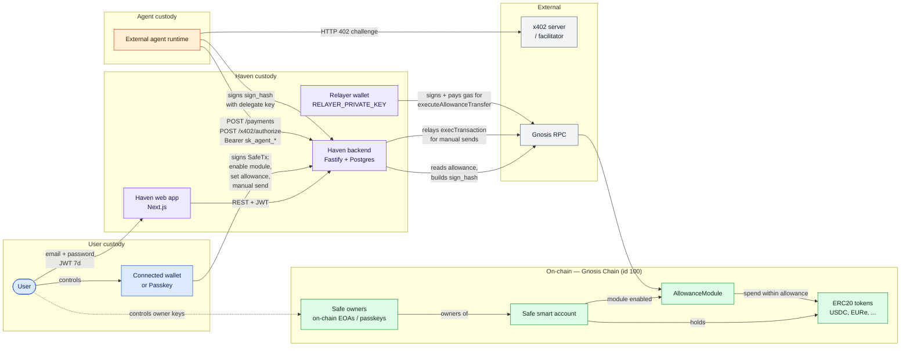

# Haven — System Context

A C4-L1 view of every actor and system Haven touches today, grouped by
**trust boundary**. Reading the colored groupings tells you the non-custodial
story at a glance: user funds live in the Safe; Haven holds operational
credentials only (JWT, hashed API keys, relayer gas wallet); the agent holds
its own delegate private key.

## Notes

- **Haven never holds delegate private keys.** Agents bring their own EOA
  ([packages/backend/src/routes/agents.ts:101](../../packages/backend/src/routes/agents.ts)).
- **The relayer wallet is the on-chain tx signer** for
  `executeAllowanceTransfer`; the delegate's signature is just calldata
  ([packages/backend/src/lib/allowance-module.ts](../../packages/backend/src/lib/allowance-module.ts)).
- **Safe ownership is trusted at import.** Haven does not query or store the
  on-chain owners list today
  ([packages/backend/src/routes/user-safes.ts](../../packages/backend/src/routes/user-safes.ts)).
- **Manual sends route through the user's wallet/passkey**, not the relayer
  ([packages/frontend/src/lib/signer.ts](../../packages/frontend/src/lib/signer.ts),
  [packages/frontend/src/lib/safe-tx.ts](../../packages/frontend/src/lib/safe-tx.ts)).
