# Haven — System Context

A C4-L1 view of Haven's primary account-control and payment paths, grouped by
**trust boundary**. User funds are held in the user's Haven wallet (a Safe smart
account) until an owner- or delegate-authorized transfer; standard x402 can
temporarily fund the agent-controlled delegate EOA. Owner authority remains
with the user. Haven operates the web app, backend, hosted MCP, and gas relayers,
but does not hold user or agent spending keys. The agent's delegate key stays in
its local signer or fully local MCP runtime.

```mermaid
flowchart LR
  classDef userCustody    fill:#dbeafe,stroke:#1d4ed8,color:#0b1d51
  classDef havenCustody   fill:#ede9fe,stroke:#6d28d9,color:#1f1147
  classDef agentCustody   fill:#ffedd5,stroke:#c2410c,color:#3a1c08
  classDef onchain        fill:#dcfce7,stroke:#15803d,color:#0a2a17
  classDef external       fill:#f3f4f6,stroke:#4b5563,color:#111827

  subgraph USER["User custody"]
    U([User])
    WALLET[Connected wallet<br/>or Passkey]
  end
  class U,WALLET userCustody

  subgraph HAVEN["Haven-operated infrastructure — no user or agent spending keys"]
    WEB["Haven web app<br/>Next.js"]
    MCP["Hosted MCP<br/>keyless orchestration"]
    BE["Haven backend<br/>Fastify + Postgres"]
    BINDING["x402 context signer<br/>non-spending key"]
    RELAYER["Gas relayer wallet(s)<br/>RELAYER_PRIVATE_KEY[_chainId]"]
  end
  class WEB,MCP,BE,BINDING,RELAYER havenCustody

  subgraph AGENT_BOX["Agent-controlled environment"]
    AGENT["External agent runtime"]
    SIGNER["Local edge signer<br/>delegate private key"]
  end
  class AGENT,SIGNER agentCustody

  subgraph CHAIN["Supported chains — Base, Gnosis, Base Sepolia"]
    SAFE["Haven wallet<br/>Safe smart account"]
    AM["AllowanceModule"]
    DELEGATE["Delegate EOA<br/>temporary x402 funds"]
    ERC20["Native and ERC-20 assets<br/>chain-specific tokens"]
    OWNERS["Safe owners<br/>EOAs / passkeys"]
  end
  class SAFE,AM,DELEGATE,ERC20,OWNERS onchain

  subgraph EXT["External"]
    RESOURCE["x402 resource server<br/>optional facilitator"]
    RPC["Per-chain RPC"]
    STS["Safe Transaction Service<br/>multisig proposals"]
  end
  class RESOURCE,RPC,STS external

  %% User identity and account control
  U -->|email + password| WEB
  WEB -->|REST + JWT| BE
  BE -->|issues JWT<br/>7-day expiry| WEB
  U -->|controls| WALLET
  WALLET -->|signs owner actions| WEB
  U -.->|controls owner keys| OWNERS
  OWNERS -->|owners of| SAFE
  SAFE -->|holds| ERC20
  SAFE -->|module enabled| AM
  WEB -->|EOA: submit signed Safe tx| RPC
  WEB -->|passkey: relay signed Safe tx| BE
  WEB -->|threshold > 1: propose tx| STS

  %% Agent payment control
  AGENT -->|high-level payment tools<br/>Bearer sk_agent_*| MCP
  MCP -->|payment intents and signed submissions| BE
  BE -->|unsigned payload + authenticated x402 context| MCP
  MCP -->|signing context| AGENT
  AGENT -->|payload hash or x402 context| SIGNER
  SIGNER -->|signature or X-PAYMENT header| AGENT
  SIGNER -.->|controls| DELEGATE
  AGENT -->|request paid resource| RESOURCE
  RESOURCE -->|402 Payment Required| AGENT
  AGENT -->|retry with signed X-PAYMENT| RESOURCE

  %% Haven execution
  BE -->|reads chain state<br/>and builds payload hashes| RPC
  BINDING -->|signs expected x402 context| BE
  RELAYER -->|pays gas for allowance transfers<br/>and signed passkey Safe txs| RPC
  RPC --> AM
  RPC --> SAFE
  AM -->|spend within approved allowance| ERC20
  AM -->|x402 funding leg| DELEGATE
```

## Trust And Custody Notes

- **The default agent topology is hosted MCP plus a local edge signer.** Hosted
  MCP constructs and relays but stays keyless. The delegate private key remains
  in the agent-controlled signer, which returns only signatures or signed
  payment headers. Direct SDK and fully local MCP integrations collapse some
  boxes in the diagram but preserve the same local-key boundary
  ([signer core](../../packages/signer/src/core.ts),
  [hosted tools](../../packages/mcp-server/src/tools.ts)).
- **API authentication is identity, not spending authority.** Agent creation
  accepts and stores a public `delegate_address`, not a private key. Payments
  require the corresponding delegate signature, and the AllowanceModule
  enforces the user-approved budget on-chain
  ([agent creation](../../packages/backend/src/routes/agents.ts),
  [agent authentication](../../packages/backend/src/middleware/agentAuth.ts)).
- **Relayers pay gas but do not create spending authority.** Allowance transfers
  can use an isolated `RELAYER_PRIVATE_KEY_<chainId>` with a global fallback.
  The delegate signature is calldata verified by the AllowanceModule. The
  passkey Safe-execution path currently uses the shared relayer only after the
  Safe validates the user's complete signature package
  ([allowance execution](../../packages/backend/src/lib/allowance-module.ts),
  [passkey Safe execution](../../packages/backend/src/routes/safe-exec.ts)).
- **Owner authority remains on-chain.** Linking an existing Haven wallet trusts
  the user-supplied Safe address at import time. Approver management later reads
  the authoritative owner list from `getOwners()` and stores only display
  metadata such as label and owner type
  ([Haven wallet routes](../../packages/backend/src/routes/user-safes.ts)).
- **User-authorized execution depends on signer type and threshold.** An EOA
  owner submits the Safe transaction through its connected wallet. A passkey
  signs locally and Haven relays the already-signed transaction. A Safe with a
  threshold above one is proposed to the Safe Transaction Service for the
  remaining signatures
  ([Safe transaction execution](../../packages/frontend/src/lib/safe-tx.ts),
  [send routing](../../packages/frontend/src/hooks/useSendTransaction.ts)).
- **x402 has separate funding and merchant legs.** Haven can fund the
  agent-controlled delegate EOA from the Safe within the approved allowance.
  The local signer then creates the merchant-bound EIP-3009 payment header, and
  the agent retries the resource request. Haven does not hold the delegate key
  or perform discretionary merchant settlement
  ([x402 authorization](../../packages/backend/src/routes/x402.ts),
  [signer tools](../../packages/signer/src/tools.ts)).
- **Supported chains are Base (8453), Gnosis Chain (100), and Base Sepolia
  (84532).** Base is the primary production network; Base Sepolia is the dev/QA
  testnet. RPC endpoints, token addresses, Safe contracts, and relayer
  configuration are selected per chain
  ([chain registry](../../packages/backend/src/lib/chains.ts)).
