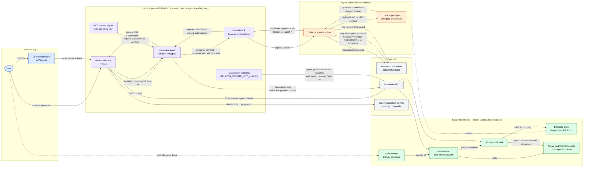

# Haven — System Context

A C4-L1 view of Haven's primary account-control and payment paths, grouped by
**trust boundary**. On the live delegation rail, user funds are held in the
user's Haven wallet (a MetaMask Hybrid DeleGator smart account) until an owner-
or delegate-authorized transfer; existing retired Safe accounts remain
user-owned and readable. Standard x402 can temporarily fund the agent-controlled
delegate EOA. Owner authority remains with the user. Haven operates the web app,
backend, hosted MCP, and gas relayers, but does not hold user or agent spending
keys. The agent's delegate key stays in
its local signer or fully local MCP runtime.

> **One live rail; this diagram is the retired baseline.** The diagram and notes
> below describe the **legacy AllowanceModule rail**, which is **RETIRED** (#1440):
> closed to new accounts (#1984), HTTP 410 on every payment and x402 entry point
> (#1986), machinery deleted (#1987/#1988/#1989). Existing Safe accounts stay
> readable but cannot spend through Haven's payment paths. All accounts that can spend run on the **delegation
> rail** (epic #821, `account_type='delegator_hybrid'`), where the Haven wallet is
> a MetaMask Hybrid DeleGator smart account and the policy is a signed delegation
> with caveat enforcers instead of an AllowanceModule allowance. The Smart Sessions
> **session rail is retired** (#834): accounts still marked
> `execution_rail='session_key'` get HTTP 410 from the payment paths. See the
> delegation-rail note below and
> [`docs/security/delegation-rail-security-model.md`](../security/delegation-rail-security-model.md).

```mermaid
flowchart LR
  classDef userCustody    fill:#dbeafe,stroke:#1d4ed8,color:#0b1d51
  classDef havenCustody   fill:#ede9fe,stroke:#6d28d9,color:#1f1147
  classDef agentCustody   fill:#ffedd5,stroke:#c2410c,color:#3a1c08
  classDef onchain        fill:#dcfce7,stroke:#15803d,color:#0a2a17
  classDef external       fill:#f3f4f6,stroke:#4b5563,color:#111827

  subgraph USER["User custody"]
    U([User])
    WALLET[Connected wallet<br/>or Passkey]
  end
  class U,WALLET userCustody

  subgraph HAVEN["Haven-operated infrastructure — no user or agent spending keys"]
    WEB["Haven web app<br/>Next.js"]
    MCP["Hosted MCP<br/>keyless orchestration"]
    BE["Haven backend<br/>Fastify + Postgres"]
    BINDING["x402 context signer<br/>non-spending key"]
    RELAYER["Gas relayer wallet(s)<br/>RELAYER_PRIVATE_KEY[_chainId]"]
  end
  class WEB,MCP,BE,BINDING,RELAYER havenCustody

  subgraph AGENT_BOX["Agent-controlled environment"]
    AGENT["External agent runtime"]
    SIGNER["Local edge signer<br/>delegate private key"]
  end
  class AGENT,SIGNER agentCustody

  subgraph CHAIN["Supported chains — Base, Gnosis, Base Sepolia"]
    SAFE["Haven wallet<br/>Safe smart account"]
    AM["AllowanceModule"]
    DELEGATE["Delegate EOA<br/>temporary x402 funds"]
    ERC20["Native and ERC-20 assets<br/>chain-specific tokens"]
    OWNERS["Safe owners<br/>EOAs / passkeys"]
  end
  class SAFE,AM,DELEGATE,ERC20,OWNERS onchain

  subgraph EXT["External"]
    RESOURCE["x402 resource server<br/>optional facilitator"]
    RPC["Per-chain RPC"]
    STS["Safe Transaction Service<br/>multisig proposals"]
  end
  class RESOURCE,RPC,STS external

  %% User identity and account control
  U -->|email + password| WEB
  WEB -->|REST + JWT| BE
  BE -->|issues JWT<br/>7-day expiry| WEB
  U -->|controls| WALLET
  WALLET -->|signs owner actions| WEB
  U -.->|controls owner keys| OWNERS
  OWNERS -->|owners of| SAFE
  SAFE -->|holds| ERC20
  SAFE -->|module enabled| AM
  WEB -->|EOA: submit signed Safe tx| RPC
  WEB -->|passkey: relay signed Safe tx| BE
  WEB -->|threshold > 1: propose tx| STS

  %% Agent payment control
  AGENT -->|high-level payment tools<br/>Bearer sk_agent_*| MCP
  MCP -->|payment intents and signed submissions| BE
  BE -->|unsigned payload + authenticated x402 context| MCP
  MCP -->|signing context| AGENT
  AGENT -->|payload hash or x402 context| SIGNER
  SIGNER -->|signature or merchant payment header| AGENT
  SIGNER -.->|controls| DELEGATE
  AGENT -->|request paid resource| RESOURCE
  RESOURCE -->|402 Payment Required| AGENT
  AGENT -->|retry with signed payment header: PAYMENT-SIGNATURE + X-PAYMENT| RESOURCE

  %% Haven execution
  BE -->|reads chain state<br/>and builds payload hashes| RPC
  BINDING -->|signs expected x402 context| BE
  RELAYER -->|pays gas for allowance transfers<br/>and signed passkey Safe txs| RPC
  RPC --> AM
  RPC --> SAFE
  AM -->|spend within approved allowance| ERC20
  AM -->|x402 funding leg| DELEGATE
```

## Trust And Custody Notes

- **The default agent topology is hosted MCP plus a local edge signer.** Hosted
  MCP constructs and relays but stays keyless. The delegate private key remains
  in the agent-controlled signer, which returns only signatures or signed
  payment headers. Direct SDK and fully local MCP integrations collapse some
  boxes in the diagram but preserve the same local-key boundary
  ([signer core](../../packages/signer/src/core.ts),
  [hosted tools](../../packages/mcp-server/src/tools.ts)).
- **API authentication is identity, not spending authority.** Agent creation
  accepts and stores a public `delegate_address`, not a private key. Payments
  require the corresponding delegate signature, and the AllowanceModule
  enforces the user-approved budget on-chain
  ([agent creation](../../packages/backend/src/routes/agents.ts),
  [agent authentication](../../packages/backend/src/middleware/agentAuth.ts)).
- **Relayers pay gas but do not create spending authority.** Allowance transfers
  can use an isolated `RELAYER_PRIVATE_KEY_<chainId>` with a global fallback.
  The delegate signature is calldata verified by the AllowanceModule. The
  passkey Safe-execution path currently uses the shared relayer only after the
  Safe validates the user's complete signature package
  ([allowance execution](../../packages/backend/src/rails/allowance-module.ts),
  [passkey Safe execution](../../packages/backend/src/routes/safe-exec.ts)).
- **Owner authority remains on-chain, and Haven no longer touches it at all.**
  Membership truth was always `getOwners()`; Haven stored only display metadata
  such as label and owner type, and it never signed an owner change. Since
  #1988 it does not construct one either — the approver routes are deleted. A
  legacy Safe with a known wallet owner can be managed through Safe's own
  interface with that wallet; a Safe owned only by a Haven passkey currently
  has no self-serve exit there, and unknown owner access must not be assumed
  ([Haven wallet routes](../../packages/backend/src/routes/user-safes.ts)).
- **User-authorized execution depends on signer type and threshold.** An EOA
  owner submits the Safe transaction through its connected wallet. A passkey
  signs locally and Haven relays the already-signed transaction. A Safe with a
  threshold above one is proposed to the Safe Transaction Service for the
  remaining signatures
  ([Safe transaction execution](../../packages/frontend/src/lib/safe-tx.ts)).
  **Since [#1989](https://github.com/d-hinders/Haven-AI/issues/1989) no
  dashboard screen composes an arbitrary Safe transfer** — the Send modal and
  its `useSendTransaction` hook are deleted with the Safe rail. The signing and
  relay path above is unchanged for owner-signed transactions posted directly
  to `POST /safe/exec`; Haven no longer composes legacy Safe agent lifecycle
  transactions in the dashboard. Legacy accounts remain readable, while live
  agent setup and budget lifecycle runs through the delegation rail.
- **x402 has separate funding and merchant legs.** Haven can fund the
  agent-controlled delegate EOA from the Safe within the approved allowance.
  The local signer then creates the merchant-bound EIP-3009 payment header, and
  the agent retries the resource request. Haven does not hold the delegate key
  or perform discretionary merchant settlement
  ([x402 authorization](../../packages/backend/src/routes/x402.ts),
  [signer tools](../../packages/signer/src/tools.ts)).
- **Delegation rail (new accounts) keeps the same custody boundary with a
  different primitive.** On `account_type='delegator_hybrid'` there is no Safe
  AllowanceModule and no Safe→delegate funding leg. The agent holds a signed
  budget delegation (period budget + optional recipient pin + expiry); Haven
  constructs a redeeming sponsored UserOp and the agent signs the account's exact
  EIP-712 typed data with its delegate key. Funds move account→recipient directly,
  metered on-chain by audited caveat enforcers during gas estimation — Haven never
  holds a DeleGator signer, and the account owner is watch-only. x402 on this rail
  settles treasury→merchant directly via ERC-7710 (no funding leg); facilitators
  without erc7710 support take the per-payment EIP-3009 fallback (#946): the
  budget delegation transiently funds the delegate EOA, which signs the standard
  merchant header — bounded by the period budget and covered by the sweep
  machinery (see doc 2's delegation-rail custody notes). This rail is
  **Base-only** (Base 8453, Base Sepolia 84532); Gnosis is not in scope. Details:
  [`delegation-rail-security-model.md`](../security/delegation-rail-security-model.md),
  [`delegation-rail-vendor-ops.md`](../operations/delegation-rail-vendor-ops.md)
  ([delegation rail](../../packages/backend/src/rails/delegation-rail.ts),
  [agent auth](../../packages/backend/src/middleware/agentAuth.ts)).
- **Supported chains are Base (8453), Gnosis Chain (100), and Base Sepolia
  (84532).** Base is the primary production network; Base Sepolia is the dev/QA
  testnet. Per-chain facts (token addresses, Safe contracts, explorers) live in
  the shared `@haven_ai/core` registry; the backend layers RPC endpoints and
  relayer configuration over it per chain
  ([core registry](../../packages/core/src/chains.ts),
  [backend chain wiring](../../packages/backend/src/domain/chains.ts)).
