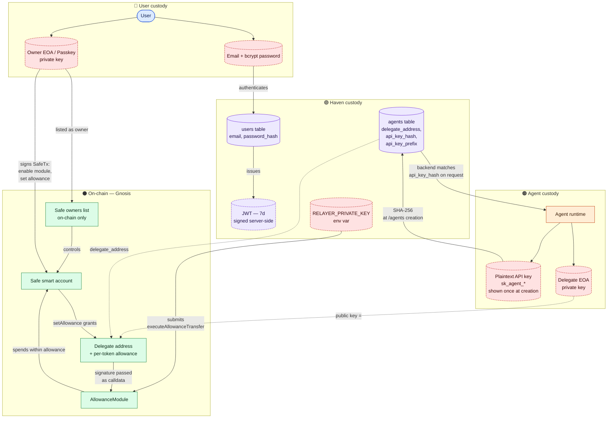

# Haven — Identity & Key/Credential Custody

Every identity, key, and credential in the system plotted with the party that
holds it. This is the diagram to consult when reasoning about blast radius:
"if X is compromised, what can move?".

The four custody zones:

| Zone | Holds | Worst-case if compromised |
|---|---|---|
| **User** | password, owner EOA/passkey | Can change Safe owners and move funds directly |
| **Haven** | JWT secret, `api_key_hash`, relayer key | Can call AllowanceModule **only within existing allowances**; cannot change owners or exceed allowances |
| **Agent** | plaintext API key, delegate EOA key | Can spend up to the remaining on-chain allowance for that delegate |
| **On-chain** | Safe state, AllowanceModule state | Authoritative source of truth |

## Custody invariants

1. **Haven cannot move funds outside an existing allowance.** Even with the
   relayer key + full DB access, `executeAllowanceTransfer` is bounded by the
   on-chain allowance the user already granted.
2. **Haven cannot impersonate an agent on-chain.** The delegate signature is
   verified by the AllowanceModule against the granted delegate address; Haven
   does not hold that key.
3. **Compromising the API key ≠ compromising funds.** The plaintext API key
   alone cannot move money — calls to `/payments/:id/sign` require an ECDSA
   signature from the delegate private key
   ([packages/backend/src/routes/payments.ts:305](../../packages/backend/src/routes/payments.ts)).
4. **Owner key compromise is total.** An attacker holding an owner EOA/passkey
   can change owners, disable modules, or move funds directly. This is by
   design — the Safe is the root of trust.
