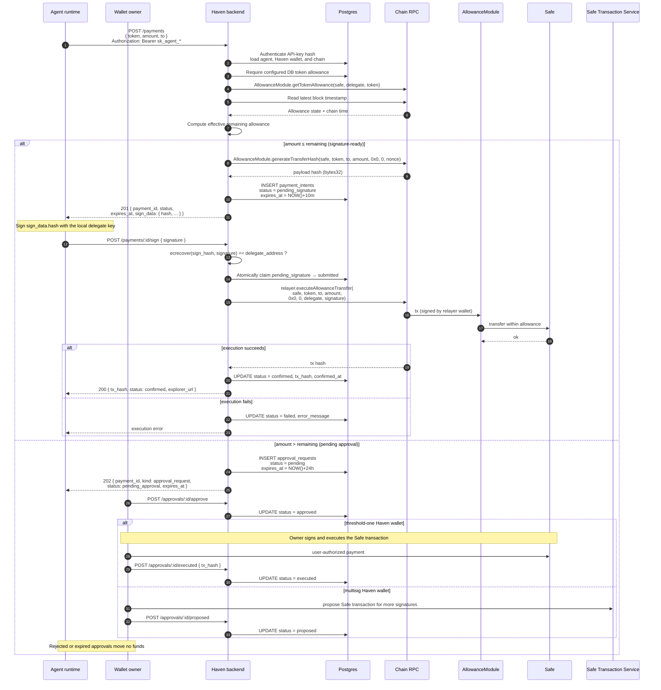

# Haven — Payment Execution Sequence

How an agent payment actually flows through the system, from intent to
on-chain settlement. Two branches: **within allowance** (agent signature
required, no user approval) and **over allowance** (queued for user approval
and user-authorized Safe execution).

Source of truth: [packages/backend/src/routes/payments.ts](../../packages/backend/src/routes/payments.ts) and
[packages/backend/src/lib/allowance-module.ts](../../packages/backend/src/lib/allowance-module.ts).

## Key invariants in this flow

- **The DB config is an eligibility gate; on-chain state is the spend
  envelope.** Haven requires a configured token allowance row, then reads the
  AllowanceModule state and latest chain timestamp. `computeEffectiveAllowance`
  applies the module's reset semantics, so out-of-band AllowanceModule transfers
  under the same delegate/token allowance are already reflected and reset
  decisions use chain time
  ([packages/backend/src/lib/allowance-module.ts](../../packages/backend/src/lib/allowance-module.ts)).
- **The delegate signature is independently re-verified by the
  AllowanceModule.** Even if the backend skipped its own `ecrecover` check,
  the on-chain module would reject a bad signature.
- **The relayer pays gas for the within-allowance delegate path.** The relayer
  wallet is the `msg.sender`; the delegate signature lives in calldata. The
  owner-approval path instead uses the Haven wallet's configured owner or
  multisig approval/execution method.

## State Lifecycles

- Direct intent: `pending_signature` (10-minute signing window) → `submitted` →
  `confirmed` or `failed`. An unsigned expired intent becomes `expired` and
  cannot execute.
- Owner approval: `pending` (24-hour review window) → `approved` → `executed`
  for threshold-one wallets, or `proposed` while a multisig waits for remaining
  signatures; `rejected` / `expired` are terminal alternatives. Approval does
  not reuse the delegate-relayer path: the wallet owner authorizes the Safe
  transaction and Haven records its result.

## Related: x402 path

`POST /x402/authorize` ([packages/backend/src/routes/x402.ts](../../packages/backend/src/routes/x402.ts))
shares the payment/approval writers and AllowanceModule execution primitive,
but its funding semantics differ:

- Token and chain come from the merchant challenge and must match the agent's
  Haven wallet.
- Coverage is balance-aware. Above `delegate balance + remaining allowance`
  returns 422 without creating payment state; above remaining allowance but
  within total coverage queues for user approval.
- Within allowance, Haven creates a Safe-to-`payTo` funding intent. The merchant
  settlement remains a separate, locally signed x402 step.
- Unsigned mode returns a 10-minute funding intent that can be submitted through
  `/payments/:id/sign`. One-shot mode accepts the funding signature on
  `/x402/authorize` and records confirmation atomically after execution.
- The shared writers persist rail, resource, merchant, idempotency, and resume
  context. A per-agent hourly limit (`max_x402_per_hour`, default 100) applies.
