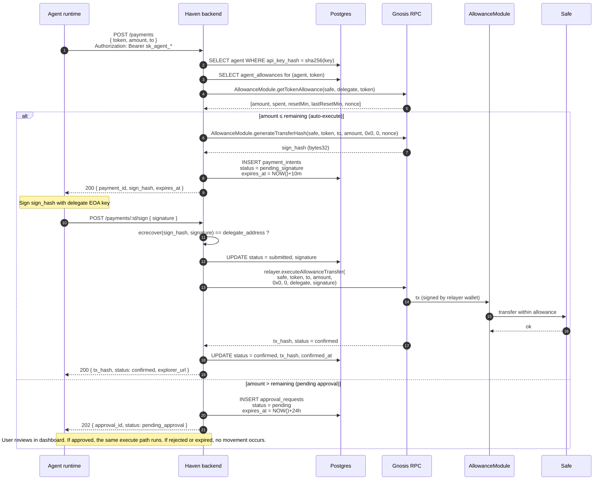

# Haven — Payment Execution Sequence

How an agent payment actually flows through the system, from intent to
on-chain settlement. Two branches: **within allowance** (auto-execute) and
**over allowance** (queued for user approval).

Source of truth: [packages/backend/src/routes/payments.ts](../../packages/backend/src/routes/payments.ts) and
[packages/backend/src/lib/allowance-module.ts](../../packages/backend/src/lib/allowance-module.ts).

## Key invariants in this flow

- **The allowance check is on-chain, not DB.** Step 4 reads
  AllowanceModule state directly, so any out-of-band on-chain spend by the
  same delegate is already counted in `spent`
  ([packages/backend/src/lib/allowance-module.ts](../../packages/backend/src/lib/allowance-module.ts)).
- **The delegate signature is independently re-verified by the
  AllowanceModule.** Even if the backend skipped its own `ecrecover` check,
  the on-chain module would reject a bad signature.
- **The relayer pays gas, the agent does not.** The relayer wallet is the
  `msg.sender`; the delegate signature lives in the calldata.
- **Approval expiry is 24h.** After that the `approval_requests` row is dead
  and the agent must re-submit.

## Related: x402 path

`POST /x402/authorize` ([packages/backend/src/routes/x402.ts](../../packages/backend/src/routes/x402.ts))
uses the same `payment_intents` table and the same execute path, plus:

- Token resolved by address rather than symbol
- Per-agent hourly rate limit (`max_x402_per_hour`, default 100, returns 429)
- `source = 'x402'` and `x402_resource_url` stored on the intent
- Optional one-shot mode where the signature is included in the initial
  request so step 7 collapses into step 1
