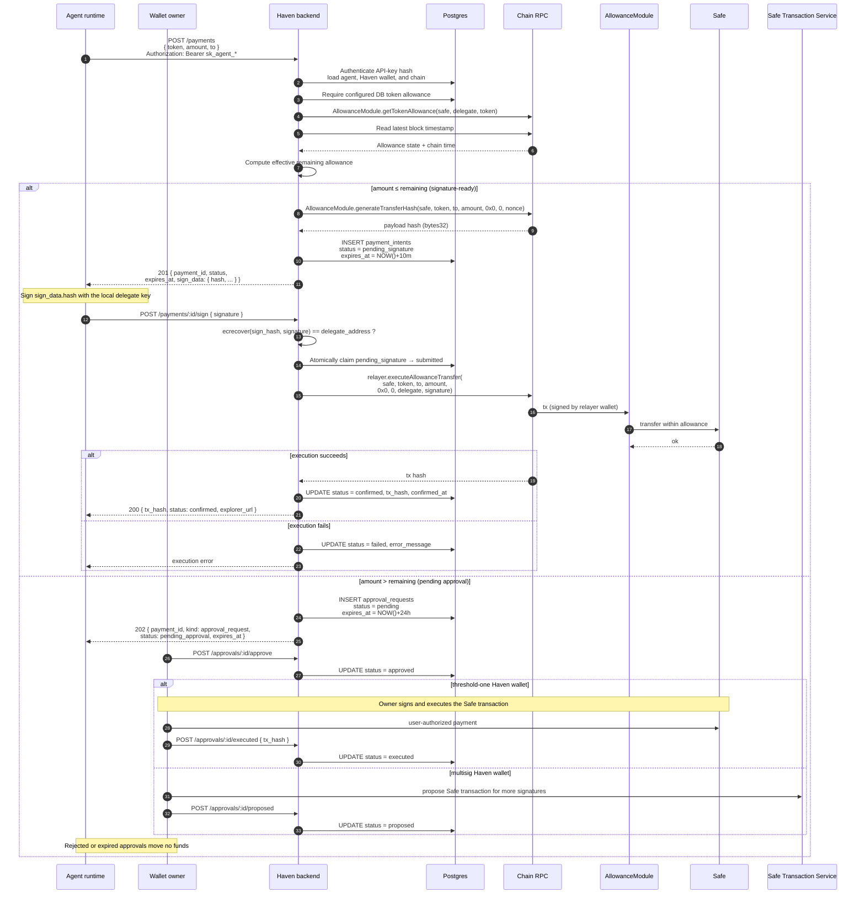

# Haven — Payment Execution Sequence

How an agent payment actually flows through the system, from intent to
on-chain settlement. The legacy rail had two branches — **within allowance**
(agent signature required, no user approval) and **over allowance** (queued
for user approval and user-authorized Safe execution) — and **neither is
reachable any more**; see the banner below and jump to the
[delegation-rail branch](#delegation-rail-new-accounts) for the live flow.

Source of truth: [packages/backend/src/routes/payments.ts](../../packages/backend/src/routes/payments.ts) and
[packages/backend/src/rails/allowance-module.ts](../../packages/backend/src/rails/allowance-module.ts).

> ⚠️ **THE SEQUENCE BELOW NO LONGER RUNS.** It is the legacy AllowanceModule
> rail, retired under epic #1440: closed to new accounts by #1984 and
> **fail-closed for spending by #1986**. `POST /payments` and
> `POST /payments/:id/sign` now answer **HTTP 410 before the allowance read**
> for any account whose `execution_rail` is not `delegation` and not
> `session_key` — nothing written, no chain call, no transfer. Step 1 of the
> diagram is where it stops. The over-allowance branch is gone at the other
> end too: #2055 deleted `routes/approvals.ts` (the five queue endpoints
> answer 404 now) and migration 070 dropped `approval_requests` outright,
> superseding #1986's refuse-unconditionally interim. The diagram is kept as the record of what the rail DID, because
> the code implementing it **has now been deleted** — the execution half by
> #1987 (the AllowanceModule transfer, transfer-hash generation, ECDSA
> signature recovery and the allowance-nonce coordinator), and the Safe-deploy
> implementation, both deployers and the five approver routes by #1988.
> **`POST /safe/exec` was deliberately KEPT** — it is owner-signed and relayed
> for gas only, not the retired rail's agent authority — though #1989 deleted
> the screen that composed such a transaction. Read the diagram as history: it
> is not behaviour you can invoke, and it is no longer behaviour you could find
> in the tree.
>
> **What still works for one of these accounts:** the account-level READS.
> Balances, transaction history, the accounts list, rename, re-default and
> unlink. (`GET /machine-payments/allowances` is no longer among them: #2020
> reversed #1986's left-readable decision on a recorded owner call, so the
> spend-authority report answers the same fail-closed 410 as the spend paths —
> the accounts are emptied and unsupported per the #2021 readability waiver.)
> `POST /safe/exec` also stays open — it is
> owner-signed and relayed for gas only, so it is how the holder of a
> passkey-owned Safe still moves funds out of an account they control.
> **Approver management is gone as of #1988**: Haven no longer constructs
> owner-change transactions, so the preventive half of #1229's recovery is no
> longer offered. An EOA owner — which every Safe in the epic's census has —
> manages owners directly through Safe's own interfaces with their own key.
>
> **The live rail is the delegation rail.** New accounts
> (`account_type='delegator_hybrid'`, `execution_rail='delegation'`) take the
> [delegation-rail branch](#delegation-rail-new-accounts) at the bottom of this
> doc; `POST /payments` resolves the rail from agent auth and builds a
> redeeming UserOp. The Smart Sessions **session rail is retired** too (#834)
> and answers its own, distinct HTTP 410; both tombstones coexist on the rail
> seam (`rails/execution-rail.ts`).

```mermaid
sequenceDiagram
  autonumber
  participant Agent as Agent runtime
  participant Owner as Wallet owner
  participant API as Haven backend
  participant DB as Postgres
  participant RPC as Chain RPC
  participant AM as AllowanceModule
  participant Safe
  participant Service as Safe Transaction Service

  Agent->>API: POST /payments<br/>{ token, amount, to }<br/>Authorization: Bearer sk_agent_*
  API->>DB: Authenticate API-key hash<br/>load agent, Haven wallet, and chain
  API->>DB: Require configured DB token allowance
  API->>RPC: AllowanceModule.getTokenAllowance(safe, delegate, token)
  API->>RPC: Read latest block timestamp
  RPC-->>API: Allowance state + chain time
  API->>API: Compute effective remaining allowance

  alt amount ≤ remaining (signature-ready)
    API->>RPC: AllowanceModule.generateTransferHash(safe, token, to, amount, 0x0, 0, nonce)
    RPC-->>API: payload hash (bytes32)
    API->>DB: INSERT payment_intents<br/>status = pending_signature<br/>expires_at = NOW()+10m
    API-->>Agent: 201 { payment_id, status,<br/>expires_at, sign_data: { hash, ... } }

    Note over Agent: Sign sign_data.hash with the local delegate key
    Agent->>API: POST /payments/:id/sign { signature }
    API->>API: ecrecover(sign_hash, signature) == delegate_address ?
    API->>DB: Atomically claim pending_signature → submitted
    API->>RPC: relayer.executeAllowanceTransfer(<br/>safe, token, to, amount,<br/>0x0, 0, delegate, signature)
    RPC->>AM: tx (signed by relayer wallet)
    AM->>Safe: transfer within allowance
    Safe-->>AM: ok
    alt execution succeeds
      RPC-->>API: tx hash
      API->>DB: UPDATE status = confirmed, tx_hash, confirmed_at
      API-->>Agent: 200 { tx_hash, status: confirmed, explorer_url }
    else execution fails
      API->>DB: UPDATE status = failed, error_message
      API-->>Agent: execution error
    end

  else amount > remaining (pending approval)
    API->>DB: INSERT approval_requests<br/>status = pending<br/>expires_at = NOW()+24h
    API-->>Agent: 202 { payment_id, kind: approval_request,<br/>status: pending_approval, expires_at }
    Owner->>API: POST /approvals/:id/approve
    API->>DB: UPDATE status = approved
    alt threshold-one Haven wallet
      Note over Owner,Safe: Owner signs and executes the Safe transaction
      Owner->>Safe: user-authorized payment
      Owner->>API: POST /approvals/:id/executed { tx_hash }
      API->>DB: UPDATE status = executed
    else multisig Haven wallet
      Owner->>Service: propose Safe transaction for more signatures
      Owner->>API: POST /approvals/:id/proposed
      API->>DB: UPDATE status = proposed
    end
    Note over Agent,Owner: Rejected or expired approvals move no funds
  end
```

## Key invariants in this flow

- **The DB config is an eligibility gate; on-chain state is the spend
  envelope.** Haven requires a configured token allowance row, then reads the
  AllowanceModule state and latest chain timestamp. `computeEffectiveAllowance`
  applies the module's reset semantics, so out-of-band AllowanceModule transfers
  under the same delegate/token allowance are already reflected and reset
  decisions use chain time
  ([packages/backend/src/rails/allowance-module.ts](../../packages/backend/src/rails/allowance-module.ts)).
- **The delegate signature is independently re-verified by the
  AllowanceModule.** Even if the backend skipped its own `ecrecover` check,
  the on-chain module would reject a bad signature.
- **The relayer pays gas for the within-allowance delegate path.** The relayer
  wallet is the `msg.sender`; the delegate signature lives in calldata. The
  owner-approval path instead uses the Haven wallet's configured owner or
  multisig approval/execution method.

## State Lifecycles

- Direct intent: `pending_signature` (10-minute signing window) → `submitted` →
  `confirmed` or `failed`. An unsigned expired intent becomes `expired` and
  cannot execute.
- Owner approval: `pending` (24-hour review window) → `approved` → `executed`
  for threshold-one wallets, or `proposed` while a multisig waits for remaining
  signatures; `rejected` / `expired` are terminal alternatives. Approval does
  not reuse the delegate-relayer path: the wallet owner authorizes the Safe
  transaction and Haven records its result.

## Delegation rail (new accounts)

For `execution_rail='delegation'` accounts, `POST /payments` does not touch the
AllowanceModule, compute a coverage envelope, or ever queue an approval. The
policy is the agent's signed budget delegation, and it is enforced **on-chain** by
audited caveat enforcers. The branch is a tight variant of the signature-ready
path above:

1. `POST /payments` authenticates the agent and selects its active budget
   delegation for the requested token **and recipient** (native-token transfers
   are not supported on this rail). With no matching delegation, it returns an
   error — there is no approval-queue fallback.
2. Haven prepares a redeeming sponsored UserOp; **budget (with native period
   refill), recipient, and expiry are enforced on-chain during gas estimation**,
   so an over-budget or wrong-recipient intent reverts here rather than being
   queued. The response is `201` with `status`, `expires_at`, and
   `sign_data: { signature_scheme: 'eip712_userop', typed_data }`.
3. The agent signs the account's **exact EIP-712 `typed_data` VERBATIM** with its
   delegate key — never a bare 4337 UserOp hash (the #829 lesson; the account
   validates the typed data, not the raw hash). It submits `{ signature }` to
   `POST /payments/:id/sign`, which Haven relays as the sponsored UserOp.
4. Funds move **account→recipient directly** — no funding leg, no delegate EOA to
   strand. The intent settles to `confirmed`, or reverts if it breached the
   on-chain policy.

Agent-facing intent shape and the `/payments/:id/sign` contract are identical to
the legacy AllowanceModule rail's; only the `sign_data` scheme (`eip712_userop`
vs the AllowanceModule transfer hash) and the enforcement mechanism differ. Delegation
lifecycle (build/activate/revoke) is managed out of band via
`/agents/:id/delegations/*`
([agent delegations](../../packages/backend/src/routes/agent-delegations.ts)).
Full security model and exit story:
[`docs/security/delegation-rail-security-model.md`](../security/delegation-rail-security-model.md)
([delegation authorization](../../packages/backend/src/rails/delegation-authorization.ts)).

## Related: x402 path

`POST /x402/authorize` ([packages/backend/src/routes/x402.ts](../../packages/backend/src/routes/x402.ts))
branches on the agent's execution rail.

**Legacy AllowanceModule rail — RETIRED (#1986); the funding leg below no
longer executes.** `POST /x402/authorize` and `POST /x402` answer HTTP 410
before the legacy authorize path could run, so the Safe→delegate funding
transfer never runs and the delegate never takes a hot balance for this rail.
The path itself — `runLegacyAuthorize` in `modules/x402/legacy-authorize.ts` —
was **deleted by #1987**; the 410 above it remains. Kept as the record of what
it did: it shared the payment/approval writers and
the AllowanceModule execution primitive, but its funding semantics differed:

- Token and chain come from the merchant challenge and must match the agent's
  Haven wallet.
- Coverage is balance-aware. Above `delegate balance + remaining allowance`
  returns 422 without creating payment state; above remaining allowance but
  within total coverage queues for user approval.
- Within allowance, Haven creates a Safe-to-`payTo` funding intent. The merchant
  settlement remains a separate, locally signed x402 step.
- Unsigned mode returns a 10-minute funding intent that can be submitted through
  `/payments/:id/sign`. One-shot mode accepts the funding signature on
  `/x402/authorize` and records confirmation atomically after execution.
- The shared writers persist rail, resource, merchant, idempotency, and resume
  context.

**Delegation rail** never touches the AllowanceModule or the approval queue,
and selects a settlement scheme **per payment** from the request's `payTo`
shape (#946); an explicit `settlementScheme`, when present, is validated
against that shape:

- **erc7710 direct settlement** (`payTo` = the merchant): Haven builds a
  settlement CHILD delegation (exact amount, payee pin, expiry capped at 600s)
  re-delegated from the agent's budget delegation
  ([packages/backend/src/modules/x402/x402-delegation.ts](../../packages/backend/src/modules/x402/x402-delegation.ts)).
  The agent signs its EIP-712 typed data (`signature_scheme:
  'eip712_delegation'`) and POSTs `/x402/:id/settle`, which returns the
  merchant payment header. The merchant redeems the `[child, budget]`
  chain and settles account→merchant directly — the period budget is metered
  by the settlement itself; no funding leg.
- **EIP-3009 fallback** (`payTo` = the agent's own delegate EOA, with
  `merchantPayTo` required): the budget delegation is redeemed as a funding
  UserOp to the delegate EOA (signed exactly like a delegation-rail payment:
  `eip712_userop` typed data via `/payments/:id/sign`), and the EOA then signs
  the standard EIP-3009 header client-side for the merchant retry.
  `settlement_scheme: 'eip3009'` is recorded in the intent metadata. The
  bridge structurally requires an **open (unpinned) budget** — recipient-pinned
  budgets cannot fund the EOA and are erc7710-only.
- One-shot authorize+execute is refused on this rail (400) — the signature is
  typed data over prepared state that does not exist yet (#961). An idempotent
  replay **resumes** instead of dead-ending: `sign_data` is reconstructed from
  the stored intent (scheme detected from the stored state), and a stale
  pending row is lazily expired so the key frees up for a fresh create.

A per-agent hourly limit (`max_x402_per_hour`, default 100) applies on every
rail — on the delegation rail it runs before any sponsored bundler prepare
(replays are exempt). After a successful settlement retry the agent can report
the merchant's own receipt via `POST /machine-payments/:id/merchant-receipt`
(#956) — best-effort, first write wins, attached as a second file in the
reporting feed.
