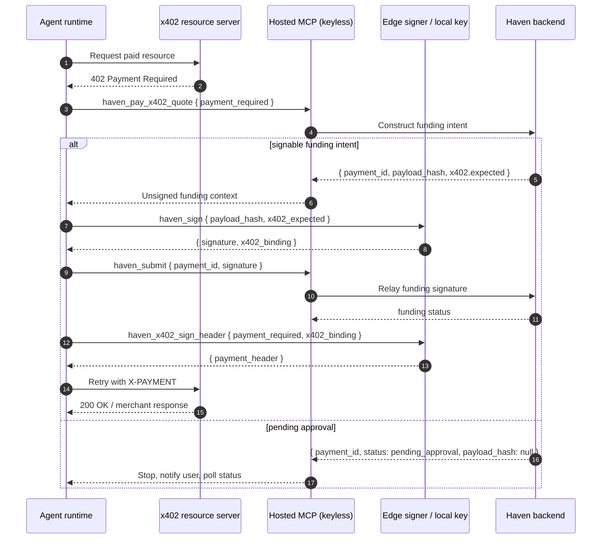

# Haven - x402 Payment Execution Sequence

How an agent pays for an x402-protected resource through Haven today.
Standard merchant-verifiable x402 support is `exact`-scheme USDC on Base and
Base Sepolia. Haven can parse some additional network/token forms for legacy
proofs and display, but they are not part of the standard settlement path.

Standard merchant x402 has two legs:

1. Haven funding leg: within budget, an agent-signed Safe AllowanceModule
   transfer funds the delegate wallet. Over budget, the user must approve and
   execute a Safe funding transaction.
2. Merchant leg: the agent signs the standard EIP-3009 `X-PAYMENT` header from
   the delegate wallet and retries the merchant/resource request.

In SDK, local MCP, and generic hosted split flows, the agent retries the merchant
request. For paid MCP tools, hosted MCP can proxy the HTTP/MCP request and
deliver an already signed payment header. It remains keyless and does not act as
a facilitator/acquirer, hold merchant funds, or create the payment signature.

Source of truth:

- [`packages/sdk/src/x402.ts`](../../packages/sdk/src/x402.ts)
- [`packages/sdk/src/client.ts`](../../packages/sdk/src/client.ts)
- [`packages/backend/src/routes/x402.ts`](../../packages/backend/src/routes/x402.ts)
- [`packages/backend/src/lib/payment-coverage.ts`](../../packages/backend/src/lib/payment-coverage.ts)
- [`packages/mcp/src/tools.ts`](../../packages/mcp/src/tools.ts)
- [`packages/mcp-server/src/tools.ts`](../../packages/mcp-server/src/tools.ts)
- [`docs/regulatory/casp-risk-guardrails.md`](../regulatory/casp-risk-guardrails.md)

## Challenge And Header Semantics

The SDK normalizes the merchant's 402 response into a `PaymentRequired` object.
It accepts the v2 `PAYMENT-REQUIRED` header, the v1 `X-PAYMENT` challenge
header, and a JSON-body fallback. When the delegate address is known, probes
also send `x402-wallet`. The paid retry uses `X-PAYMENT`; a successful merchant
response may include `PAYMENT-RESPONSE` evidence.

`quoteX402()` and `haven_quote_x402` are read-only. They parse the challenge but
do not create a Haven payment, approval request, signature, or on-chain
transaction.

## Standard SDK / Local MCP Flow

```mermaid
sequenceDiagram
  autonumber
  participant Agent as Agent runtime
  participant Resource as x402 resource server
  participant SDK as Haven SDK / local MCP
  participant API as Haven backend
  participant AM as Safe AllowanceModule
  participant Safe as Haven wallet / Safe

  Agent->>SDK: quoteX402(url) / haven_quote_x402
  SDK->>Resource: Probe paid resource (x402-wallet when known)
  Resource-->>SDK: 402 + PaymentRequired
  SDK-->>Agent: Parsed quote (read-only)
  Agent->>SDK: payX402Quote / haven_pay_x402_quote
  SDK->>SDK: Build merchant EIP-3009 X-PAYMENT locally
  SDK->>API: Create funding intent (Bearer identifies agent)
  API->>AM: Read allowance + delegate balance
  alt within allowance
    API-->>SDK: Unsigned funding hash + authenticated x402 context
    SDK->>SDK: Sign funding hash with local delegate key
    SDK->>API: Submit funding signature
    API->>AM: Relay signed Safe-to-delegate funding transfer
    AM->>Safe: Transfer within approved budget
    API-->>SDK: Funding transaction
    SDK->>SDK: Wait for at least one confirmation
    SDK->>Resource: Retry original request with X-PAYMENT
    alt merchant accepts
      Resource-->>SDK: Success + optional PAYMENT-RESPONSE
      SDK-->>Agent: Merchant response
    else merchant rejects after funding
      Resource-->>SDK: Error response
      SDK-->>Agent: x402_retry_rejected_after_funding
      Note over Agent,SDK: Reconcile; sweep if delegate funds are stranded
    end
  else remaining < amount ≤ remaining + delegate balance
    API-->>SDK: pending_approval + payment id + x402 context
    SDK->>SDK: Attach resumeState
    SDK-->>Agent: Tell user to approve in Haven and preserve resume state
  else amount > remaining + delegate balance
    API-->>SDK: 422 insufficient_funds / fund_safe_or_raise_allowance
    Note over Agent,API: No payment or approval is created
  end
```

Bearer authentication identifies the agent but is never payment authority. Both
the merchant header and the Safe funding payload are signed by the local
delegate key.

## Hosted Generic Split Flow

Hosted MCP is keyless, so the funding signature and merchant header signature
are local edge-signing steps. The generic decomposed path is:



Before signing the funding hash, the edge signer checks payload-hash equality,
reconstructs the canonical payment/resource/merchant/amount/asset/network/expiry
context, verifies Haven's expected-context signature against its configured
trusted signer. Before building the merchant header, it rejects expired context
and verifies that the live challenge still matches the recorded funded context.

## Hosted Paid-MCP-Tool Flow

The recommended three-call fast path for an x402-protected MCP tool is:

1. `haven_pay_mcp_tool` — hosted MCP sends a `tools/call` probe, records the MCP
   transport context, and returns the unsigned funding payload plus merchant/tool
   context.
2. `haven_sign_x402` — the local signer signs the funding hash and creates the
   merchant-bound payment header.
3. `haven_settle_mcp_tool` — hosted MCP relays the funding signature, waits for
   confirmation, performs a fresh merchant MCP handshake, delivers the signed
   header, and returns the tool result.

The decomposed alternative is:

```text
haven_pay_mcp_tool
  → haven_sign
  → haven_submit
  → haven_x402_sign_header
  → haven_complete_mcp_tool
```

If the merchant rejects after funding, hosted MCP returns
`MERCHANT_REJECTED_AFTER_FUNDING`. The delegate may hold stranded funds; retain
the payment id and inspect and reconcile the attempt before using
`haven_sweep_delegate`. Do not silently retry or abandon a confirmed balance.

## Approval Resume

When `remaining allowance < amount ≤ remaining allowance + delegate balance`,
Haven queues a pending approval. Amounts above total coverage return 422 with
`fund_safe_or_raise_allowance` and create no approval; the agent must stop until
funding or rules change.

For the SDK, the correct approval behavior is:

1. Preserve the returned `paymentId`, `idempotencyKey`, and `resumeState` when
   available.
2. Tell the user the payment is waiting in Haven.
3. The user approves and executes the Safe funding transaction in Haven.
4. Poll `getPaymentStatus(paymentId)`. The lifecycle can progress through
   `pending`, `approved`, and, for multisig, `proposed`; only `executed` returns
   `nextAction: "retry_original_x402_request"`.
5. When that next action is returned, call
   `resumeX402Payment`.
6. Retry the original merchant/resource request with `X-PAYMENT`.

MCP tools expose related state with their own wire conventions: local MCP
normalizes most fields to camelCase while retaining `resume_state`; backend HTTP
responses use snake_case. Local MCP can use `haven_resume_x402_payment`.

Hosted MCP approval resume is not currently completable through the edge signer
tools: its resume response omits the `payload_hash`, authenticated
`x402.expected`, and `x402_binding` required to sign funding or the merchant
header. Do not pass that response to `haven_sign`, `haven_sign_x402`, or
`haven_x402_sign_header`. Until that contract is fixed, use the SDK/local MCP
approval path for an x402 payment that may require user approval.

If the process restarted and only the payment id remains, call
`getResumeState(paymentId)` after execution to rehydrate Haven's stored x402
context. Haven stores payment context, not the agent's local request stream, so
request bodies, tool names, and tool arguments may still need to be preserved or
reconstructed. SDK and hosted MCP tool completion establish a fresh MCP
transport session; callers do not need to preserve the old session id.

## Differences From Direct Payments

| Concern | Direct `/payments` | x402 |
|---|---|---|
| Payment target | Recipient address from agent intent | Merchant `payTo` from HTTP 402 challenge |
| Amount units | Human decimal string | Atomic amount from x402 option |
| Agent action after funding | None for direct confirmed payment | Retry original merchant/resource request |
| Header sent to merchant | None | `X-PAYMENT` |
| Payment authority | Delegate signature + on-chain allowance | Same for funding leg; EIP-3009 signature for merchant leg |
| Approval resume | Poll payment status | Poll status, then resume original x402 request |

## Guardrails

- Keep x402 budgets small and reset-bound.
- Treat the delegate key as a hot payment key for x402.
- Reconcile or sweep stranded delegate balances before scaling.
- Do not describe demo x402 endpoints as production merchant settlement,
  facilitator, acquiring, fiat/card, or merchant-of-record products.
- Use [`docs/regulatory/casp-risk-guardrails.md`](../regulatory/casp-risk-guardrails.md)
  before changing x402/MPP flows or merchant-facing demos.
