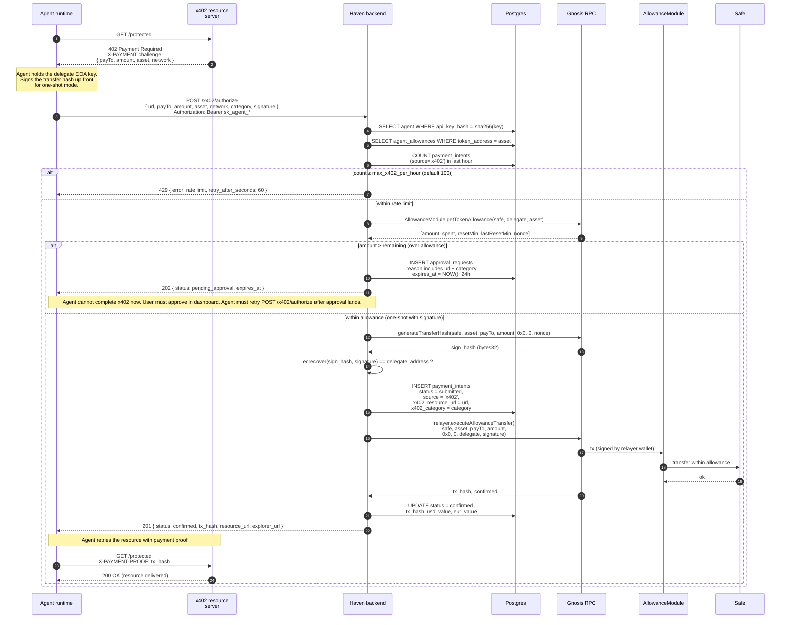

# Haven — x402 Payment Execution Sequence

How an agent pays for an x402-protected resource through Haven. The interesting
piece is the **left edge** of this diagram — the HTTP 402 challenge from the
resource server — which is what x402 is for. Once Haven is involved, the
mechanics overlap heavily with the normal `/payments` flow but with a few
differences worth knowing.

Source of truth: [packages/backend/src/routes/x402.ts](../../packages/backend/src/routes/x402.ts) and
[packages/backend/src/lib/allowance-module.ts](../../packages/backend/src/lib/allowance-module.ts).

## Differences vs the regular `/payments` flow

The on-chain mechanics are identical (same `payment_intents` table, same
`executeAllowanceTransfer`, same delegate signature verification). The x402
endpoint adds four things on top:

| Concern | Regular `/payments` | `/x402/authorize` |
|---|---|---|
| Token resolution | by **symbol** | by **address** (asset field from X-PAYMENT) |
| Amount units | human-readable + decimals | **atomic units** straight from the x402 challenge |
| Rate limit | none | per-agent `max_x402_per_hour` (default 100) — 429 if exceeded |
| Metadata | none | `source='x402'`, `x402_resource_url`, `x402_category` stored on the intent |
| Modes | always two-step (sign separately) | optional **one-shot** when `signature` is included in the body |

## Two-step mode (alternative happy path)

If the agent posts `/x402/authorize` **without** a `signature`, the endpoint
returns `201 { status: 'pending_signature', sign_data }` instead of executing.
The agent then signs `sign_data.hash` with its delegate key and either:

1. `POST /payments/:id/sign` — same path as the regular `/payments` flow
   ([packages/backend/src/routes/payments.ts:264](../../packages/backend/src/routes/payments.ts)), or
2. `POST /x402/authorize` again with the `signature` field — one-shot
   execution against the same nonce.

Both routes converge on `executeAllowanceTransfer` via the relayer wallet.

## Why x402 is not just a `/payments` alias

The protocol-shaped concerns live entirely on the **left half** of the diagram
(the resource server's 402 challenge and the agent's retry with proof). Haven
does not talk to the resource server or any x402 facilitator directly — that
is the agent's job. Haven's contribution is: accept the wire-format inputs
that x402 hands to the agent (atomic amount, asset address, CAIP-2 network),
enforce per-protocol guardrails (rate limit, category tagging), and settle
on-chain in one round-trip when possible.
