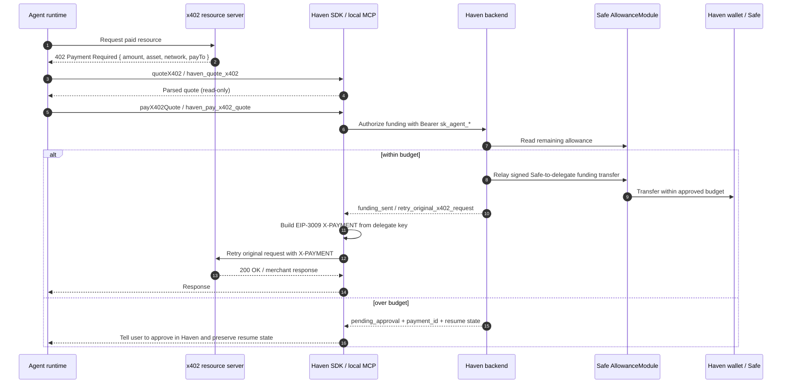
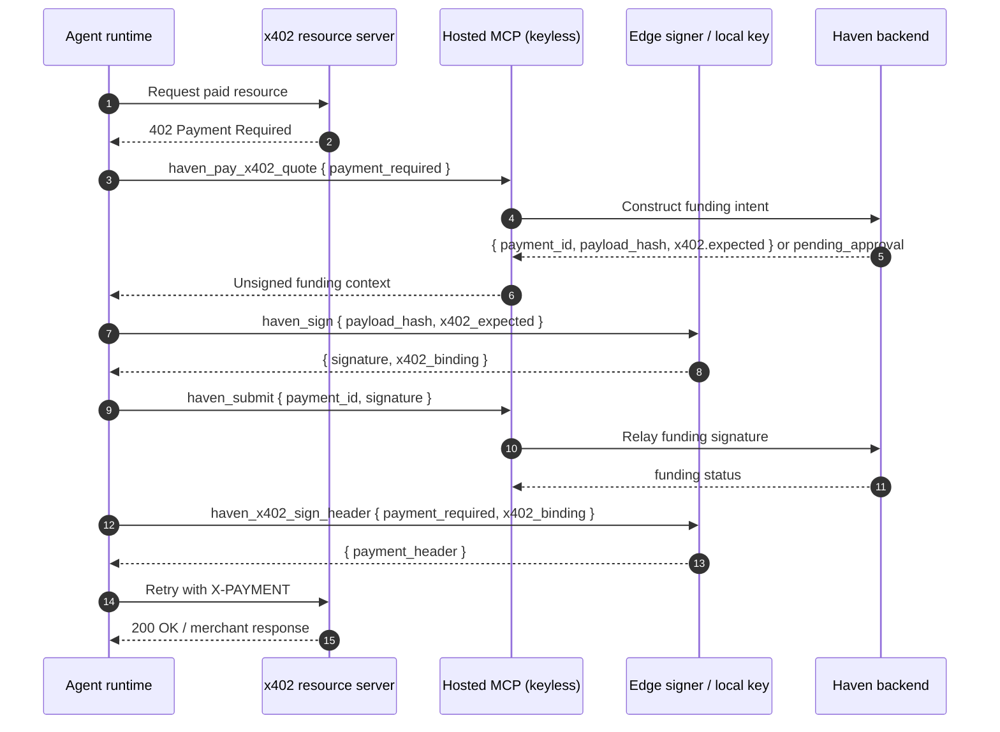

# Haven - x402 Payment Execution Sequence

How an agent pays for an x402-protected resource through Haven today.

Standard merchant x402 has two legs:

1. Haven funding leg: a Safe AllowanceModule transfer funds the agent delegate
   wallet within the user's agent budget.
2. Merchant leg: the agent signs the standard EIP-3009 `X-PAYMENT` header from
   the delegate wallet and retries the merchant/resource request.

Haven does not talk to the merchant, settle merchant balances, act as a
facilitator/acquirer, or hold merchant funds in this flow. The merchant leg is
the agent's retry request.

Source of truth:

- [`packages/sdk/src/x402.ts`](../../packages/sdk/src/x402.ts)
- [`packages/backend/src/routes/x402.ts`](../../packages/backend/src/routes/x402.ts)
- [`packages/mcp/src/tools.ts`](../../packages/mcp/src/tools.ts)
- [`packages/mcp-server/src/tools.ts`](../../packages/mcp-server/src/tools.ts)
- [`docs/regulatory/casp-risk-guardrails.md`](../regulatory/casp-risk-guardrails.md)

## Standard SDK / Local MCP Flow

`quoteX402()` and `haven_quote_x402` are read-only. They parse the merchant's
HTTP 402 response but do not create a Haven payment, approval request,
signature, or on-chain transaction.

## Hosted MCP Flow

Hosted MCP is keyless, so the funding signature and merchant header signature
are local edge-signing steps.

The signer validates that the live merchant challenge still matches the funded
amount, merchant recipient, resource URL, asset, and network before it signs the
merchant header.

## Approval Resume

When an x402 funding leg exceeds the remaining on-chain agent budget, Haven
queues a pending approval and returns `next_action:
"wait_for_user_approval"`. The agent must not loop or create duplicate merchant
sessions.

The correct behavior is:

1. Preserve the returned `payment_id`, `idempotencyKey`, and `resumeState` when
   available.
2. Tell the user the payment is waiting in Haven.
3. Poll `getPaymentStatus(payment_id)`.
4. When status returns `next_action: "retry_original_x402_request"`, call the
   matching resume helper.
5. Retry the original merchant/resource request with `X-PAYMENT`.

If the process restarted and only the `payment_id` remains, call
`getResumeState(payment_id)` after approval to rehydrate Haven's stored x402
context. Haven stores payment context, not the agent's local request stream, so
POST bodies and MCP sessions may still need to be reconstructed by the agent.

## Differences From Direct Payments

| Concern | Direct `/payments` | x402 |
|---|---|---|
| Payment target | Recipient address from agent intent | Merchant `payTo` from HTTP 402 challenge |
| Amount units | Human decimal string | Atomic amount from x402 option |
| Agent action after funding | None for direct confirmed payment | Retry original merchant/resource request |
| Header sent to merchant | None | `X-PAYMENT` |
| Payment authority | Delegate signature + on-chain allowance | Same for funding leg; EIP-3009 signature for merchant leg |
| Approval resume | Poll payment status | Poll status, then resume original x402 request |

## Guardrails

- Keep x402 budgets small and reset-bound.
- Treat the delegate key as a hot payment key for x402.
- Reconcile or sweep stranded delegate balances before scaling.
- Do not describe demo x402 endpoints as production merchant settlement,
  facilitator, acquiring, fiat/card, or merchant-of-record products.
- Use [`docs/regulatory/casp-risk-guardrails.md`](../regulatory/casp-risk-guardrails.md)
  before changing x402/MPP flows or merchant-facing demos.
