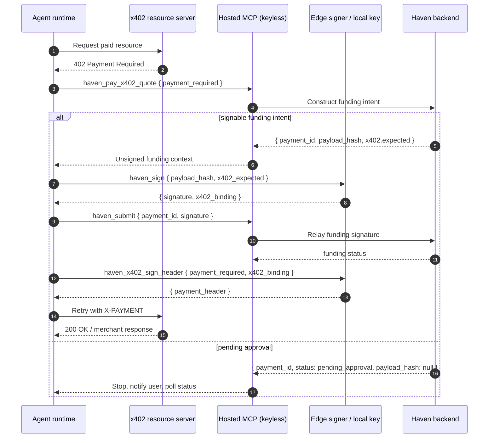

# Haven - x402 Payment Execution Sequence

How an agent pays for an x402-protected resource through Haven today.
Standard merchant-verifiable x402 support is `exact`-scheme USDC on Base and
Base Sepolia. Haven can parse some additional network/token forms for legacy
proofs and display, but they are not part of the standard settlement path.

Standard merchant x402 has two legs:

1. Haven funding leg: within budget, an agent-signed Safe AllowanceModule
   transfer funds the delegate wallet. Over budget, the user must approve and
   execute a Safe funding transaction.
2. Merchant leg: the agent signs the standard EIP-3009 `X-PAYMENT` header from
   the delegate wallet and retries the merchant/resource request.

> **This doc describes the legacy AllowanceModule rail** (import-only, existing
> accounts) with its two-leg funding model. New accounts
> (`account_type='delegator_hybrid'`) settle x402 in a **single direct leg** via
> ERC-7710 — see [Delegation rail x402](#delegation-rail-x402-new-accounts)
> below. The Smart Sessions **session rail is retired** (#834): the machine-payment
> path answers HTTP 410 for `session_key` accounts, fail-closed.

In SDK, local MCP, and generic hosted split flows, the agent retries the merchant
request. For paid MCP tools, hosted MCP can proxy the HTTP/MCP request and
deliver an already signed payment header. It remains keyless and does not act as
a facilitator/acquirer, hold merchant funds, or create the payment signature.

Source of truth:

- [`packages/sdk/src/x402.ts`](../../packages/sdk/src/x402.ts)
- [`packages/sdk/src/client.ts`](../../packages/sdk/src/client.ts)
- [`packages/backend/src/routes/x402.ts`](../../packages/backend/src/routes/x402.ts) — request
  validation, auth wiring, rate-limit config, and response serialization only.
  The authorize orchestration (scheme routing, funding-leg prep, erc7710 child
  building, the #961 replay/resume logic) and settle assembly live in
  [`packages/backend/src/modules/x402/`](../../packages/backend/src/modules/x402/index.ts)
  (#996, epic #980 M4). `x402-delegation.ts` lives inside that module (folded
  in by #998 — its only production consumers were already inside it) — it is
  the settlement *compiler* (typed-data / header assembly primitives), not
  route orchestration.
- [`packages/backend/src/domain/payment-coverage.ts`](../../packages/backend/src/domain/payment-coverage.ts)
- [`packages/mcp/src/tools.ts`](../../packages/mcp/src/tools.ts)
- [`packages/mcp-server/src/tools.ts`](../../packages/mcp-server/src/tools.ts)
- [`docs/regulatory/casp-risk-guardrails.md`](../regulatory/casp-risk-guardrails.md)

## Challenge And Header Semantics

The SDK normalizes the merchant's 402 response into a `PaymentRequired` object.
It accepts the v2 `PAYMENT-REQUIRED` header, the v1 `X-PAYMENT` challenge
header, and a JSON-body fallback. When the delegate address is known, probes
also send `x402-wallet`. The paid retry uses `X-PAYMENT`; a successful merchant
response may include `PAYMENT-RESPONSE` evidence.

`quoteX402()` and `haven_quote_x402` are read-only. They parse the challenge but
do not create a Haven payment, approval request, signature, or on-chain
transaction.

Every merchant-facing SDK fetch (probes, MCP handshakes, paid retries,
resume retries) is bounded since #1300: `config.merchantTimeout` (default
60 s — generous because a merchant may settle on-chain synchronously inside
the paid retry), caller signals combined, timeout surfaced as a clear 504
naming the URL. A non-402 quote answer is the typed
`X402UnexpectedStatusError`.

`haven_pay_mcp_tool` additionally accepts a **base merchant URL**, in BOTH
topologies (#1271, ported to the local runtime in #1301 — the discovery
helper itself lives once in `@haven_ai/sdk` and both `packages/mcp` and
`packages/mcp-server` call it): when the probe misses, it makes one bounded
same-origin discovery pass — GET `/.well-known/haven-demo-merchant` then `/`,
no redirects, off-origin `mcp_url` refused unfetched — and retries once at
the document's `mcp_url`, returning the resolved `merchant_url`. The hosted
probe's miss is the typed `X402UnexpectedStatusError` (non-402); the local
flow has no dedicated probe step (`haven.fetch()` resolves a 402 itself), so
its equivalent miss is a non-ok `Response` from the untouched first hop.
Discovery finds endpoints; payment authority is unchanged.

## Standard SDK / Local MCP Flow

```mermaid
sequenceDiagram
  autonumber
  participant Agent as Agent runtime
  participant Resource as x402 resource server
  participant SDK as Haven SDK / local MCP
  participant API as Haven backend
  participant AM as Safe AllowanceModule
  participant Safe as Haven wallet / Safe

  Agent->>SDK: quoteX402(url) / haven_quote_x402
  SDK->>Resource: Probe paid resource (x402-wallet when known)
  Resource-->>SDK: 402 + PaymentRequired
  SDK-->>Agent: Parsed quote (read-only)
  Agent->>SDK: payX402Quote / haven_pay_x402_quote
  SDK->>SDK: Build merchant EIP-3009 X-PAYMENT locally
  SDK->>API: Create funding intent (Bearer identifies agent)
  API->>AM: Read allowance + delegate balance
  alt within allowance
    API-->>SDK: Unsigned funding hash + authenticated x402 context
    SDK->>SDK: Sign funding hash with local delegate key
    SDK->>API: Submit funding signature
    API->>AM: Relay signed Safe-to-delegate funding transfer
    AM->>Safe: Transfer within approved budget
    API-->>SDK: Funding transaction
    SDK->>SDK: Wait for at least one confirmation
    SDK->>Resource: Retry original request with X-PAYMENT
    alt merchant accepts
      Resource-->>SDK: Success + optional PAYMENT-RESPONSE
      SDK-->>Agent: Merchant response
    else merchant rejects after funding
      Resource-->>SDK: Error response
      SDK-->>Agent: x402_retry_rejected_after_funding
      Note over Agent,SDK: Reconcile; sweep if delegate funds are stranded
    end
  else remaining < amount ≤ remaining + delegate balance
    API-->>SDK: pending_approval + payment id + x402 context
    SDK->>SDK: Attach resumeState
    SDK-->>Agent: Tell user to approve in Haven and preserve resume state
  else amount > remaining + delegate balance
    API-->>SDK: 422 insufficient_funds / fund_safe_or_raise_allowance
    Note over Agent,API: No payment or approval is created
  end
```

Bearer authentication identifies the agent but is never payment authority. Both
the merchant header and the Safe funding payload are signed by the local
delegate key.

## Hosted Generic Split Flow

Hosted MCP is keyless, so the funding signature and merchant header signature
are local edge-signing steps. The generic decomposed path is:


```mermaid
sequenceDiagram
  autonumber
  participant Agent as Agent runtime
  participant Resource as x402 resource server
  participant MCP as Hosted MCP (keyless)
  participant Signer as Edge signer / local key
  participant API as Haven backend

  Agent->>Resource: Request paid resource
  Resource-->>Agent: 402 Payment Required
  Agent->>MCP: haven_pay_x402_quote { payment_required }
  MCP->>API: Construct funding intent
  alt signable funding intent
    API-->>MCP: { payment_id, payload_hash, x402.expected }
    MCP-->>Agent: Unsigned funding context
    Agent->>Signer: haven_sign { payload_hash, x402_expected }
    Signer-->>Agent: { signature, x402_binding }
    Agent->>MCP: haven_submit { payment_id, signature }
    MCP->>API: Relay funding signature
    API-->>MCP: funding status
    Agent->>Signer: haven_x402_sign_header { payment_required, x402_binding }
    Signer-->>Agent: { payment_header }
    Agent->>Resource: Retry with X-PAYMENT
    Resource-->>Agent: 200 OK / merchant response
  else pending approval
    API-->>MCP: { payment_id, status: pending_approval, payload_hash: null }
    MCP-->>Agent: Stop, notify user, poll status
  end
```

Before signing the funding hash, the edge signer checks payload-hash equality,
reconstructs the canonical payment/resource/merchant/amount/asset/network/expiry
context, verifies Haven's expected-context signature against its configured
trusted signer.

> **Every field in that context must be the value Haven SIGNED, not a locally
> preferred one.** The hosted MCP relays the context; it is never a second
> opinion about what it contains. `resource_url` is the worked example
> ([#1189](https://github.com/d-hinders/Haven-AI/issues/1189)): the backend
> signs `paymentRequired.resource.url`, and the hosted surface briefly preferred
> the accepted option's own `resource` when a merchant set one. The
> reconstruction then differed by one field and the signer refused — correctly,
> but with `authentication message is invalid`, which reads as a credential
> problem rather than a field mismatch. When a relayed field looks like it has
> two plausible sources, the signed one wins by definition. Before building the merchant header, it rejects expired context
and verifies that the live challenge still matches the recorded funded context.

### Expected context v1 / v2 — which payload may be signed (#1138)

The hosted flow above works on the **delegation rail** too, with one difference
that the signer, not the caller, enforces. On that rail the account validates
the UserOp's **EIP-712 typed data**, while `payload_hash` is the bare ERC-4337
hash — a different value. Binding only the hash would leave the edge signer
endorsing bytes it cannot check, which is the opposite of the property the
binding exists to provide.

So the expected context is versioned, and the version is *derived* from its
contents rather than announced:

| Version | Carries | Signer may sign |
|---|---|---|
| v1 | no `typedDataHash` | the bare hash (raw ECDSA) — legacy rail |
| v2 | `typedDataHash` | `sign_data.typed_data` (EIP-712) — delegation rail. Preferred transport (#1263): the signer fetches the exact payload itself via `GET /x402/:id/sign-context` when handed just `payment_id` — and the hosted x402 quote tools are accordingly **compact by default** (#1272): no `typed_data`/`typed_data_b64` in the response unless `include_signing_payload=true`. Fallback (#1255): re-run the quote with the same `idempotency_key` plus that flag (the replay returns the ORIGINAL sign_data, #1207), then relay `typed_data_b64` as one opaque base64 string, unchanged. All transports land in this same digest check |

The signer refuses the mismatch **in both directions**: raw-signing the hash of
a v2 intent (the account would reject that signature on-chain, after the intent
is claimed), and signing typed data under a v1 context (no commitment to what
is being signed). It then re-derives the digest from the typed data in hand and
requires it to equal the committed one, so the Haven-signed declaration covers
the exact bytes signed. `buildX402ExpectedMessage` puts the version in both the
header line and the signed payload, so neither context can be replayed as the
other.

A version outside the table is a **third** refusal, and the one an operator is
most likely to meet (#1143). The set a given signer understands is
`SUPPORTED_X402_EXPECTED_VERSIONS` in `packages/signer/src/core.ts`; anything else
fails closed before any content check, with an error naming the received version,
the signer's ceiling, and the fix. This is not hypothetical housekeeping: the
backend deploys continuously from `dev` while a signer reaches users only on a
merge to `main`, so a signer one release behind a context bump is a structural
state. The tool schema therefore accepts any positive integer for `auth.version`
and leaves the decision to the signer — a literal there is validated by the MCP
server *before* any handler runs, which is how the original v2 rollout produced a
raw Zod string instead of a Haven diagnosis. Widening the schema widened the error
path only; an unrecognised version was never signable and still is not. Symptom
strings per signer age are tabulated in
[`mcp-runtime-compatibility.md`](../operations/mcp-runtime-compatibility.md).

That refusal is still *reactive* — the agent learns by quoting and then failing
to sign. Since [#1155](https://github.com/d-hinders/Haven-AI/issues/1155) both
halves of the comparison are also available **before** anything is signed:
`haven_pay_x402_quote` and `haven_pay_mcp_tool` return
`signer_compatibility.x402_expected_context_version` (the version that quote will
emit), and the signer states the set it verifies at its own MCP `initialize`.
The comparison is necessarily agent-mediated — the two servers cannot introspect
each other, and only the client sees both handshakes — so this layer ships
information and a prompt, never a gate. A mismatch is **advisory**: nothing that
succeeded before fails now, and the signing-time refusal above remains the
enforcement point. See
[`mcp-runtime-compatibility.md`](../operations/mcp-runtime-compatibility.md#detecting-skew-before-a-payment-1155).

Delegation-rail UserOp signing is **local-signer-only** — the hosted/edge
keyless path never signs an account UserOp. That is a non-custody and CASP-scope
boundary (owner decision, 2026-08-06), not a sequencing preference.

## Hosted Paid-MCP-Tool Flow

The recommended three-call fast path for an x402-protected MCP tool is:

1. `haven_pay_mcp_tool` — hosted MCP sends a `tools/call` probe, records the MCP
   transport context, and returns the unsigned funding payload plus merchant/tool
   context.
2. `haven_sign_x402` — the local signer signs the funding hash and creates the
   merchant-bound payment header.
3. `haven_settle_mcp_tool` — hosted MCP relays the funding signature, waits for
   confirmation, performs a fresh merchant MCP handshake, delivers the signed
   header, and returns the tool result.

The decomposed alternative is:

```text
haven_pay_mcp_tool
  → haven_sign
  → haven_submit
  → haven_x402_sign_header
  → haven_complete_mcp_tool
```

If the merchant rejects after funding, hosted MCP returns
`MERCHANT_REJECTED_AFTER_FUNDING`. The delegate may hold stranded funds; retain
the payment id and inspect and reconcile the attempt before using
`haven_sweep_delegate`. Do not silently retry or abandon a confirmed balance.

## Approval Resume

When `remaining allowance < amount ≤ remaining allowance + delegate balance`,
Haven queues a pending approval. Amounts above total coverage return 422 with
`fund_safe_or_raise_allowance` and create no approval; the agent must stop until
funding or rules change.

For the SDK, the correct approval behavior is:

1. Preserve the returned `paymentId`, `idempotencyKey`, and `resumeState` when
   available.
2. Tell the user the payment is waiting in Haven.
3. The user approves and executes the Safe funding transaction in Haven.
4. Poll `getPaymentStatus(paymentId)`. The lifecycle can progress through
   `pending`, `approved`, and, for multisig, `proposed`; only `executed` returns
   `nextAction: "retry_original_x402_request"`.
5. When that next action is returned, call
   `resumeX402Payment`.
6. Retry the original merchant/resource request with `X-PAYMENT`.

MCP tools expose related state with their own wire conventions: local MCP
normalizes most fields to camelCase while retaining `resume_state`; backend HTTP
responses use snake_case. Local MCP can use `haven_resume_x402_payment`.

Hosted MCP approval resume is not currently completable through the edge signer
tools: its resume response omits the `payload_hash`, authenticated
`x402.expected`, and `x402_binding` required to sign funding or the merchant
header. Do not pass that response to `haven_sign`, `haven_sign_x402`, or
`haven_x402_sign_header`. Until that contract is fixed, use the SDK/local MCP
approval path for an x402 payment that may require user approval.

If the process restarted and only the payment id remains, call
`getResumeState(paymentId)` after execution to rehydrate Haven's stored x402
context. Haven stores payment context, not the agent's local request stream, so
request bodies, tool names, and tool arguments may still need to be preserved or
reconstructed. SDK and hosted MCP tool completion establish a fresh MCP
transport session; callers do not need to preserve the old session id.

## Differences From Direct Payments

| Concern | Direct `/payments` | x402 |
|---|---|---|
| Payment target | Recipient address from agent intent | Merchant `payTo` from HTTP 402 challenge |
| Amount units | Human decimal string | Atomic amount from x402 option |
| Agent action after funding | None for direct confirmed payment | Retry original merchant/resource request |
| Header sent to merchant | None | `X-PAYMENT` |
| Payment authority | Delegate signature + on-chain allowance | Same for funding leg; EIP-3009 signature for merchant leg |
| Approval resume | Poll payment status | Poll status, then resume original x402 request |

The legacy rail's `payment_intents`/`approval_requests` INSERTs are the SAME
rail-agnostic `infra/repositories/` writers the mpp module uses for its own
rails (`modules/mpp/`, #997) — `modules/x402/legacy-authorize.ts` and
`modules/x402/delegation-authorize.ts` call them directly rather than through
a `lib/machine-payments.ts` pass-through (removed by #997: it added no logic
over the repository call and kept x402 coupled to a private mpp file once
mpp's own orchestration moved into its module). Token resolution
(`resolvePaymentToken`) is genuinely shared between the two modules and lives
in `src/domain/payment-token.ts` for the same reason.

## Delegation rail x402 (new accounts)

On the delegation rail (#830, epic #821) there is **no funding leg and no delegate
EOA to strand**. The agent's budget delegation *is* the settlement instrument:
funds move `account → merchant` directly, and the on-chain caveat enforcers meter
the period budget as part of the settlement itself.

The flow is a two-call variant of `/x402/authorize`:

1. `POST /x402/authorize` resolves the account's rail from agent auth. For a
   delegation account it builds a **settlement child delegation** and returns the
   EIP-712 `typed_data` the agent must sign — not an AllowanceModule funding hash,
   and it never queues an approval (over-budget/wrong-recipient reverts on-chain).
2. The agent signs that typed data VERBATIM with its delegate key (the #829
   lesson) and submits `{ signature }` to `POST /x402/:id/settle`. Settle
   **recovers the signer** from the child delegation's EIP-712 payload and
   compares it to the agent's `delegate_address` *before* the intent status
   flips ([#1053](https://github.com/d-hinders/Haven-AI/issues/1053) review,
   finding 3). A malformed signature or one from the wrong key is a `400` with
   the intent left signable — the client re-signs the same `sign_data`; nothing
   is burned. (Recovery lives in
   [`rails/delegation-policy.ts`](../../packages/backend/src/rails/delegation-policy.ts)
   as `recoverDelegationSigner`, not in the route: `routes/**` may not import
   viem under the chain-SDK boundary rule.)
3. Haven assembles the merchant-facing `X-PAYMENT` header using MetaMask x402's
   `erc7710` payload
   (`{ delegationManager, permissionContext, delegator }`
   — [`x402-delegation.ts`](../../packages/backend/src/modules/x402/x402-delegation.ts)).
   The agent retries the merchant with that header, and the merchant settles the
   payment directly from the account through the DelegationManager.

   The response also carries `passport` — `{ attestation_uid, chain_id }` (plus
   an optional convenience `verify_url`) or `null`
   ([#976](https://github.com/d-hinders/Haven-AI/issues/976)),
   so the agent can PRESENT its passport rather than have the merchant discover
   it. It is deliberately **outside** the `X-PAYMENT` payload: that payload is
   parsed by a facilitator Haven does not control, and an unrecognised key is a
   rejection risk. `null` whenever nothing is verifiable, and a lookup **error**
   never fails the payment (it degrades to `null`; a lookup *hang* is a
   different case, handled by ordering the lookup before the status `UPDATE`).
   On the EIP-3009 path the reference cannot ride the
   payment at all — see the delivery matrix in
   [`11-agent-passport-schema.md`](11-agent-passport-schema.md).

The intent moves to `submitted`; final settlement is observed through the
merchant/receipt path. `POST /x402/:id/settle` is Base-only and, as of this
writing, sits on the OpenAPI drift check's `KNOWN_UNDOCUMENTED_ROUTES` allowlist
pending the epic docs sweep (#834). Operational detail (gas sponsorship, vendor
dependencies): [`delegation-rail-vendor-ops.md`](../operations/delegation-rail-vendor-ops.md);
security model: [`delegation-rail-security-model.md`](../security/delegation-rail-security-model.md).

### What the settlement child delegation actually constrains

The child built by
[`x402-delegation.ts`](../../packages/backend/src/modules/x402/x402-delegation.ts) is
issued to `ANY_BENEFICIARY` (`0x…0a11`) unconditionally. When the 402 names
facilitator addresses, the **redeemer caveat** — not the `to` field — is what
restricts who may redeem; pinning `to` to the first entry (the pre-#1061
behaviour) silently contradicted a multi-entry caveat and would have failed for
every facilitator but the first.

Since [#1058](https://github.com/d-hinders/Haven-AI/issues/1058) the redeemer
list IS populated in practice: the client forwards the 402 entry's
`extra.facilitatorAddresses` (MetaMask's erc7710 shape, validated 1–16
addresses) into `POST /x402/authorize`, the child's redeemer caveat is built
from the normalized addresses, and the **verbatim** strings are stored with the
settle state and echoed in the v2 X-PAYMENT header's accepted entry — required,
because @x402/core's v2 matcher demands the advertised `extra` as a subset of
the echo. The demo merchant advertises its settlement account this way, so the
QA leg exercises the pinned path end-to-end.

When a merchant advertises **no** facilitators there is nothing to pin and the
child remains a bearer instrument — whoever holds it can redeem it — within
hard bounds that are the actual guarantee:

- the **exact** payment amount (`erc20TransferAmount` scope),
- **pinned to the merchant** `payTo`,
- an expiry of **≤600 s**.

The ceiling of that exposure is "the merchant gets paid without delivering",
never loss of funds beyond the quoted amount.

### Settlement-scheme reality and the EIP-3009 bridge

Redeeming the `[child, budget]` chain requires **facilitator-side erc7710
support**, and adoption is still thin: as of the 2026-07 catalog probe, ≈every
real x402 merchant is **EIP-3009-only**. erc7710 alone therefore left
delegation-rail accounts (the default for new accounts) with no route to most
merchants — so the rail now selects a settlement scheme **per payment**
([#946](https://github.com/d-hinders/Haven-AI/issues/946), shipped and
live-proven 2026-07-18; design of record: RFC
[#791](https://github.com/d-hinders/Haven-AI/issues/791) §18 "B4-D").

**How the scheme is chosen.** The `modules/x402/` authorize orchestration
(`scheme-selection.ts`, since #996) keys on the authorize request's
`payTo` shape — which is exactly the standard-x402 SDK contract, so existing
SDKs gained delegation-rail merchant reach with no client change:

| `payTo` | Scheme | Merchant sees |
|---|---|---|
| the merchant address | **erc7710 direct settlement** (unchanged) | the delegation chain, redeemed in-band |
| the agent's own delegate EOA (+ required `merchantPayTo`) | **EIP-3009 fallback** | a standard header from the delegate EOA |

**The erc7710 `X-PAYMENT` header is x402 v2-shaped (#1064):** alongside the
scheme payload it ECHOES the accepted requirements entry (`accepted`:
scheme/network/amount/payTo/asset/maxTimeoutSeconds +
`extra.assetTransferMethod: 'erc7710'`) — @x402/core v2 merchants match the
echo field-for-field before touching the chain, and the quoted
`maxTimeoutSeconds` must round-trip (stored at authorize; pre-#1064 intents
echo the 300 default their child expiry was built with). The v1 payload-only
shape made every v2 merchant reject with a generic failure — caught by the
#1064 QA leg's first live run.

An explicit `settlementScheme` field is validated against that shape on every
rail, so a confused client fails loudly instead of silently getting the wrong
flow. Native-token x402 is still rejected on this rail (no ERC20 transfer to
pin or meter). The chosen scheme is recorded on the intent
(`machine_metadata.settlement_scheme`, alongside `network`) so 3009-mode usage
is auditable and its eventual retirement measurable — as of #1061 the
**erc7710 branch records it too**, so the accounting feed can tell the two
schemes apart without parsing `prepared_user_op`. Since
[#1059](https://github.com/d-hinders/Haven-AI/issues/1059) the hash semantics
are honest too: `delegation_hash` records the instrument the agent **signed**
for the intent (the settlement CHILD on erc7710, the budget on the 3009
funding leg and on direct `/payments` transfers), while
**`budget_delegation_hash`** always records the METERING budget — the same
question answered uniformly, so the accounting feed's attribution reads one
column regardless of scheme (exposed per receipt in
`/machine-payments/receipts`). NULL on legacy-rail intents and on rows
predating migration 053; derived backfill was deliberately skipped.

Since #717 every relayer-paid leg (allowance transfers, sweeps, deploys)
also runs under a per-identity **relayer gas budget** (`relayer_gas_events`,
migration 054): over-cap requests get a 429 with the intent left pending —
never burned to failed — and every submitted relayer tx is recorded with its
receipt's gas numbers for cost attribution. Availability guard, not a funds
gate: it fails open on database errors because funds stay caveat-gated
on-chain either way.

Since #994 the x402 route reaches the chain only through the `ChainClient`
port and `infra/chain/` modules (binding-signer consolidated there) — the
route file itself imports no chain SDK.
Since #1130 agent authentication ahead of every x402 call distinguishes a
pending agent (`403 agent_pending_approval`, actionable) from a bad key
(`401`) — the compound misdiagnosis from #1129's URL confusion is now
separable. Since #993 the x402 authorize entry point also runs the
retired-session gate: a session-marked account gets the seam's 410 (nothing written) before
either scheme branch — it can no longer slip into the legacy AllowanceModule
flow below.

**How 3009-mode works.** EIP-3009 (`transferWithAuthorization`) is ECDSA-based —
the fund-holder must be an **EOA** that signs (USDC rejects EIP-1271 for it),
which neither Hybrid can do — so 3009-mode redeems the budget delegation to
**transiently fund the agent EOA** (a sponsored UserOp the agent signs; caveats
run on-chain at gas estimation), which then signs the standard header. One
budget delegation meters direct transfers, erc7710 settlement, and 3009 funding:
revoke once, everything stops. (The owner-side revoke signature picks its
scheme per DEVICE — a multi-signer account signs with whichever of its
signers is reachable, never forced onto the owner wallet; security model §6.)

**Pins are never weakened.** A recipient-pinned budget delegation structurally
cannot fund the EOA (the pin locks the transfer to the merchant), so
**pinned agents stay erc7710-only** — an owner decision recorded on #946, not a
limitation to engineer around. 3009-mode requires an open (unpinned) budget.

This is a deliberate, temporary interop bridge that **reintroduces a bounded
funding leg** (transient hot balance + sweep) — accepted because an agent that
can pay with a short-lived hot balance beats one that cannot pay at all;
erc7710 stays the long-term goal. The exposure is bounded by exact-amount
funding, the capped header window, the delegate-balance monitor, and the
rail-agnostic sweep (which recovers residuals to the treasury Hybrid).

(Treasury-op note, shared machinery: ops against the treasury Hybrid pin its
DEPLOYED address; for a still-counterfactual account — a zero-agent account
enrolling its first backup signer — the op instead carries initCode derived
from the full stored signer config, with the derived address checked against
the stored pin. Deploy and the signer change ride one sponsored op; no
relayer draw on that path.)

**Hardening on the authorize path** ([#961](https://github.com/d-hinders/Haven-AI/issues/961)):
an idempotent retry **resumes** — `sign_data` is reconstructed from the stored
intent rather than re-running a sponsored estimation, a confirmed retry replays
the receipt, and a stale pending row is lazily expired so its key frees;
one-shot authorize+execute is refused (a signature over not-yet-prepared state
can never be valid); and the per-agent hourly x402 cap now guards the delegation
branch too — placed after the replay lookup (replays are never rate-limited) but
before any sponsored prepare, making it sponsorship-cost protection as well.

Further hardening with #1061: a non-numeric `maxTimeoutSeconds` is a `400` at
the top of authorize rather than a `NaN` that clamps through into a `502`; and
`delegationRailBundlerUrl()` asserts that a chain-scoped bundler URL names the
chain being requested. `DELEGATION_RAIL_BUNDLER_URL` is a single value while two
chains are enabled, so a mismatched env now fails at first use with a config
error instead of quietly routing a payment at the wrong chain's bundler.

## Guardrails

- Data access for this flow lives in `packages/backend/src/infra/repositories/`
  (`x402-authorizations.ts`, `payment-intents.ts`, `approval-requests.ts`, #995) —
  routes hold the control flow only, and every statement (idempotency lookups,
  the #961 stale-replay refresh, the settle flip) is PREPARE-checked against the
  real schema in CI via `db-schema-smoke`.
- Keep x402 budgets small and reset-bound.
- Treat the delegate key as a hot payment key for x402.
- Reconcile or sweep stranded delegate balances before scaling.
- Do not describe demo x402 endpoints as production merchant settlement,
  facilitator, acquiring, fiat/card, or merchant-of-record products.
- Use [`docs/regulatory/casp-risk-guardrails.md`](../regulatory/casp-risk-guardrails.md)
  before changing x402/MPP flows or merchant-facing demos.
