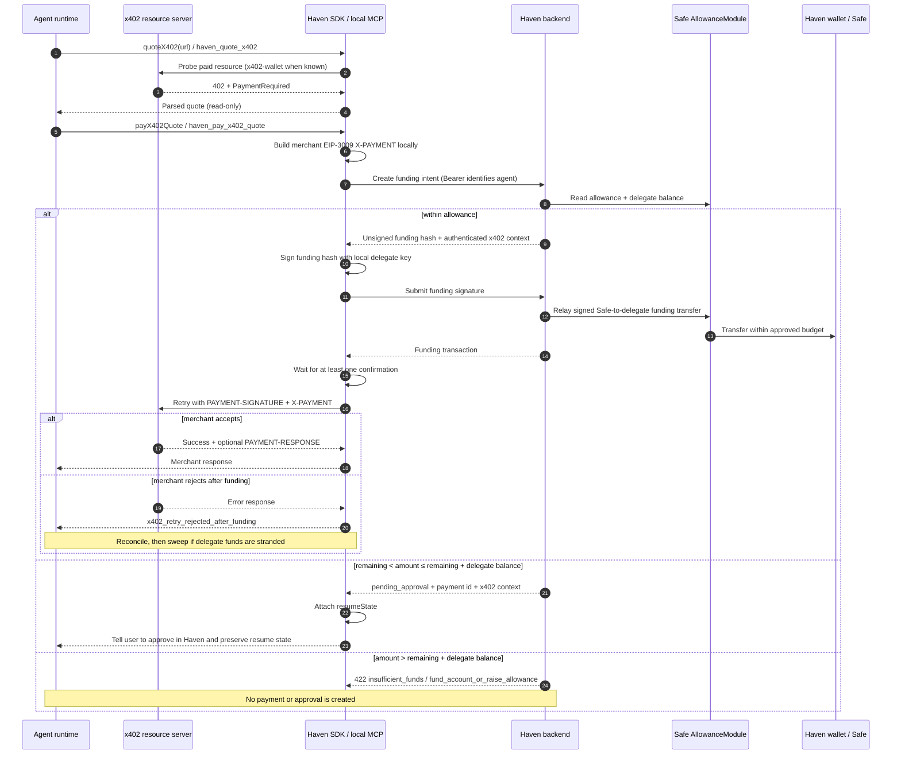
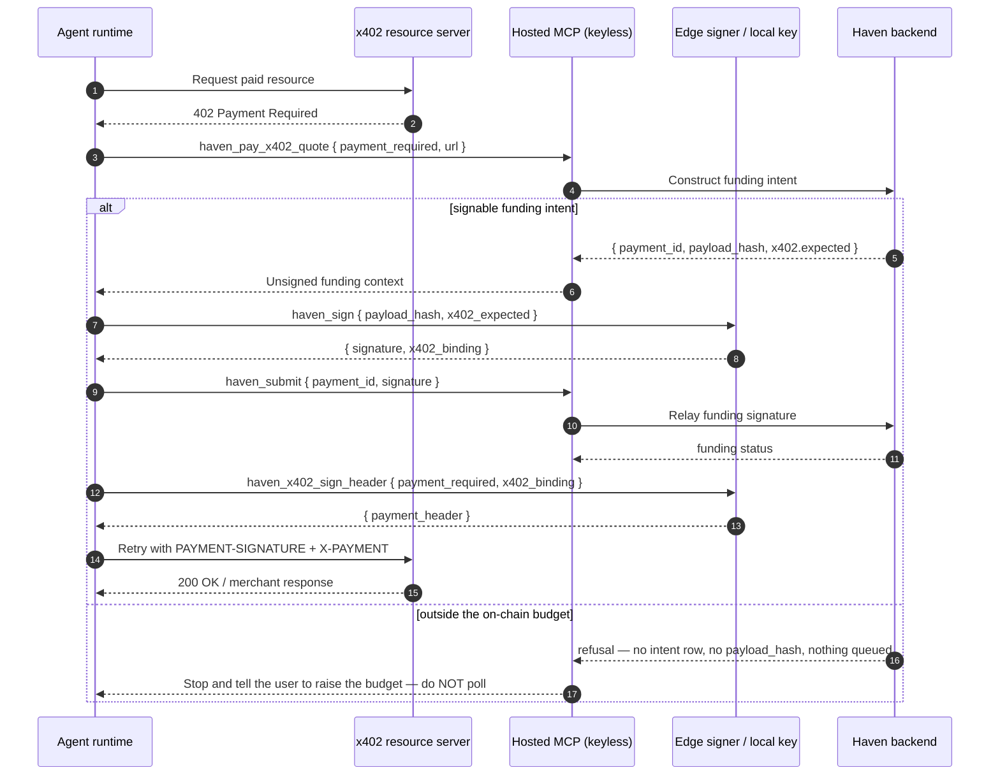

# Haven - x402 Payment Execution Sequence

How an agent pays for an x402-protected resource through Haven today.
Standard merchant-verifiable x402 support is `exact`-scheme USDC on Base and
Base Sepolia. Haven can parse some additional network/token forms for legacy
proofs and display, but they are not part of the standard settlement path.

The live delegation-rail merchant x402 flow is scheme-specific:

1. On `erc7710`, the agent signs the settlement context and the merchant
   redeems the payment directly from the delegated account; there is no funding
   leg or delegate hot balance.
2. On EIP-3009, Haven may first relay a signed funding leg to the delegated
   account, then the agent signs the merchant payment header locally and
   retries the merchant/resource request.

> ⚠️ **The legacy AllowanceModule two-leg described below NO LONGER RUNS.**
> Under epic #1440 the Safe rail was closed and then fail-closed for spending
> (sequence in the [decision log](../archive/decision-log.md#2026-08-14--retire-the-safe-rail-entirely-1440)):
> `POST /x402/authorize`, `POST /x402`,
> `POST /payments`, `POST /payments/:id/sign` and `POST /machine-payments/send`
> all answer **HTTP 410** for an `allowance_module` account — nothing written,
> no Safe→delegate funding transfer, no delegate hot balance. The sequence
> below is kept as the record of what the rail DID. The code that implemented
> it **has now been deleted** by #1987 — `modules/x402/legacy-authorize.ts` in
> full, along with the AllowanceModule transfer, transfer-hash generation and
> the allowance-nonce coordinator it drove. Read it as history: not behaviour
> you can invoke, and no longer behaviour in the tree. Account, balance and history rows are untouched
> and still readable to a direct database query, but since #2413 no account, agent or
> dashboard surface displays them. Transaction history is the exception:
> `GET /transactions` has no rail predicate on either its account or its agent list and
> still spans every row.
>
> The live rail is the delegation rail: new accounts
> (`account_type='delegator_hybrid'`) settle x402 in a **single direct leg** via
> ERC-7710 — see [Delegation rail x402](#delegation-rail-x402-new-accounts)
> below. The Smart Sessions **session rail is retired** (#834) and answers its
> own, distinct HTTP 410 for `session_key` accounts; both tombstones coexist on
> the rail seam (`rails/execution-rail.ts`).

In SDK, local MCP, and generic hosted split flows, the agent retries the merchant
request. For paid MCP tools, hosted MCP can proxy the HTTP/MCP request and
deliver an already signed payment header. It remains keyless and does not act as
a facilitator/acquirer, hold merchant funds, or create the payment signature.

Source of truth:

- [`packages/sdk/src/x402.ts`](../../packages/sdk/src/x402.ts)
- [`packages/sdk/src/client.ts`](../../packages/sdk/src/client.ts) — the public
  `HavenClient` facade. Since #1618 (epic #1613) it delegates the x402 lifecycle
  rather than implementing it.
- [`packages/sdk/src/x402-protocol.ts`](../../packages/sdk/src/x402-protocol.ts) —
  what BOTH settlement schemes share: quote/receipt/resume shapes, the merchant
  request snapshot a resume replays, the `x402-wallet` header, and the checks
  that decide whether a payment is resumable at all.
- [`packages/sdk/src/x402-funding-leg.ts`](../../packages/sdk/src/x402-funding-leg.ts) —
  what only the EIP-3009 two-hop scheme has: funding confirmation, the
  delegate's fundability check (#1521), header minting from the local delegate
  key, and the authorization-keyed receipt cache. The erc7710 direct-settlement
  path has no funding leg and must not import this module; a test enforces that
  the protocol layer never does either.
- [`packages/sdk/src/x402-erc7710.ts`](../../packages/sdk/src/x402-erc7710.ts) —
  the direct-settlement lifecycle (#1619): scheme and rail selection, the
  authorize/settle halves the hosted topology drives with the local signer in
  between, and the refusals that keep it from ever silently rerouting to the
  3009 path. It asks no chain anything, because on this path there is no
  funding transaction to confirm and no delegate balance to check.
- [`packages/sdk/src/mcp-merchant-transport.ts`](../../packages/sdk/src/mcp-merchant-transport.ts) — bounded paid MCP/merchant HTTP delivery, sessions, and SSE framing.
- [`packages/sdk/src/merchant-completion.ts`](../../packages/sdk/src/merchant-completion.ts) —
  what must be true AROUND a merchant call once a payment exists (#1620): which
  wallet the merchant sees, what the payment's live state permits, and the
  evidence written afterwards. Scheme-neutral, so the erc7710 and 3009 paths
  finish through the same door. Every write here is best-effort and swallows:
  the resource is already paid for, and bookkeeping that threw would turn a
  completed payment into a reported failure.
- [`packages/sdk/src/payment-state.ts`](../../packages/sdk/src/payment-state.ts) — shared payment-state/status-error normalization.
- [`packages/backend/src/routes/x402.ts`](../../packages/backend/src/routes/x402.ts) — auth
  wiring, rate-limit config, and response serialization only. Since
  [#3031](https://github.com/d-hinders/Haven-AI/issues/3031) the request
  SHAPE is not checked here either: the plugin enforces this
  module, so an off-spec body is refused
  before the handler and the route keeps only the rules JSON Schema cannot
  state (a non-zero amount, a network this agent's chain can settle, the
  64 KB bound on `paymentRequired`).
  The authorize orchestration (scheme routing, funding-leg prep, erc7710 child
  building, the #961 replay/resume logic) and settle assembly live in
  [`packages/backend/src/modules/x402/`](../../packages/backend/src/modules/x402/index.ts)
  (#996, epic #980 M4). `x402-delegation.ts` lives inside that module (folded
  in by #998 — its only production consumers were already inside it) — it is
  the settlement *compiler* (typed-data / header assembly primitives), not
  route orchestration.
- [`packages/mcp/src/tools.ts`](../../packages/mcp/src/tools.ts)
- [`packages/mcp-server/src/tools.ts`](../../packages/mcp-server/src/tools.ts) — the hosted facade: since #2812 a composition-only facade (no handler, no tool-specific branching; every hosted tool is owned by a capability module under [`src/tools/`](../../packages/mcp-server/src/tools/paid-mcp-completion.ts))
- [`packages/mcp-server/src/tools/state-direct-recovery.ts`](../../packages/mcp-server/src/tools/state-direct-recovery.ts) — the hosted state, direct-payment and recovery handlers since #2809, including `haven_submit`'s settlement-scheme branch and both expiry mappings
- [`packages/mcp-server/src/tools/paid-mcp-completion.ts`](../../packages/mcp-server/src/tools/paid-mcp-completion.ts) — the hosted paid-MCP completion since #2812: `haven_complete_mcp_tool` and `haven_settle_mcp_tool` plus the merchant delivery / context-rehydration helpers, carrying the #2282 resolve-before-relay ordering
- [`packages/backend/src/modules/mpp/reconciliation.ts`](../../packages/backend/src/modules/mpp/reconciliation.ts) — `POST /machine-payments/reconciliation-events`, and the #2292 acceptance-is-terminal precedence rule.
- [`docs/regulatory/casp-risk-guardrails.md`](../regulatory/casp-risk-guardrails.md)

## Challenge And Header Semantics

The SDK normalizes the merchant's 402 response into a `PaymentRequired` object.
It accepts the v2 `PAYMENT-REQUIRED` header, the v1 `X-PAYMENT` challenge
header, and a JSON-body fallback. When the delegate address is known, probes
also send `x402-wallet`. On the EIP-3009 path the paid retry sets **both**
payment header names to the same value — the v2 `PAYMENT-SIGNATURE` and the v1
`X-PAYMENT` (#2289) — so a strict merchant on either version reads it. On
erc7710 the retry sends `PAYMENT-SIGNATURE` **alone** (#2341): that header
carries a whole delegation chain, and duplicating it under both names crossed
Node's default 16 KB header ceiling and turned every erc7710 settlement into
an HTTP 431. A successful merchant response may include `PAYMENT-RESPONSE`
evidence.

**Native MCP transport profile (#3118).** A merchant following the official
x402 MCP transport specification (`x402-foundation/x402`,
`specs/transports-v2/mcp.md`) never answers HTTP 402. Its challenge is a tool
RESULT under HTTP 200 with `isError: true`, the `PaymentRequired` object as
`structuredContent` and `JSON.stringify` of it as the text content; the
payment travels in the `tools/call` request's
`params._meta["x402/payment"]` as a JSON object (the same v2 envelope the
`PAYMENT-SIGNATURE` header carries base64-encoded); settlement comes back in
`result._meta["x402/payment-response"]` (`{ success, transaction, network,
payer }`). The SDK reads all three beside the HTTP forms, which are retained
unchanged: `quoteX402` / `quoteMcpX402` / `fetch()` quote a payment-required
tool result exactly like a 402 (structured content first, text fallback
second, both through `normalizePaymentRequired`, so an ordinary tool error or a
successful result that merely resembles a challenge is never a payment
demand); the paid retry sends the header AND, when the body is a `tools/call`
request, the `_meta` object — unrelated `_meta` keys, arguments and the id are
preserved, and any other body is sent byte-for-byte; `PAYMENT-RESPONSE` is
read first, and when absent the `_meta` settlement is re-encoded as base64 JSON
so the evidence report's receipt payload goes through the one existing
decoder — on the hosted completion and on the local `fetch()` retry alike.
An SSE-framed paid answer is collapsed to its result whether or not a session
was established (a profile merchant on a plain URL answers without one): the
hosted completion always collapses, and `fetch()` collapses the paid retry
once the merchant has spoken JSON-RPC (a session or a tool-result challenge)
while a non-402 pass-through that never did is returned as it came; and the
collapse happens only when the stream carries a JSON-RPC result or error —
an SSE answer made of anything else is returned as it came, never reduced to
its last frame. The
Bazaar handshake signal is read from the tool-result challenge as well as
from a 402 body. Only a JSON or SSE body is read when a non-402 answer is
probed for a challenge, and the local paid retry reads a JSON or SSE answer
once for its tool result; any other body is returned untouched, never
buffered. Two in-band outcomes are REJECTIONS, never successes, whatever the
status code: an `isError: true` payment-required result on the paid retry
(the tool's content was withheld), and a `_meta` settlement with
`success: false`. A settlement object without a boolean `success` is not a
settlement statement and no transaction is taken from it. Merchants on Haven's
HTTP-402-over-MCP layering (including the demo merchant) see one change only:
their `tools/call` body now carries a `_meta` key they may ignore.

`quoteX402()`, `haven_quote_x402`, `haven_quote_mcp_tool`, and
`haven_quote_catalog_purchase` are read-only. The MCP variants establish the
merchant session and send an unpaid `tools/call` probe (and may read the public
agent delegate address to send `x402-wallet`), but none creates a Haven payment,
approval request, signature, funding operation, paid merchant retry, or
on-chain transaction. Every quote is informational rather than a price
reservation or payment authority.

Every merchant-facing SDK fetch (probes, MCP handshakes, paid retries,
resume retries) is bounded since #1300: `config.merchantTimeout` (default
**300 s**, calibrated to the protocol contract — the merchant's own
`maxTimeoutSeconds: 300` and viem's 180 s settlement wait; a test pins the
default at or above it), caller signals combined, timeout surfaced as the
typed `MerchantTimeoutError` (504, names the URL). A non-402 quote answer
carrying no native-profile tool-result challenge (#3118) is the typed
`X402UnexpectedStatusError`. A timeout AFTER confirmed funding is
routed to `MERCHANT_UNRESPONSIVE_AFTER_FUNDING` with verify-then-sweep
guidance — an unanswered retry is not proof of rejection, and the merchant
may still settle late against its valid EIP-3009 authorization.

Since #1308 the hosted purchase responses — and, since #3102, the hosted
refusals too — carry a **structured next-step
contract**: `next_action` (values from the existing AgentPaymentNextAction
taxonomy), `next_tool` + small literal `next_arguments` (or
`next_tool_omitted_reason`, #3101), `safe_to_continue`
(false on the retained fail-closed `pending_approval` branch — on BOTH quote
tools and on the settle tool's non-payable-funding branch), a compact
`agent_summary`, and an advisory `warnings[]` (MISSING_MAX_AMOUNT absorbs the
#1275 cap nudge; QUOTE_EXPIRES_SOON; MERCHANT_URL_DISCOVERED). Warnings never
replace refusals; failure codes stay authoritative.

> **`safe_to_continue: false` is still a value the contract carries, but it is
> a DECLINE, not a queue** (#2121). The `pending_approval` status behind it is
> not minted by any live rail — the legacy rail answers 410 (#1986), the
> delegation rail refuses at prepare with nothing written, and
> `approval_requests` was dropped with its table by #2055. The branches are
> deliberately **retained fail-closed** (#2101/#2113) for a row stored before
> the retirement, and their verdict is `next_action:
> stop_and_tell_user`, never `wait_for_user_approval`. An over-budget amount
> on the delegation rail never reaches this field at all: it is refused at
> `POST /x402/authorize` (#2082). Read `safe_to_continue: false` as *stop and
> tell the user to raise the budget* — never as *wait for an approval*.

Since #1349, a successful hosted `haven_settle_mcp_tool` also places the default
reporting contract at `agent_summary.purchase_summary`: `{ status: 'settled',
product, amount, amount_atomic, asset, network, merchant, invoice_id,
funding_tx_hash, settlement_tx_hash, allowance }`. Haven payment state supplies
settlement status, money, merchant identity, and funding fields. `product` and
`invoice_id` are narrow merchant display metadata; `settlement_tx_hash` is an
optional merchant `PAYMENT-RESPONSE` (or, since #3118,
`_meta["x402/payment-response"]`) receipt reference, not Haven settlement
proof. Missing values are explicit `null` — on erc7710, `funding_tx_hash` is
always `null` (no funding leg; #3423), never back-filled from the settlement
hash the scheme's `payment.txHash` otherwise carries. The top-level raw
`result` remains advanced merchant evidence and never decides whether Haven
reports settlement.

Hosted `haven_pay_mcp_tool` additionally accepts a **base merchant URL**
(#1271): when the probe misses (non-402), it makes one bounded same-origin
discovery pass — GET `/.well-known/haven-demo-merchant` then `/`, no
redirects, off-origin `mcp_url` refused unfetched — and retries once at the
document's `mcp_url`, returning the resolved `merchant_url`. Discovery finds
endpoints; payment authority is unchanged.

`haven_pay_mcp_tool` additionally accepts a **base merchant URL**, in BOTH
topologies (#1271, ported to the local runtime in #1301 — the discovery
helper itself lives once in `@haven_ai/sdk` and both `packages/mcp` and
`packages/mcp-server` call it): when the probe misses, it makes one bounded
same-origin discovery pass — GET `/.well-known/haven-demo-merchant` then `/`,
no redirects, off-origin `mcp_url` refused unfetched — and retries once at
the document's `mcp_url`, returning the resolved `merchant_url`. The hosted
probe's miss is the typed `X402UnexpectedStatusError` (non-402); the local
flow has no dedicated probe step (`haven.fetch()` resolves a 402 itself), so
its equivalent miss is a non-ok `Response` from the untouched first hop.
Discovery finds endpoints; payment authority is unchanged.

## Historical SDK / Local MCP Flow — retired AllowanceModule rail


```mermaid
sequenceDiagram
  autonumber
  participant Agent as Agent runtime
  participant Resource as x402 resource server
  participant SDK as Haven SDK / local MCP
  participant API as Haven backend
  participant AM as Safe AllowanceModule
  participant Safe as Haven wallet / Safe

  Agent->>SDK: quoteX402(url) / haven_quote_x402
  SDK->>Resource: Probe paid resource (x402-wallet when known)
  Resource-->>SDK: 402 + PaymentRequired
  SDK-->>Agent: Parsed quote (read-only)
  Agent->>SDK: payX402Quote / haven_pay_x402_quote
  SDK->>SDK: Build merchant EIP-3009 X-PAYMENT locally
  SDK->>API: Create funding intent (Bearer identifies agent)
  API->>AM: Read allowance + delegate balance
  alt within allowance
    API-->>SDK: Unsigned funding hash + authenticated x402 context
    SDK->>SDK: Sign funding hash with local delegate key
    SDK->>API: Submit funding signature
    API->>AM: Relay signed Safe-to-delegate funding transfer
    AM->>Safe: Transfer within approved budget
    API-->>SDK: Funding transaction
    SDK->>SDK: Wait for at least one confirmation
    SDK->>Resource: Retry with PAYMENT-SIGNATURE + X-PAYMENT
    alt merchant accepts
      Resource-->>SDK: Success + optional PAYMENT-RESPONSE
      SDK-->>Agent: Merchant response
    else merchant rejects after funding
      Resource-->>SDK: Error response
      SDK-->>Agent: x402_retry_rejected_after_funding
      Note over Agent,SDK: Reconcile, then sweep if delegate funds are stranded
    end
  else remaining < amount ≤ remaining + delegate balance
    API-->>SDK: pending_approval + payment id + x402 context
    SDK->>SDK: Attach resumeState
    SDK-->>Agent: Tell user to approve in Haven and preserve resume state
  else amount > remaining + delegate balance
    API-->>SDK: 422 insufficient_funds / fund_account_or_raise_allowance
    Note over Agent,API: No payment or approval is created
  end
```

Bearer authentication identifies the agent but is never payment authority. Both
the merchant header and the Safe funding payload are signed by the local
delegate key.

## Hosted Generic Split Flow

Hosted MCP is keyless, so the funding signature and merchant header signature
are local edge-signing steps. The diagram below is the **EIP-3009 shape** of
the generic decomposed path — since
[#2041](https://github.com/d-hinders/Haven-AI/issues/2041) it is one of two: a
delegation-rail account at a merchant advertising
`extra.assetTransferMethod: "erc7710"` takes the erc7710 shape recorded
immediately after it instead.

**Where the paid retry goes (#3097).** The merchant's 402 declares
`resource.url`; Haven records that declaration as the resource's identity (the
binding message, the intent row and the resume checks all compare against it),
but the request that carries `PAYMENT-SIGNATURE` goes to the URL the caller
quoted whenever one exists. The hosted quote returns it as `request_url`, the
agent passes it back as `url` to `haven_pay_x402_quote` (and to
`haven_resume_x402_payment`), and both answer with `retry_url` — the one URL
the agent retries — beside `resource_url` and
`resource_url_differs_from_request`. A retry target that is not `https` (nor
loopback / a reserved test host) is refused with `INSECURE_RETRY_TARGET` before
any intent exists; on the SDK and local paths the same rule sits on the one
seam every paid retry crosses (`McpMerchantTransport.deliverPayment`; on the
MCP-merchant family that is after funding, and the hosted completion tool then
reports `funded_but_unsettled` with sweep guidance). The live
case: the Ampersend sandbox declares `http://` for a resource it serves over
https, and its `http://` answers 308 → https — a client that adopted the
declaration sent the signed header in clear on the first hop.

**Request mode ([#3739](https://github.com/d-hinders/Haven-AI/issues/3739)) —
the hosted default.** The drawing below is `payment_required` mode, where the
agent hands over the 402 it received. In request mode the agent instead passes
`haven_pay_x402_quote` the request it quoted (`url`, `method`, `headers`,
`body`, and a required cap — `haven_quote_x402` names them in its
`next_arguments`), and the hosted MCP makes that unpaid request again itself:
https only, no IP-literal, loopback or reserved host, no redirect followed, a
15 s timeout and a 256 KB read cap. It builds the intent from the 402 *it*
fetched, so the challenge the backend stores — and the eip3009 header echoes —
is the merchant's, never an agent's copy (the 2026-10-07 Bitrefill failure was
an agent dropping `extensions.bazaar.schema` while retyping it). A repeated call
with the same `idempotency_key` answers from Haven's record
(`GET /x402/by-idempotency-key/{key}`) before any re-probe; without a key the
derived key covers the whole probed challenge, `extensions` included. The paid
request is still the agent's own retry. What the probe cannot refuse from
inside `mcp-server` is a public name that resolves to a private address
([#3740](https://github.com/d-hinders/Haven-AI/issues/3740)).


```mermaid
sequenceDiagram
  autonumber
  participant Agent as Agent runtime
  participant Resource as x402 resource server
  participant MCP as Hosted MCP (keyless)
  participant Signer as Edge signer / local key
  participant API as Haven backend

  Agent->>Resource: Request paid resource
  Resource-->>Agent: 402 Payment Required
  Agent->>MCP: haven_pay_x402_quote { payment_required, url }
  MCP->>API: Construct funding intent
  alt signable funding intent
    API-->>MCP: { payment_id, payload_hash, x402.expected }
    MCP-->>Agent: Unsigned funding context
    Agent->>Signer: haven_sign { payload_hash, x402_expected }
    Signer-->>Agent: { signature, x402_binding }
    Agent->>MCP: haven_submit { payment_id, signature }
    MCP->>API: Relay funding signature
    API-->>MCP: funding status
    Agent->>Signer: haven_x402_sign_header { payment_required, x402_binding }
    Signer-->>Agent: { payment_header }
    Agent->>Resource: Retry with PAYMENT-SIGNATURE + X-PAYMENT
    Resource-->>Agent: 200 OK / merchant response
  else outside the on-chain budget
    API-->>MCP: refusal — no intent row, no payload_hash, nothing queued
    MCP-->>Agent: Stop and tell the user to raise the budget — do NOT poll
  end
```

> **What this branch used to say, and why it changed** (#2121). It read `else
> pending approval` and ended `Stop, notify user, poll status` — an
> approval-queue branch drawn inside the **live** flow, which the text below
> then says applies to the delegation rail too. Unlike the legacy two-leg
> diagram at the top of this file, deliberately kept as history under its own
> banner, this diagram documents behaviour a caller can invoke today, so a
> branch that cannot occur was rewritten rather than disclaimed.
>
> What actually happens on the branch is a **refusal, and it is rail- and
> scheme-specific**: on the EIP-3009 shape drawn here the delegation rail
> estimates the redemption, and the caveat enforcer's refusal surfaces as a
> typed `403 delegation_budget_exceeded` (#2082, extended to this leg by
> [#2706](https://github.com/d-hinders/Haven-AI/issues/2706)) when the
> authorize-time pre-check read the live budget — the fail-open posture is
> inherited verbatim, so a degraded budget read (`fromChain: false`) or a
> thrown one proceeds to prepare, where the enforcer's revert still surfaces
> as a `502` **with no intent row** — typed `prepare_reverted` with the
> decoded `revert_reason` and bounded `details` since
> [#3609](https://github.com/d-hinders/Haven-AI/issues/3609) (before it,
> one untyped 502 carrying the whole redacted error); on erc7710 authorize pre-checks the live remaining
> budget and answers `403 delegation_budget_exceeded`
> ([#2082](https://github.com/d-hinders/Haven-AI/issues/2082)); the legacy rail
> answers `410` (#1986). None of the three writes anything, and none produces a
> `payment_id` to poll. The `pending_approval` branch retained in the hosted
> tool code is fail-closed cover for a row stored before the retirement
> (#2101/#2113) — its verdict is `stop_and_tell_user`, and no live rail mints
> the status that reaches it.

**The erc7710 shape of the same tools (#2041).** When the shared #1450/#1453
selector picks erc7710, `haven_pay_x402_quote` prepares a settlement child
instead of a funding intent and reports `settlement_scheme: "erc7710"` with
`settlement.funding_leg: false`. The sequence then loses two steps rather than
gaining any:

```text
haven_pay_x402_quote  → settlement child + settlement_scheme: "erc7710"
haven_sign            → { payment_id } only; the signer fetches the child
haven_submit          → { payment_id, signature, settlement_scheme: "erc7710" }
                        POST /x402/:id/settle → payment_header, retry_headers
                        (#3727: { "PAYMENT-SIGNATURE": <header> } — the names
                        come from the SDK's live rule, not prose), tx_hash null
agent retry           → PAYMENT-SIGNATURE: <payment_header>   (ONLY — #2341:
                        the header carries a delegation chain, and adding the
                        X-PAYMENT copy doubles it past Node's 16 KB ceiling)
```

There is no `haven_submit` funding relay to confirm and **no
`haven_x402_sign_header` step at all** — Haven assembles the header, the
merchant redeems the `[child, budget]` chain, and the delegate EOA never holds
the money. The scheme is stated explicitly at both hops (reported at quote,
echoed at submit) rather than inferred, which is #1360's property applied to a
second entry point.

Before signing the funding payload, the edge signer checks the typed-data
digest against Haven's committed `typedDataHash`, reconstructs the canonical payment/resource/merchant/amount/asset/network/expiry
context, verifies Haven's expected-context signature against its configured
trusted signer.

> **Every field in that context must be the value Haven SIGNED, not a locally
> preferred one.** The hosted MCP relays the context; it is never a second
> opinion about what it contains. `resource_url` is the worked example
> ([#1189](https://github.com/d-hinders/Haven-AI/issues/1189)): the backend
> signs `paymentRequired.resource.url`, and the hosted surface briefly preferred
> the accepted option's own `resource` when a merchant set one. The
> reconstruction then differed by one field and the signer refused — correctly,
> but with `authentication message is invalid`, which reads as a credential
> problem rather than a field mismatch. When a relayed field looks like it has
> two plausible sources, the signed one wins by definition. Before building the merchant header, it rejects expired context
and verifies that the live challenge still matches the recorded funded context.

### Expected context v1 / v2 — which payload may be signed (#1138)

The hosted flow above works on the **delegation rail** too, with one difference
that the signer, not the caller, enforces. On that rail the account validates
the UserOp's **EIP-712 typed data**, while `payload_hash` is the bare ERC-4337
hash — a different value. Binding only the hash would leave the edge signer
endorsing bytes it cannot check, which is the opposite of the property the
binding exists to provide.

So the expected context is versioned, and the version is *derived* from its
contents rather than announced:

| Version | Carries | Signer may sign |
|---|---|---|
| v1 | no `typedDataHash` | **nothing — retired (#3272).** Refused as an unsupported version; the backend can no longer emit it (`signX402ExpectedContext` requires `typedDataHash`) |
| v2 | `typedDataHash` | `sign_data.typed_data` (EIP-712) — delegation rail. Preferred transport (#1263): the signer fetches the exact payload itself via `GET /x402/:id/sign-context` when handed just `payment_id` — and the hosted x402 quote tools are accordingly **compact by default** (#1272): no `typed_data`/`typed_data_b64` in the response unless `include_signing_payload=true`. Fallback (#1255): re-run the quote with the same `idempotency_key` plus that flag (the replay returns the ORIGINAL sign_data, #1207), then relay `typed_data_b64` as one opaque base64 string, unchanged. All transports land in this same digest check |

Since #3272 there is no raw-hash signing path, so only one mismatch remains to
refuse: a context that carries no `typedDataHash` (v1) is refused as an
unsupported version before any content check. For v2 and v3 the signer
re-derives the digest from the typed data in hand and requires it to equal the
committed one, so the Haven-signed declaration covers
the exact bytes signed. `buildX402ExpectedMessage` puts the version in both the
header line and the signed payload, so neither context can be replayed as the
other.

A version outside the table is a **third** refusal, and the one an operator is
most likely to meet (#1143). The set a given signer understands is
`SUPPORTED_X402_EXPECTED_VERSIONS` in `packages/signer/src/core.ts`; anything else
fails closed before any content check, with an error naming the received version,
the signer's ceiling, and the fix. This is not hypothetical housekeeping: the
backend deploys continuously from `dev` while a signer reaches users only on a
merge to `main`, so a signer one release behind a context bump is a structural
state. The tool schema therefore accepts any positive integer for `auth.version`
and leaves the decision to the signer — a literal there is validated by the MCP
server *before* any handler runs, which is how the original v2 rollout produced a
raw Zod string instead of a Haven diagnosis. Widening the schema widened the error
path only; an unrecognised version was never signable and still is not. Symptom
strings per signer age are tabulated in
[`mcp-runtime-compatibility.md`](../operations/mcp-runtime-compatibility.md).

That refusal is still *reactive* — the agent learns by quoting and then failing
to sign. Since [#1155](https://github.com/d-hinders/Haven-AI/issues/1155) both
halves of the comparison are also available **before** anything is signed:
`haven_pay_x402_quote` and `haven_pay_mcp_tool` return
`signer_compatibility.x402_expected_context_version` (the version that quote will
emit), and the signer states the set it verifies at its own MCP `initialize`.
The comparison is necessarily agent-mediated — the two servers cannot introspect
each other, and only the client sees both handshakes — so this layer ships
information and a prompt, never a gate. A mismatch is **advisory**: nothing that
succeeded before fails now, and the signing-time refusal above remains the
enforcement point. See
[`mcp-runtime-compatibility.md`](../operations/mcp-runtime-compatibility.md#detecting-skew-before-a-payment-1155).

Delegation-rail UserOp signing is **local-signer-only** — the hosted/edge
keyless path never signs an account UserOp. That is a non-custody and CASP-scope
boundary (owner decision, 2026-08-06), not a sequencing preference.

## Hosted Paid-MCP-Tool Flow

Before the paid flow, `haven_quote_mcp_tool({ merchant_url, tool_name,
arguments? })` can return the live merchant/resource identity, amount in atomic
and display form, token/decimals, network/chain, timeout, and session transport
without creating an intent. It runs the same bounded, same-origin endpoint
discovery as the paid tool, and returns the resolved `merchant_url` when a base
URL was supplied. It deliberately returns no `payment_required`, `payment_id`,
signing context, cap/allowance guidance, or persisted call context. A later
`haven_pay_mcp_tool` must re-run the live quote and apply its own explicit cap
before creating any funding intent; the informational result cannot be reused as
a paid authorization.

The recommended three-call fast path for an x402-protected MCP tool is:

1. `haven_pay_mcp_tool` — hosted MCP establishes an MCP session (`initialize`,
   then `notifications/initialized`) and sends the unpaid, session-bound
   `tools/call` quote probe. It records the MCP transport context and returns
   the unsigned funding payload plus merchant/tool context.
2. `haven_sign_x402` — the local signer signs the funding payload and creates the
   merchant-bound payment header.
3. `haven_settle_mcp_tool` — hosted MCP resolves the merchant call context
   (#2282, below), relays the funding signature, waits for confirmation,
   performs a fresh merchant MCP handshake, delivers the signed header, and
   returns `agent_summary.purchase_summary` as the default report; raw `result`
   remains optional merchant evidence.

**Hosted header preflight (#1398).** Before step 3 relays the funding
signature, hosted MCP validates the bounded, signed `X-PAYMENT` header against
the agent-scoped persisted intent: payee, asset, network, atomic amount,
resource when the x402 version carries it, captured delegate payer, valid
authorization window, nonce shape, and EIP-712 recovery. A malformed,
unsupported, expired, or mismatched header fails closed with
`INVALID_PAYMENT_HEADER`; no funding is relayed, no merchant retry occurs, and
header values are not included in the error. This is an integrity preflight
only: it never rebuilds or alters the signature/header, persists it, or claims
merchant settlement. The merchant/facilitator remains the final verifier.

**Settle by `payment_id` (#1307).** `haven_settle_mcp_tool` and
`haven_complete_mcp_tool` accept `merchant_url` / `tool_name` / `arguments` /
`mcp_transport` as OPTIONAL. `haven_pay_mcp_tool` (step 1) persists the merchant
call context it was invoked with on the funding intent's existing
`machine_metadata` column (no migration — the same JSONB blob
`settlement_scheme` already lives in). Omitting those fields at settle time
makes Haven rehydrate them by `payment_id` via
`GET /x402/:id/merchant-call-context` — the settle-leg twin of the #1263
sign-context handoff, and the same rehydration precedent
(`rebuildDelegationSignContext`) extended to a second stored-state read. This
is convenience metadata for retrying the MERCHANT's own JSON-RPC call, never
payment authority: rehydration constructs nothing and cannot redirect funds,
only the outbound merchant HTTP call. Passing the fields explicitly remains
supported as the version-skew fallback (older signer/backend, or an intent
Haven never stored a call context for — e.g. a plain non-MCP-tool x402
resource, or the pre-#1307 shape). The endpoint refuses with the same
discipline as sign-context: unknown/foreign `payment_id` → 404 (never a
403-leak); no stored context, or an incomplete one → 409 naming the fallback;
the funding/quote window expired → 410 (lazy-expiring a still-pending row past
its window, exactly like #1263 — a row that already moved past
`pending_signature` stays servable for however long merchant delivery takes,
so a retry after a `MERCHANT_UNRESPONSIVE_AFTER_FUNDING` timeout is never
forced into a fresh, re-funding quote).

**The context is resolved BEFORE anything is submitted (#2282).** On
`haven_settle_mcp_tool` the resolution above runs ahead of the funding relay on
the EIP-3009 bridge, and ahead of `POST /x402/:id/settle` on erc7710 — not
inside the merchant-delivery helper, where it used to run. It had been correct
and late: the `haven_pay_x402_quote` entry point stores no call context (that
tool receives only the raw 402, and an x402 `PaymentRequired` carries a resource
URL but no MCP tool name and no arguments), so a quote-first settle relayed and
confirmed the funding userop and only then answered
`MERCHANT_CALL_CONTEXT_UNAVAILABLE`, leaving a `funded_but_unsettled` intent
this tool can no longer finish — a settle retry with explicit context relays
funding again and is refused with `expected pending_signature`, which reads
like "your context was fine". Resolved first, the identical refusal lands while
the intent is still `pending_signature` with nothing spent, and the caller
retries the SAME tool with explicit `merchant_url` / `tool_name` / `arguments`
and it settles. Storing a context at `haven_pay_x402_quote` time was considered
and rejected: the tool has no tool name or arguments to store, so accepting
them optionally would leave every caller who omitted them in exactly the state
this removes.

**`mcp_transport` is snake_case at this boundary, and the other spelling is
refused (#2282).** Hosted MCP tool arguments are snake_case
(`{ handshake_required, source }`); the SDK type `X402McpTransport` and
`POST /x402/authorize`'s `mcpCallContext.mcpTransport` are camelCase
(`{ handshakeRequired, source }`). Both are authoritative at their own
boundary and the hosted server bridges them. A caller reaching the tool
boundary with the camelCase shape is REFUSED, with a message naming both
spellings — the tool schema is strict (matching the `additionalProperties:
false` it advertises) rather than stripping the unknown key, and the internal
transport parser throws on a present-but-unrecognised transport instead of
answering `undefined`, which is the value "no transport supplied" also
produces. A rejection the caller can act on is worth more than a permissive
parse: the failure mode being closed here is a caller unable to tell that their
explicit-context retry was never seen.

The decomposed alternative is:

```text
haven_pay_mcp_tool
  → haven_sign
  → haven_submit
  → haven_x402_sign_header
  → haven_complete_mcp_tool
```

If the merchant rejects after funding, hosted MCP returns
`MERCHANT_REJECTED_AFTER_FUNDING`. The delegate may hold stranded funds; retain
the payment id and inspect and reconcile the attempt before using
`haven_sweep_delegate`. Do not silently retry or abandon a confirmed balance.
Since #3118 a rejection may arrive under HTTP 200: a native-profile merchant
answers the paid `tools/call` with an `isError: true` payment-required result
or a `_meta["x402/payment-response"]` of `success: false`, and
`completeX402MerchantCall` reports `ok: false` for both — the hosted message
then names HTTP 200, which is the status the merchant really returned. The
hosted quote (`haven_pay_mcp_tool`, `haven_quote_mcp_tool`) accepts the
profile's tool-result challenge through the same `quoteMcpX402` path, and the
settle leg delivers the payment in both the header and `params._meta`.
Since #3170 the demo merchant explains an erc7710 redemption that reverts at
submit as a payer-side decision (the child's caveat exhausted, the delegator
short, or the child redeemed elsewhere — after first asking the chain whether
the money already moved, #1515) instead of a `merchant_fault`, so the
`MERCHANT_REJECTED_AFTER_FUNDING` message the agent sees carries the cause and
the next action rather than "see merchant logs" — the merchant puts the next
action before the cause list and caps the revert reason at 120 printable
ASCII characters because `paid-mcp-completion.ts` relays only the first 500
characters of the 402 body. A failure of the merchant's own settlement key or node (nonce, fee,
rate limit, unreachable RPC) is still reported as a merchant-side fault
carrying its #2979 `reason_code` (`settlement_rpc_unreachable`,
`settlement_wallet_out_of_gas`, or the generic `merchant_fault`).
Since #3171 a paid `tools/call` on a session the demo merchant no longer holds
(expired past `sessionIdleTtlMs`, or forgotten by a redeploy) answers HTTP 404
+ JSON-RPC `-32001` whose `error.data` states the merchant's own guarantee
(`settled: false`, `next_action: 'reinitialize_then_retry_same_payment_header'`,
true because the #1578 guard runs before the payment gate), and the SDK's one
delivery seam — `MerchantCompletion.retryRequest` for the local paid retry and
`completeX402MerchantCall` for this hosted leg — re-initializes once and
resends the SAME header on the new session on exactly that shape; a bare
`-32001` or any other 404 is still a `MERCHANT_REJECTED_AFTER_FUNDING`.

## Guided Catalog Purchase Preflight (#1306)

Before this guided path, the agent can read the curated catalog through
`GET /catalog` or `haven_discover_tools`. That discovery surface is still
strictly read-only: `category` is matched case-insensitively after trim, while
optional `search` normalizes whitespace, accepts at most eight words, and
requires every word to match the product `name`, `description`, or `category`.
Merchant name is deliberately excluded because it belongs to the separate
merchant table. The existing `rail` plus agent-chain scoping still apply.
Results stay deterministically ordered and may be empty or multi-row; they
never authorize payment, and any catalog price remains indicative until the
live quote below.
Since #3100 each entry carries `suggested_tool` **and** `suggested_arguments`,
spelled in that tool's own vocabulary and accepted by it verbatim — on the
hosted surface an MCP entry points at the cap-free `haven_quote_catalog_purchase`
`{ catalog_id }` (prepare requires a cap the server must never invent) and an
HTTP entry at `haven_quote_x402 { url }`; the local runtime points at its pay
tools with `{ merchant_url, tool_name, arguments }` (`arguments` only when the
row carries them) / `{ url }`. A row the suggested tool would refuse — no
`tool_name` on either surface, degraded on the hosted one — gets
`suggested_tool_omitted_reason` instead of a hint. A hosted strict refusal
names the declared keys and the declared alias of a rejected key
(`resource_url` → `url`, `id` → `catalog_id`; epic #3105, decision 5). The
quote tool the hosted hint names carries no structured next step of its own
yet — its description leads to prepare; slice #3102 closes that hop.

Since [#2530](https://github.com/d-hinders/Haven-AI/issues/2530) `GET /catalog`
also answers WITHOUT a credential, in a reduced public shape: name,
description, category, rail, protocol, endpoint **host** and verification tier.
That path has no agent, so the agent-chain scoping above does not apply to it,
and it withholds prices and tool-invocation detail — an agent reaching the
guided purchase path below holds a credential by then and sees the full shape.
Nothing else about this surface changes: still read-only, still never
authorizing a payment.

`haven_quote_catalog_purchase({ catalog_id })` is the read-only catalog wrapper:
it performs the same chain-scoped catalog lookup and usable-MCP-row guard, then
runs the same live merchant probe as `haven_quote_mcp_tool`. It returns the
generic quote fields plus the catalog identity and its price, explicitly marked
indicative. It creates no intent, approval, signing context, allowance check, or
price reservation. A degraded or tool-less MCP row keeps the manual fallback
`haven_pay_mcp_tool`. A plain-HTTP row hands off to `haven_quote_x402 { url:
resource_url }` (#3423). An unknown row names `haven_discover_tools`. When
ready to buy, call `haven_prepare_catalog_purchase` with a cap;
that paid preflight obtains a fresh live quote and checks the cap independently.
When the user stated no cap, the documented convention
([#1548](https://github.com/d-hinders/Haven-AI/issues/1548)) is quote first and
cap at the live quoted amount — never invented headroom; a price rise between
the two then refuses safely at the cap check and the agent re-confirms with
the user. Guidance only: the cap stays required and its enforcement is
unchanged.

`haven_prepare_catalog_purchase({ catalog_id, max_amount_human | max_amount, idempotency_key? })`
starts a paid-MCP-tool purchase from a curated `merchant_catalog` row instead
of a hand-copied `merchant_url` / `tool_name` / `tool_arguments`. It is a
convenience and verification layer built entirely from EXISTING primitives —
it composes, rather than duplicates, the `haven_pay_mcp_tool` internals: the
quote probe with the #1271 discovery fallback is shared via one
`quoteMcpToolCall` helper, and since
[#1547](https://github.com/d-hinders/Haven-AI/issues/1547) the settlement
scheme too — the guided path runs the same `selectX402SettlementScheme`
(#1453) `haven_pay_mcp_tool` runs, where before it was hard-wired to the 3009
funding leg (so the RECOMMENDED catalog route forced the fallback scheme while
the manual tool got the preferred one). On the delegation rail against an
erc7710-advertising merchant it composes the same `prepareX402Erc7710` call
(#1456) and returns the direct-settlement shape (`settlement_scheme:
'erc7710'`, `settlement.funding_leg: false`) plus the catalog fields and
allowance block; the signer flow is then `haven_sign` with `payment_id` alone
and settle carries NO `payment_header`. Otherwise it composes the same
`createX402Intent` call, and the response is the SAME compact ready-to-sign
shape `haven_pay_mcp_tool` returns (#1272: `payment_id`, `payload_hash`,
`expires_at`, `signer_compatibility`, `x402`) plus catalog fields — never a
third signing surface; the signer flow is `haven_sign_x402` with `payment_id`
alone (#1355: the signer's authenticated sign-context fetch also carries the
`payment_required` persisted on the intent's `machine_metadata` at authorize
time — the #1307 pattern applied to the sign leg; on a pre-#1355 backend the
signer asks for `payment_required` explicitly), then `haven_settle_mcp_tool`.
On BOTH schemes the `mcpCallContext` is persisted per #1307 (the erc7710
authorize accepts it too, #1547), so settle rehydrates the merchant call by
`payment_id` and the agent never re-threads merchant fields.

Sequence:

1. Load the catalog entry by `catalog_id` via `GET /catalog/:id`. Chain
   scoping comes free from the #1299 SQL (agent-authenticated reads add a
   `network = eip155:<agent.chain_id>` predicate) — an id that does not exist
   and an id curated for a DIFFERENT chain both 404 identically; nothing is
   re-filtered in JS.
2. Refuse before any merchant probe: a plain-HTTP row (`protocol !== 'mcp'`)
   hands off to `haven_quote_x402 { url: resource_url }` (#3423, checked
   FIRST — the mcp-only fallback below needs a `tool_name` an http row does
   not have); a `degraded` MCP row or one missing `tool_name` names
   `haven_pay_mcp_tool` (with an explicit `merchant_url`/`tool_name`) as the
   manual fallback.
3. Run the LIVE quote against the entry's own `resource_url` / `tool_name` /
   `tool_arguments` — the shared probe, including the #1271 same-origin
   discovery fallback. **Round-trip budget (#1348):** the two Haven reads
   steps 5–6 need (agent, allowances) are independent of this probe, so they
   are DISPATCHED here and overlap the merchant leg — the slowest part of the
   preflight — instead of following it. Failure semantics are unchanged: the
   quote is awaited first (its error wins deterministically when several legs
   fail), the agent read remains a hard pre-intent refusal, and the allowance
   read still degrades to a warning. Additionally, `getAgent` coalesces
   CONCURRENT calls into one HTTP GET (in-flight dedupe only, never a cache —
   sequential calls stay fresh reads), and `createX402Intent` accepts the
   already-fetched `delegateAddress` instead of re-fetching the agent. Net: a
   successful preflight makes exactly ONE call per Haven surface — catalog,
   agent, allowances, `POST /x402` — inside the handler (through the hosted
   server, the dispatch identity gate in `tools/identity-gate.ts` makes one
   agent read before the handler runs), pinned by
   [`packages/mcp-server/src/tools.test.ts`](../../packages/mcp-server/src/tools.test.ts)
   ("ROUND-TRIP BUDGET", #1348), which counts every stubbed fetch per surface;
   per-step wall-clock telemetry rides the
   promotion-gating QA scenario's pass detail.
4. A spending cap is **required** on this tool, as on `haven_pay_mcp_tool` —
   this IS the guided path, so there is no `cap_warning`
   softness. Enforced against the amount actually authorized — the option
   `selectX402SettlementScheme` selected, via the shared `priceSelectedOption`
   guard — never the unselected standard entry (#2051: the two selectors are
   mutually exclusive by #1453, so "the live quote" and "the amount authorized"
   are DIFFERENT `accepts[]` entries on the erc7710 branch, and a
   merchant-controlled 402 could steer the cap onto the cheap one while the
   expensive one was sent). Asserted before any intent exists, funding or
   settlement child (`PRICE_EXCEEDS_MAX`).

   **Two spellings, one cap (#1351).** `max_amount` is atomic units;
   `max_amount_human` is the same cap in whole tokens, so `"1"` means 1 USDC
   rather than 0.000001 USDC. Exactly one may be sent — pinned by
   [`packages/mcp-server/src/strict-tool-input.test.ts`](../../packages/mcp-server/src/strict-tool-input.test.ts)
   ("Both max_amount", #2349). The human form is
   converted using the decimals of the **selected option's own** asset
   (`resolveTokenFromAddress(option.asset, option.network)` inside
   `priceSelectedOption` — the same address→token binding that produces
   `token`) — never the unselected standard entry's, never a caller-supplied
   token name, never an assumed 6. Three refusals, all before any
   merchant probe, funding intent, or signature, and none of which can widen the
   on-chain budget:

   | Condition | Code | When it fires |
   |---|---|---|
   | Both fields sent | `AMBIGUOUS_MAX_AMOUNT` | Before any network call — even when the two agree |
   | Neither field sent | `INVALID_INPUT` | Before any network call (this tool only) |
   | Human cap unconvertible — unknown asset decimals, or more fraction digits than the asset holds | `MAX_AMOUNT_UNCONVERTIBLE` | After the live quote, before the funding intent |
   | A cap of **either** spelling was sent but no payment option is settleable, so there is no merchant-authoritative amount to compare it against (`haven_pay_x402_quote`) | `MAX_AMOUNT_UNCONVERTIBLE` | Before the funding intent |

   The unknown-decimals case is reachable rather than theoretical:
   `selectStandardPaymentOption` checks network and asset against separate sets,
   so Base-Sepolia USDC advertised on mainnet Base is selectable but resolves to
   no known token. `X402Quote.decimals` is `null` there and the human cap is
   refused; an exact atomic `max_amount` still works, since comparing it needs no
   decimals. `max_amount`'s meaning is unchanged for existing callers.
5. Read a rail-aware allowance/budget report via the EXISTING, already
   rail-aware `POST /machine-payments/budget-precheck` (#3054) — no new
   derivation logic. The response carries an `allowance`
   block: `{ rail: 'delegation', sufficient: boolean | null,
   remaining_atomic?: string, remainingAtomic?: string,
   source: 'active_delegations' }`. #3464: the declared TYPE is the
   delegation arm only — its former `'legacy'` / `'allowance_module'` arm was
   **unreachable in practice** — since #2020, every retired-rail read answers
   HTTP 410 (`GET /machine-payments/allowances` for the summary read,
   `budget-precheck` for this block; `POST /x402` refuses the account before
   step 3 could pass), so no caller ever received those values (#2265); the
   declared type now says so instead of carrying dead arms. The canonical
   figure spelling is `remainingAtomic` — the SAME name `haven_get_agent`'s
   `allowances[]` rows report (#3464) — with `remaining_atomic` kept as a
   deprecated alias for a deprecation window. A failed read degrades to `sufficient: null` plus a warning
   (`ALLOWANCE_CHECK_UNAVAILABLE`) — it never fails the preflight, since the
   on-chain policy remains the actual gate either way; this holds on BOTH
   rails, including the delegation rail's no-approval-queue branch below
   (#1319: `sufficient` degrades to `null`, never a fabricated `false`, so
   step 6's strict `=== false` refusal guard does not fire on a failed read).
   On the delegation rail specifically, a read can also SUCCEED on an
   OPTIMISTIC number: the on-chain enforcer read behind it
   (`readRemainingBudget`, #1145) deliberately falls back to reporting the
   full configured budget — never throwing — when the RPC read itself times
   out, so this preflight's failed-read branch never fires for that failure
   mode. The wire now carries that provenance
   (`onchain.remaining_is_from_chain`, additive/optional, delegation-rail
   only), and when it reads `false` this preflight adds a second, distinct
   warning (`ALLOWANCE_READ_OPTIMISTIC`) alongside a real `sufficient`
   true/false — the reported remaining budget could not be read live from
   chain and is the configured full budget, not a confirmed figure; the
   on-chain policy (the budget caveat enforcer) remains the actual gate at
   redemption regardless.
6. An over-budget quote REFUSES right here, before any funding intent is
   created (`DELEGATION_BUDGET_EXCEEDED`,
   `next_action: fund_account_or_raise_allowance`), rather than letting a later
   on-chain redemption revert. There is no approval queue to fall back to
   (#1090). **#3492:** when this tool also names the quote's
   `idempotency_key` and the #3054 read resolves it to an already-SETTLED
   erc7710 payment for this exact quote, the budget-precheck answers
   sufficient (`replay: true`) instead — this bullet's refusal never fires —
   and the authorize step that follows falls through to the #3417 done
   state for the same settled replay, rather than a fresh purchase. **#3527:**
   the same bypass extends to a settled EIP-3009 replay (confirmed funding
   leg); step 9's `createX402Intent` call then reaches its own confirmed
   state, answered either as the `eip3009ConfirmedReplayResponse` done state
   (funding_tx_hash set, settlement_tx_hash always null; `settled: true` only when the merchant settlement is verified) or, with no
   merchant-leg evidence yet, the funded-awaiting-merchant / check-status-later
   answer — see the compat note's #3527 entry for the exact split.

   > **#3518 re-verification, 2026-10-01 — WHICH budget the compare runs
   > against.** The pre-check selects the payment's OWN budget
   > (`selectBudgetForPaymentReport`, the mirror of the payment rule
   > `SELECT_DELEGATION_FOR_PAYMENT_SQL`): a recipient-pinned budget for
   > `merchantTo` wins, a pin to a different payee is excluded, and the open
   > budget answers everything else — never the FIRST per-token row, which
   > with an open 0.001 beside a pinned 0.005 described a budget that did
   > not pay. No `merchantTo` in the call → only the open budget is
   > eligible (a pinless quote cannot claim a recipient-scoped grant). This
   > changes refusals in both directions: an open 0.001 plus a pinned 0.005
   > for the pinned merchant is no longer refused; a large open budget
   > beside a small pin for this payee is now refused on the pin's
   > remaining. Success and refusal bodies both name the budget that paid
   > (`budget_id`, `budget_delegation_hash`,
   > `budget_recipient_address`, `budget_merchant_id`), additive/optional;
   > the typed refusal contract (`error_code`, `phase`,
   > `next_action`, `remaining_atomic`, `shortfall_atomic`, the refusal
   > ledger row) is unchanged — only the budget whose figures it cites
   > moved. The allowance rows this section's summary reports carry the
   > same identity (`delegation_hash`) plus scope
   > (`recipient_address`, `merchant_id`) and the Haven-side
   > reservation (`reserved_haven_atomic`, summed beside the on-chain
   > remaining, never folded into it).

   > **This bullet described a two-rail split until #2265, and the legacy half
   > was false on every clause.** It read: "on the **legacy** rail, an
   > insufficient allowance does NOT refuse here … the resulting funding intent
   > queues for wallet-owner approval (`pending_approval`)." A legacy account
   > cannot reach this preflight at all — `POST /x402` answers HTTP 410 (#1986)
   > — `approval_requests` was dropped outright by #2055, and no code path
   > constructs a queued payment on any rail. This section carries no
   > retirement banner, so it was the last live doc text telling a reader a
   > Haven payment can queue.
7. `createX402Intent` runs identically to `haven_pay_mcp_tool`, persisting
   the same `mcpCallContext` (#1307) for settle-leg rehydration by
   `payment_id`.
8. The catalog's `price_atomic`/`price_display` are surfaced as
   `catalog_price_atomic`/`catalog_price_display` with
   `catalog_price_is_indicative: true` — NEVER authoritative. The amount actually
   being authorized (`amount`/`amount_atomic`/`token`, from the selected
   option — the quote's own price only on the EIP-3009 branch, #2051) is
   authoritative; a `CATALOG_PRICE_DIFFERS` warning fires when the two
   disagree.

No new backend endpoint was needed: `GET /catalog/:id`, `GET
/machine-payments/agent`, `GET /machine-payments/allowances`, and `POST
/x402` are all existing, composed reads/writes. `GET /machine-payments/agent`
gained one additive field (`execution_rail: 'legacy' | 'delegation'`) so the
hosted tool can label the allowance block correctly without a second
derivation.

## Post-Purchase Allowance Summary (#1310)

`haven_settle_mcp_tool`'s `settled: true` branch, and `haven_get_payment_status`
for a genuinely settled x402 payment (`rail: 'x402'`, `phase:
'payment_confirmed'` — `funded_but_unsettled` is deliberately excluded, since
that phase means the merchant did NOT accept the paid retry), carry an
`allowance` field: a rail-aware remaining-spend summary so the agent can
report budget to the user without a separate `haven_get_agent` /
`haven_get_allowances` round trip. No new backend endpoint here either — the
SDK's `HavenClient.getPostPurchaseAllowanceSummary(paymentId)` resolves the
settled token from `getPaymentStatus`, then reads through the EXACT same path
as `getAllowances()` / #1306's preflight `allowance` block (`GET
/machine-payments/agent` + `GET /machine-payments/allowances`; delegation-rail
values are the #1090 `deriveDelegationBudgets`-backed enforcer read, never
`agent_allowances`) — so it can never disagree with `haven_get_allowances` for
the same fixture. Shape:

```text
{ rail: 'delegation', remaining_atomic: string, remainingAtomic?: string,
  remaining_display?: string, remainingDisplay?: string,
  token_symbol?: string, tokenAddress?: string, tokenSymbol?: string,
  token_address?: string, reset_period?: number, resetPeriodMin?: number,
  source: 'active_delegations' }
```

#3464: the declared type is the delegation arm only. The former
`'legacy'` / `'allowance_module'` arms were the declared type rather than a
reachable value — this summary reads through
`GET /machine-payments/allowances`, which 410s for a retired-rail account
(#2020), and it only fires for a settled x402 payment, which a retired-rail
account cannot have (#1986) — doubly unreachable (#2265) — so the type now
carries the one reachable arm instead of dead ones. The canonical key
spelling is the camelCase set — `remainingAtomic`, `remainingDisplay`,
`resetPeriodMin`, `tokenSymbol`, `tokenAddress` — the SAME names
`haven_get_agent`'s `allowances[]` rows report; the snake_case keys
(`remaining_atomic`, `remaining_display`, `token_symbol`, `token_address`,
`reset_period`) are DEPRECATED and kept for a deprecation window, removed
once `packages/qa-agent` reads the camelCase keys.

Deliberately the SAME spelling as `haven_get_agent`'s `allowances[]` rows —
which is also the spelling of #1306's `allowance` block above, minus the
preflight-only `sufficient` field (#3464 restated the invariant from
"matches #1306" to "matches `haven_get_agent`"; the two blocks still move
together) — post-purchase reporting answers
"what is left", not "was this purchase covered". This is read-only reporting,
never a spend authority claim: the on-chain policy (the active delegation's
caveat enforcers) remains the actual gate regardless of
whether this summary can be produced. A failed read (payment-status lookup,
agent lookup, or the allowance/budget lookup itself) NEVER converts a
succeeded settlement into a failure — `getPostPurchaseAllowanceSummary`
degrades to `{ allowance: null, warnings: [ALLOWANCE_CHECK_UNAVAILABLE] }` —
and so does a SUCCESSFUL read where no allowance/budget row matches the
settled token (#1320 review: unknown is reported as unknown, never a
fabricated zero) —
folded into the response's existing `warnings[]` (#1308). `ALLOWANCE_CHECK_UNAVAILABLE`
predates this issue (#1306) and is reused rather than respelled; per #1318 it
was confirmed SDK-side only, never mirrored on the backend. #3464: the
summary's `remainingDisplay` is now produced by the ONE shared formatter
(`formatRemainingDisplay`) `haven_get_agent` uses, so a settled
unknown-decimals token reports the same explicit atomic label get_agent does
instead of omitting the field.

Freshness caveat (#1319): the delegation rail's on-chain enforcer read can
silently fall back to the optimistic full period budget without throwing when
the RPC read itself fails (the pre-existing #1145 design, deliberately
unchanged by #1319 — the fallback stays fund-safe). The underlying wire now
carries the provenance (`onchain.remaining_is_from_chain`, #1319), but this
summary — unlike the #1306 catalog-purchase preflight above — does not yet
surface it as a warning; `remaining_atomic` / `remainingAtomic` still reflect
the last successful
chain read, not a guaranteed-live one, and phrasing here avoids claiming
freshness.

#3518 re-verification (2026-10-01): the settled row now names the budget that
metered it. `payment_intents.budget_delegation_hash` (recorded at authorize,
migration 053) rides `GET /machine-payments/:id/status` as
`budget_delegation_hash` / SDK `budgetDelegationHash` (additive/optional;
omitted on the legacy rail and on rows predating migration 053), and the
settle summary picks the allowance row whose `delegationHash` equals it —
the budget that PAID — instead of re-deriving a (token, payee) first match
whose winner can move between pay and settle (the grants' window can shift,
and task-/sub-budget payments meter their PARENT by hash while the payee
matches no pin at all). The token first-match remains only as the fallback
for an older backend whose status predates the field. A status payload that
carries the field but matches none of the agent's own rows (a sub-budget
payment metering another agent's budget, or a re-key between pay and settle)
reports the figure unavailable (`ALLOWANCE_CHECK_UNAVAILABLE`), never another
budget's remaining; the failed-read degradation above is unchanged.

## Resuming An Authorized Payment

> ⚠️ **The approval-queue resume this section used to describe NO LONGER
> RUNS** (#2121, epic #1440). It narrated a queue — *"Haven queues a pending
> approval"*, *"tell the user the payment is waiting in Haven"*, *"the user
> approves and executes the Safe funding transaction"*, then a poll through
> `pending` → `approved` → `proposed` → `executed`. **None of those four
> statuses is constructible.** `payment_intents.status` has a five-literal
> write domain (`pending_signature | submitted | confirmed | expired |
> failed`); the four polled here were `approval_requests` statuses, and #2055
> dropped that table and its route. The proof is structural and pinned in
> [`modules/payments/__tests__/status-domain.test.ts`](../../packages/backend/src/modules/payments/__tests__/status-domain.test.ts)
> — cite it rather than re-deriving the argument. An agent implementer
> following the old text would have written a polling loop for a state no code
> produces.
>
> Deleted rather than kept as history, because — unlike the legacy two-leg
> diagram this file banners at the top — it was step-by-step instruction for
> an integrator, not a record of a flow. What replaces it below is the state of
> the two things that were never approval-specific, stated separately because
> they differ: context rehydration, which is live, and the resume call itself,
> which since #2145 has a reachable, server-derived trigger.

**What is live: rehydrating stored context.** If the process restarted and only
the payment id remains, call `getResumeState(paymentId)` to rehydrate Haven's
stored x402 context. It is a plain read with no status precondition, and it is
rail-neutral. Haven stores payment context, not the agent's local request
stream, so request bodies, tool names, and tool arguments may still need to be
preserved or reconstructed. SDK and hosted MCP tool completion establish a
fresh MCP transport session; callers do not need to preserve the old session
id. Local MCP normalizes most fields to camelCase while retaining
`resume_state` (and, since #3103, dual-emits `nextAction` / `next_action` on
its failure envelope, the converged spelling being `next_action`); backend
HTTP responses use snake_case.

**What is live since #2145: the resume CALL, with a reachable trigger.**
`resumeX402Payment` / `haven_resume_x402_payment` (and `resumeAuthorizedX402`
beneath them) are gated by `assertCanResumeX402`
([`packages/sdk/src/x402-protocol.ts`](../../packages/sdk/src/x402-protocol.ts)),
which hard-requires `nextAction === retry_original_x402_request` and throws
otherwise. That value now has exactly one producer, and it is server-side
(pinned by
[`packages/backend/src/__tests__/x402-resume-producer-pin.test.ts`](../../packages/backend/src/__tests__/x402-resume-producer-pin.test.ts),
#2680):

1. The backend's status projection
   ([`modules/payments/agent-payment-status.ts`](../../packages/backend/src/modules/payments/agent-payment-status.ts),
   `intentStateFor`) answers `phase: funded_but_unsettled`, `next_action:
   retry_original_x402_request` for a **confirmed x402 EIP-3009 intent whose
   merchant leg was never reported** — no
   `machine_payment_evidence` row upgraded past the server-written
   `payment_confirmed` base — once a grace window
   (`MERCHANT_REPORT_GRACE_MIN`, 15 minutes after the funding confirmation)
   has passed. This is the crash shape: the agent died between the funding
   leg confirming and its own merchant retry, value sits on the delegate EOA,
   and the merchant was never paid. Before #2145 this exact state answered
   `next_action: none` — *"The payment is confirmed."*
   The #2159 QA deployment may set `MERCHANT_REPORT_GRACE_MIN_OVERRIDE=0` only
   when it serves **only Base Sepolia** (`HAVEN_DEPLOY_CHAIN_IDS=84532`); startup
   refuses that override on mainnet, mixed, or unbounded deployments, so the
   production 15-minute protection cannot be shortened accidentally.
2. The derivation is entirely from evidence Haven holds server-side
   (`merchant_leg_reported` in the status projection SQL,
   [`infra/repositories/payment-intents.ts`](../../packages/backend/src/infra/repositories/payment-intents.ts))
   — deliberately **not** from the client-written
   `merchant_retry_rejected_after_payment` reconciliation event, whose only
   producer is an agent that survived to report its own failure. That event
   still has its own meaning: when it exists, the retry was **tried and
   refused**, and the answer is `sweep_stranded_funds` instead. The two
   states are self-consistent — a resumed retry that the merchant rejects is
   recorded by the SDK and flips the answer from retry to sweep.
3. The consuming path is unchanged from what #2131 verified:
   `resumeAuthorizedX402` reads **`GET /machine-payments/:id/status`**, and
   `mapPaymentStatusResult`
   ([`packages/sdk/src/payment-mappers.ts`](../../packages/sdk/src/payment-mappers.ts))
   passes `next_action` through verbatim, so the guard reads the backend's
   verdict directly.

Scope worth stating: the trigger fires only for `settlement_scheme:
'eip3009'`. On erc7710 there is no funding leg — `confirmed` *is* merchant
settlement — and an intent with no scheme metadata fails closed to the plain
`confirmed` answer. The residual ambiguity is a delivered payment whose
best-effort evidence upgrade never reached Haven: it reads as undelivered and
is told to retry a merchant that was already paid, which is the safe side —
x402 merchants answer a re-request of a settled purchase idempotently
(#1519).

**What is live since #2292: a way for the agent to say what happened.** The
derivation above is deliberately server-side, and stays so — case 2 has to
fire for an agent that never came back, which no client-written signal can
provide. What #2292 changes is how long the *surviving* agent has to wait. On
the plain-HTTP path Haven never sends the merchant the paid request (it sends
only unpaid probes: `haven_quote_x402`'s, and since #3739 request mode's), so before #2292 both
routes into `funded_but_unsettled` were out of reach there: the
`merchant_retry_rejected_after_payment` event had exactly one producer, the
SDK's own retry path, and a manually retried merchant could not write it; and
the grace window is fifteen minutes. A demonstrably failed purchase therefore
read `confirmed` / `payment_confirmed` / `none` for that whole window. Not a
wrong status — an unobservable one.

`haven_report_x402_outcome` (hosted MCP) and
`HavenClient.reportX402MerchantOutcome` (SDK) close that. `rejected` posts the
same `POST /machine-payments/reconciliation-events` the SDK path posts, so
case 1 fires on the next status call; `accepted` posts `POST
/machine-payments/evidence`, which upgrades `proof_status` to
`merchant_response_observed` and therefore removes the payment from case 2's
predicate permanently rather than until the window elapses.

> **Re-verified (#3475 follow-up, 2026-09-30, passage only).** An `accepted`
> outcome on an eip3009 payment with no merchant *settlement* recorded yet
> (a separate fact from the evidence row above — the delegate → merchant
> transfer, not the merchant's HTTP response) also names
> `haven_report_settlement_evidence` as the next tool, `payment_id`
> prefilled: pass the merchant's `PAYMENT-RESPONSE.transaction` as
> `settlement_tx_hash` if it returned one. A call carrying only `payment_id`
> is a well-formed success no-op — nothing checked, nothing recorded — never
> a refusal, since the merchant may simply have returned no hash.
> `last-verified` unchanged.
>
> **Folded in one call earlier (#3727).** The outcome tool itself now takes
> the optional evidence — `settlement_tx_hash` and/or the raw base64
> `PAYMENT-RESPONSE` header as `payment_response` — and on an `accepted`
> outcome records it through the same `reportSettlementEvidence` seam,
> verified on-chain BEFORE recording (a mismatching or zero hash refuses
> before anything is written; the decoded header contributes `transaction`
> only, never `payer`). With evidence supplied the response names no next
> tool, so the plain-HTTP eip3009 purchase is six hosted/signer calls, not
> seven; the standalone `haven_report_settlement_evidence` stays for agents
> that call it and for the paid-MCP/erc7710 handoffs that already name it.

The report is caller-**asserted**, and the boundary is drawn the way #2092/#2096
drew it for a caller-asserted settlement hash:

- **Verified:** the payment resolves scoped to the calling agent (both routes
  are `WHERE agent_id = $`, so a foreign payment is a 404); it is an x402
  intent, `confirmed`, with a Haven funding transaction; the anchor tx hash and
  resource URL are read from that record and are **not** arguments — the tool
  refuses `tx_hash` / `resource_url` outright rather than stripping them; and
  `merchant_status` must be a 100–599 integer that agrees with the asserted
  outcome.
- **Deliberately not verified:** that the merchant actually returned that
  status, or that the resource was delivered. Checking would mean calling the
  merchant, which is the property this path exists to preserve. Haven must not
  start talking to this merchant, not even to be helpful.
- **What a false report can therefore achieve:** on the reporter's own payment
  only, either hiding its stranded-funds prompt or raising a spurious one. It
  cannot move funds, cannot change the intent's status, amount or recipient,
  cannot confirm a `submitted` erc7710 intent (that has no Haven tx hash and is
  refused here — the on-chain-verified seam in `attachMachinePaymentEvidence`
  stays the only door, pinned by an importer census
  ([`packages/backend/src/__tests__/erc7710-confirm-seam-census-pin.test.ts`](../../packages/backend/src/__tests__/erc7710-confirm-seam-census-pin.test.ts),
  #2680)), and cannot block or unblock a sweep, which is driven by
  the delegate's on-chain balance. A false `accepted` additionally triggers the
  server's own post-settlement residue read, which re-flags stranded funds
  independently.

**Precedence between contradictory reports, decided once:** an acceptance is
terminal. An acceptance after a rejection resolves the open event (the attach
path already did this); a rejection after an acceptance is now refused with
409 rather than opening a stranding on a delivered payment. Before #2292 the
three orderings gave three different answers, none of them chosen. Delivery is
the stronger fact, and an x402 merchant answers a re-request of a settled
purchase idempotently (#1519), so a later 402 says something about the retry
and not about whether the user got what they paid for.

**What is live since #2290: the signing leg the remedy depends on.** Until
#2290 the trigger above was reachable and its cure was not. `haven_sign_x402`
builds the merchant header, and it gets the bytes from
`GET /x402/:id/sign-context` — which refused **every** `confirmed` intent with
`409 already_executed`, regardless of what `next_action` had just told the
agent to do. An agent following the documented remedy reached a dead end four
calls in, with the funding leg already spent (live case: payment `d480c3e4`,
0.01 USDC on the delegate EOA).

> **Correction (#2291).** This paragraph originally said `haven_sign_x402`
> "mints the `x402_binding` that `haven_x402_sign_header` requires" — naming a
> sequence that cannot execute. `haven_sign_x402` is a **one-shot**: it calls
> `buildX402PaymentHeader` internally, which consumes the binding on every exit
> path, so the binding it returns is already spent and the follow-up call can
> only refuse. On the resume path the header is the `payment_header` in
> `haven_sign_x402`'s own result; retry the merchant with that.
> `haven_x402_sign_header` is the successor to **`haven_sign`**, which records
> the context without consuming it — that decomposed flow, shown elsewhere in
> this document, is unaffected. Recorded rather than silently rewritten because
> the identical claim was written into three places at once (here,
> `RESUME_X402_DESCRIPTION`, and the guidance `reason`), which says more about
> how easily the two tools are conflated than about any one of the three.

The gate now opens for exactly the state described above and no other, because
it reads the *same* predicate over the *same* derived row:
`isFundedX402AwaitingMerchantLeg` is exported from `agent-payment-status.ts`
and called by both `intentStateFor` and `getX402SignContext`
([`modules/x402/sign-context.ts`](../../packages/backend/src/modules/x402/sign-context.ts)),
so a published remedy and the permission to act on it cannot drift apart. That
two-site roster is pinned by
[`packages/backend/src/__tests__/resume-gate-call-census-pin.test.ts`](../../packages/backend/src/__tests__/resume-gate-call-census-pin.test.ts)
(#2680). A real-Postgres test asserts that biconditional across nine evidence states.
Everything else still refuses: erc7710, a reported merchant leg, a
client-reported rejection (whose remedy stays `sweep_stranded_funds`), an
intent inside the grace window, absent scheme metadata, and a pending intent
past its quote window.

Two things about the rebuild are worth stating, because neither is obvious
from the gate alone:

- **`expires_at` is minted fresh, not re-served.** The stored value is the
  QUOTE window; it bounded signing the funding leg, which has happened. The
  signer's own `assertX402PaymentWindowOpen`
  ([`packages/signer/src/core.ts`](../../packages/signer/src/core.ts)) refuses
  an expired expected context, so re-serving the stale value would leave the
  rebuild inert for precisely the payments it exists to rescue. Haven signs the
  fresh value, so the binding still verifies; the merchant-side EIP-3009
  validity window is a separate clock the signer derives at signing time. Only
  this caller gets a fresh window — the #961 idempotent replay and the ordinary
  pending-signature fetch are unchanged.
- **The merchant's own `extra` survives.** The rebuilt `payment_required` is
  the blob persisted at authorize time (`machine_metadata.payment_required`,
  #1355), re-served verbatim, so `accepts[].extra` — the USDC EIP-712 domain
  `{name, version}` — is the merchant's, never a default inferred from the
  network. A wrong domain yields a signature the facilitator rejects. Note this
  is the *sign-context* path; `getResumeState`'s `payment_required` is
  reconstructed from columns and does not carry `extra`.

Nothing about what the signer will sign changed: `assertExpectedBinding` and
the digest re-derivation are untouched, and the funding UserOperation is
already submitted, so no second funding can be initiated from this route.

**Historical record (#2131/#2145), kept because both states shipped.** From
the approval queue's removal (#2055) until #2145, this value had **no
producer at all**: the backend never emitted it, and the SDK's only mapping
to it — `executed` → `retry_original_x402_request` in `nextActionForStatus`
— read a status that cannot be constructed (`executed` was an
`approval_requests` status; the table is dropped). Thirteen agent-facing
sites nonetheless instructed agents to gate on it, which #2131 removed; with
the producer now real, those sites advertise the trigger again, accurately.
#2145 also resolved the `executed` mapping itself the way #2101 treated its
siblings: fail-closed to `stop_and_tell_user`, because the reachable
producer is the backend projection arriving via `next_action`, never a
client-side status fallback. (An earlier draft of the #2131 analysis said
`'executed'` "does not appear anywhere in backend production code", which
was false — `packages/core/src/machine-payment-lifecycle.ts` compares
against it in a live, vacuous branch; caught by `haven-doc-reviewer` on
#2131 and kept here as a scope-of-grep lesson.)

## Which Address A Merchant Sees, And Mapping It Back (#1472)

On erc7710 the merchant-visible payer is **the agent's delegate account** — the
`delegator` of the settlement child in the `X-PAYMENT` header. It is neither
the treasury (where the funds provably leave: the ERC-20 `Transfer.from` is the
owner's account) nor the signing EOA. All three are distinct addresses, and a
receipt or dispute will usually carry the middle one.

To map a merchant-visible payer back to a Haven agent:
`GET /machine-payments/agent` returns `delegate_account_address` for
delegation-rail agents — a pure derivation (the counterfactual Hybrid address
of the signing EOA), `null` on the legacy rail. Match the receipt's payer
against it; no delegation-chain reading required.

The demo merchant's own receipt labels the address for what it is
(`delegatkonto — betalningen dras från ägarens treasury`) rather than implying
custody it does not have. Third-party merchants will print whatever they
print — which is exactly why the API-side mapping exists.

**#2960** names these four addresses on the API side as a shared vocabulary
(`treasury_account` / `delegate` / `delegate_account` / `merchant`), additive
on receipts, payment status and the payment-receipt bundle — see
[`agent-payment-status.ts`](../../packages/backend/src/modules/payments/agent-payment-status.ts)
and [`party-model.ts`](../../packages/backend/src/openapi/party-model.ts). It
also closed the one place the demo merchant's OWN invoice document (as
opposed to the confirmation text quoted above) still called this address "the
buyer" without qualification —
[`invoice.ts`](../../packages/demo-merchant-mcp/src/invoice.ts)'s `kopare.roll`
now carries the same distinction the confirmation text already made.

## Differences From Direct Payments

| Concern | Direct `/payments` | x402 |
|---|---|---|
| Payment target | Recipient address from agent intent | Merchant `payTo` from HTTP 402 challenge |
| Amount units | Human decimal string | Atomic amount from x402 option |
| Agent action after funding | None for direct confirmed payment | Retry original merchant/resource request |
| Header sent to merchant | None | EIP-3009: `PAYMENT-SIGNATURE` **and** `X-PAYMENT`, same value (#2289); erc7710: `PAYMENT-SIGNATURE` alone (#2341) |
| Payment authority | Agent signature over the account's typed data, redeeming the owner-signed budget delegation; the caveat enforcers are the gate | Same for the funding leg; EIP-3009 signature for the merchant leg |
| Restart recovery | Fetch payment status | Rehydrate stored x402 context by payment id (`getResumeState`); resume when status answers `retry_original_x402_request` (#2145) — see [Resuming An Authorized Payment](#resuming-an-authorized-payment) |
| Recipient history hint | `recipient.class` (#3531), direct `/payments` only | Not present |

**`recipient.class` (#3531).** A direct `POST /payments` 201 carries a
top-level, advisory `recipient: { class }` — never inside `sign_data`, which
the signer validates and which stays byte-identical with or without this
field. `previously_paid` when the AUTHENTICATED AGENT itself has any prior
CONFIRMED payment to this exact recipient address on this chain — any token
and any rail (direct, x402 or MPP); `new_address` otherwise. A failure of
that read omits the field; it never fails the prepare. It is history-only by owner decision (2026-10-01): no
`own_account`, `contact` or `catalog_merchant` class is computed or returned,
so an agent cannot learn anything about the owner's accounts or address book
by probing addresses — the #3528/#3560 lesson (a `SELF_TRANSFER` warning that
leaked exactly that, withdrawn before reaching `main`). It never looks at
another agent's or another owner's confirmed payments, changes no refusal, no
`safe_to_continue` value, and is recomputed (never carried on the row) on an
idempotent replay of the same key, so a replay answers the caller's CURRENT
history rather than a stale snapshot. The hosted `haven_send`/`haven_pay`
results carry it as a top-level `recipient_class` (not inside
`agent_summary`); the local `@haven_ai/mcp`
`haven_send` does not, because it calls the all-in-one `pay()`, whose
`PaymentResult` is built from post-confirmation state and carries nothing from
the intermediate `createIntent()` call this field is computed at.

The `payment_intents` INSERTs are the SAME
rail-agnostic `infra/repositories/` writers the mpp module uses for its own
rails (`modules/mpp/`, #997) — `modules/x402/delegation-authorize.ts` calls
them directly rather than through
a `lib/machine-payments.ts` pass-through (removed by #997: it added no logic
over the repository call and kept x402 coupled to a private mpp file once
mpp's own orchestration moved into its module). This sentence named an
`approval_requests` writer alongside `payment_intents` until #2121; there is no
such writer — `infra/repositories/approval-requests.ts` was deleted with its
table by #2055, as the Guardrails section below already records. Token
resolution (`resolvePaymentToken`) is genuinely shared between the two modules
and lives in `src/domain/payment-token.ts` for the same reason.

## Delegation rail x402 (new accounts)

On the delegation rail (#830, epic #821), erc7710 direct settlement has **no
funding leg and no delegate EOA to strand**; the one delegation-rail shape that
funds the delegate first is the EIP-3009 bridge below (#946), for facilitators
without erc7710 support. The agent's budget delegation *is* the settlement instrument:
funds move `account → merchant` directly, and the on-chain caveat enforcers meter
the period budget as part of the settlement itself.

The flow is a two-call variant of `/x402/authorize`:

1. `POST /x402/authorize` resolves the account's rail from agent auth. For a
   delegation account it builds a **settlement child delegation** and returns the
   EIP-712 `typed_data` the agent must sign — not an AllowanceModule funding hash,
   and it never queues an approval (over-budget/wrong-recipient reverts on-chain).

   **An over-budget amount is refused here, before the child exists**
   ([#2082](https://github.com/d-hinders/Haven-AI/issues/2082)). Authorize reads
   the selected budget delegation's live remaining period budget — the same
   `ERC20PeriodTransferEnforcer` storage read `GET /machine-payments/allowances`
   performs (#1145) — and answers `403` `delegation_budget_exceeded` with
   `phase: insufficient_funds`, `next_action: fund_account_or_raise_allowance` and
   the shortfall, writing nothing and deploying nothing.

   Read this as a fail-fast convenience, **not a policy boundary**, and the
   distinction is the whole point. The caveat stack is still the gate: it
   refused an over-budget redemption before this check existed and refuses one
   now, and nothing here widens what the chain will allow. What changed is
   *when* Haven says no. Previously this branch prepared nothing at authorize —
   unlike `POST /payments` and, at the time, the EIP-3009 shape, which
   estimated a redemption and so surfaced the enforcer's refusal as a `502`
   with no intent row (the 3009 shape gained the same pre-check in #2706 and
   `POST /payments` in #3503, so no path reaches the enforcer unconditionally
   any more) — so an
   over-budget erc7710 request came back `201 pending_signature` **with**
   `sign_data`, and the refusal only landed after the agent had signed, settled,
   and retried the merchant. Since [#1450](https://github.com/d-hinders/Haven-AI/issues/1450)
   made erc7710 the preferred scheme, the path most payments take was the one
   that refused latest.

   The check **fails OPEN**: `readRemainingBudget` reports `fromChain: false`
   when the enforcer read failed or the delegation carries no period caveat it
   can speak for, and a fallback number never refuses a payment. Refusing on a
   degraded RPC read would turn a transient outage into a stopped agent, which
   is the same posture as #1145's fallback and #1319's `remaining_is_from_chain`
   honesty flag.

   **This paragraph used to close with "The EIP-3009 branch is deliberately
   untouched — it already refuses at authorize, and a second pre-check there
   would be a second source of truth for one condition."** That was #2082's
   reasoning and #2706 overturned it: the 3009 branch now carries exactly that
   second pre-check (`delegation-authorize.ts`, the block above
   `prepareDelegationPayment`). The reason is #2706's own and differs from
   #2082's, because the two legs started from different places: #2082 argued
   about WHEN the refusal arrives (on erc7710 it landed four round trips later,
   after the agent had signed and settled), while the 3009 leg already refused
   at authorize — so what #2706 bought there is COST, "one extra indexed read
   ahead of a bundler call that costs orders of magnitude more" in that block's
   own words. The "second source of truth" worry was
   answered by the fail-open posture rather than by abstaining: on a degraded
   read the pre-check yields and the enforcer still rules, so there is one
   authority and one convenience, not two authorities (#2756).

   Before the intent is created, authorize also **deploys the child's delegator —
   the delegate hybrid account — if it is still counterfactual**
   ([#1667](https://github.com/d-hinders/Haven-AI/issues/1667)): the
   DelegationManager verifies the child's signature via EIP-1271 when the
   delegator has code and ecrecover when it does not, so against an undeployed
   account the delegate EOA's signature recovers to the EOA ≠ delegator and
   redemption reverts `InvalidEOASignature`. The EIP-3009 bridge deploys the
   account as a side effect of its first funding UserOp's initCode, which is why
   the gap surfaced only for a fresh agent whose *first* payment is erc7710 —
   and would have been permanent for recipient-pinned agents, which can never
   run a 3009 leg. The deploy is the same permissionless, relayer-paid factory
   call as treasury activation (#860, `ensureHybridDeployed`), short-circuits on
   a single `getBytecode` once deployed, counts against the relayer gas budget
   (#717 → 429), and fails closed with a retryable 502 before any intent row
   exists.
2. The agent signs that typed data VERBATIM with its delegate key (the #829
   lesson) and submits `{ signature }` to `POST /x402/:id/settle`. Settle
   **recovers the signer** from the child delegation's EIP-712 payload and
   compares it to the agent's `delegate_address` *before* the intent status
   flips ([#1053](https://github.com/d-hinders/Haven-AI/issues/1053) review,
   finding 3). A signature from the wrong key is a `400` with
   the intent left signable (one whose WIRE SHAPE is malformed is refused a
   step earlier, by the request-validation plugin against the operation's
   schema — #3031) — the client re-signs the same `sign_data`; nothing
   is burned. (Recovery lives in
   [`rails/delegation-policy.ts`](../../packages/backend/src/rails/delegation-policy.ts)
   as `recoverDelegationSigner`, not in the route: `routes/**` may not import
   viem under the chain-SDK boundary rule.)
3. Haven assembles the merchant-facing `X-PAYMENT` header using MetaMask x402's
   `erc7710` payload
   (`{ delegationManager, permissionContext, delegator }`
   — [`x402-delegation.ts`](../../packages/backend/src/modules/x402/x402-delegation.ts)).
   The agent retries the merchant with that header, and the merchant settles the
   payment directly from the account through the DelegationManager.

   The response also carries `passport` — `{ attestation_uid, chain_id }` (plus
   an optional convenience `verify_url`) or `null`
   ([#976](https://github.com/d-hinders/Haven-AI/issues/976)),
   so the agent can PRESENT its passport rather than have the merchant discover
   it. It is deliberately **outside** the `X-PAYMENT` payload: that payload is
   parsed by a facilitator Haven does not control, and an unrecognised key is a
   rejection risk. `null` whenever nothing is verifiable, and a lookup **error**
   never fails the payment (it degrades to `null`; a lookup *hang* is a
   different case, handled by ordering the lookup before the status `UPDATE`).
   On the EIP-3009 path the reference cannot ride the
   payment at all — see the delivery matrix in
   [`11-agent-passport-schema.md`](11-agent-passport-schema.md).

The intent moves to `submitted`. `POST /x402/:id/settle` is Base-only and is
documented in the OpenAPI spec as the live delegation-rail settlement endpoint.
Operational detail (gas sponsorship, vendor dependencies):
[`delegation-rail-vendor-ops.md`](../operations/delegation-rail-vendor-ops.md);
security model: [`delegation-rail-security-model.md`](../security/delegation-rail-security-model.md).

#### Completing an erc7710 settlement (#2092)

`submitted` is where the intent used to STOP. Haven submits nothing on this
scheme, so nothing flipped it to `confirmed` and it never acquired a
`tx_hash` — and every downstream surface is keyed on exactly that pair:
`recordMachinePaymentEvidenceBase` (book-time FX in `amount_sek`, the
fee-ledger row, and `feedSettledPaymentBestEffort`), `GET /receipts`,
`POST /machine-payments/:id/merchant-receipt`, and dashboard transaction
history. erc7710 payments were therefore absent from the Fortnox accounting
feed (named the "reporting feed" until #2859) and from the UI, while EIP-3009
payments reached both.

The completion seam is **scheme-agnostic by construction**: no consumer knows
about schemes. `POST /machine-payments/evidence` — the call the SDK already
made after a successful paid retry — gained one pre-step
([`modules/x402/settlement-observed.ts`](../../packages/backend/src/modules/x402/settlement-observed.ts)).
When the reported payment is a `submitted`, delegation-rail,
`settlement_scheme: 'erc7710'` intent with no hash, the reported `txHash` is
**verified on-chain** and the intent is confirmed; from that point it is
indistinguishable from a 3009 intent and the existing pipeline runs unchanged.
On every other shape the pre-step is a no-op, so eip3009 and the legacy rail
keep exactly the transitions they had.

**What the hash is checked against.** The hash is client input on a path that
ends in the user's bookkeeping, so
[`infra/chain/settlement-transfer-verifier.ts`](../../packages/backend/src/infra/chain/settlement-transfer-verifier.ts)
requires ALL of: the tx is mined on the intent's own chain; its receipt status
is success; it carries an ERC-20 `Transfer` log emitted by the intent's token
contract, `from` the payer smart account, `to` the merchant `payTo`, for
**exactly** the authorized atomic amount; and the mined block's timestamp falls
inside **this intent's own settlement window** (the settlement child's
`timestamp` caveat is enforced on-chain, so a genuine settlement of this child
cannot be mined outside `authorize .. authorize + 600s`).

Since [#2094](https://github.com/d-hinders/Haven-AI/issues/2094) there is a
check 8, and it is the only one about WHICH payment rather than what shape it
had (the eight-check roster is pinned by
[`packages/backend/src/__tests__/settlement-verifier-roster-pin.test.ts`](../../packages/backend/src/__tests__/settlement-verifier-roster-pin.test.ts),
#2680): when the transaction carries `RedeemedDelegation` logs from the **pinned**
DelegationManager, the emitted `Delegation` struct is re-hashed with the
framework's own `hashDelegation` and this intent's stored `delegation_hash`
must be among them; if it is not, the transaction demonstrably settled a
different payment and is refused. It is deliberately conditional and can never
turn a genuine settlement into a refusal — no stored child, no manager pinned
for the chain, or no decodable log from it means check 8 is skipped and the
verdict is checks 1–7 exactly as before. An absent log is "we learned nothing
here", not evidence of a forgery.

**Naming the two hashes (#2998).** `tx_hash` on a receipt (`GET
/machine-payments/receipts`, `HavenPaymentReceipt.txHash`) means something
different per scheme, and nothing on the receipt used to say which: on
eip3009 it is Haven's own FUNDING transaction (treasury → delegate), while on
erc7710 — one transaction, no funding leg — it IS the settlement. An agent
reading `txHash` alone (or the merchant-reported settlement transaction in
`protocolReceiptPayload.transaction`, present only on eip3009) could not tell
which hash to cite as "the payment". The receipt now also carries
`funding_tx_hash` / `settlement_tx_hash` (`fundingTxHash` / `settlementTxHash`
in the SDK, the same spelling `AgentPurchaseSummary` already uses):
`funding_tx_hash` is `tx_hash` on eip3009 (and on scheme-less retired-x402
rows) and `null` on erc7710 and on scheme-less retired mpp-rail rows (one
direct account → merchant transaction); `settlement_tx_hash` is `tx_hash`
itself on erc7710 and on those retired mpp rows. On eip3009 it is, first,
the merchant settlement an agent reported and Haven verified on-chain (#3475,
`machine_metadata.merchant_settlement_tx_hash`: a delegate → merchant
Transfer of exactly the amount, mined after this payment's funding, through
`haven_report_settlement_evidence`); otherwise
`protocol_receipt_payload.transaction` when it is a non-zero 0x-prefixed
32-byte hash; else `null` — the merchant has not reported a settlement, or
reported the zero-hash "delivered, not settled" marker `isZeroSettlementTxHash`
recognizes elsewhere in the SDK. The trust level differs: on erc7710, and on
eip3009 when the hash is the verified report, Haven verified it on-chain; the
eip3009 fallback is the merchant's claim as relayed in `PAYMENT-RESPONSE`, not
verified on-chain by Haven — cite it as such. `tx_hash` /
`txHash` are unchanged and kept for wire compatibility, marked deprecated in
their OpenAPI/SDK description only.

Deliberately NOT checked: the facilitator's DelegationManager **calldata**
(facilitator-specific and opaque — the Transfer log is the settlement's
universal EFFECT, and the caveat enforcers already bounded on-chain what could
move; check 8 reads the pinned manager's fixed-ABI EVENT instead, which is why
it adds no coupling to any facilitator), the submitter identity (redemption is
permissionless; who paid the gas is not an integrity property), and reorg depth
beyond one confirmation.

**The child is intent-unique (#2094).** The settlement child is salted with
`keccak256("haven-x402-settlement:" || <payment intent id>)`, and the intent id
is generated BEFORE the child is built and written as the row's explicit
primary key. Two authorizations that share merchant, token, amount and expiry
second therefore no longer produce a byte-identical child: their `childHash`
values differ, their `RedeemedDelegation` logs differ, and check 8 above can
name exactly one of them. The salt is **derived, never random** — the mapping
intent → child is a pure function of stored data, so a verifier (and a future
passive settlement sweeper) can recompute the child it should look for from the
intent row alone rather than trusting an opaque column. Nothing sensitive
reaches the chain: the preimage is a domain tag plus a v4 UUID that is already
the public `payment_id`, it is hashed so it is not legible on-chain anyway, and
the domain tag makes a collision with a budget-delegation salt
(`haven-delegation:…`, `rails/delegation-policy.ts`) structurally impossible.

**Ambiguity is still refused, never guessed.** Checks 1–7 are about the
transfer's SHAPE and its window; only check 8 is about WHICH intent, so the
guard that refuses to place an unattributable settlement is **kept** — narrowed,
not deleted. A look-alike `submitted` erc7710 twin of the same
agent/chain/token/recipient/amount, close enough in time for the two settlement
windows to OVERLAP, still refuses the confirm and leaves **both** `submitted`,
UNLESS all three hold: check 8 bound this settlement to this intent's own
child, this intent has a recorded child, and the twin has a recorded child that
is a DIFFERENT one. A twin whose child was never recorded is *unknown*, and
unknown is ambiguous rather than different — spelled out as two `IS NOT NULL`s
plus `<>` precisely so `IS DISTINCT FROM` cannot read NULL as "a different
child". The overlap reach is unchanged and still wider than one window — a
window is `[t - skew, t + M + skew]`, so two of them intersect whenever their
authorize times are within `M + 2 * skew`, not `M + skew`
(`AMBIGUITY_WINDOW_SECONDS`); sizing it to one window's own forward reach would
leave a skew-wide band of genuinely overlapping look-alikes unguarded. A missing
book entry is recoverable; a wrong one is not.

**In-flight authorizations are unaffected.** An authorization created before
#2094 and settled after it carries the old constant salt, and its stored
`delegation_hash` was taken from that child; the verifier re-hashes what the
chain EMITS rather than what today's builder would build, so it binds exactly as
a new child does. Two such pre-#2094 look-alikes share one child hash, fail the
"different child" conjunct, and are still both refused — which is the correct
answer for them, and the reason the guard is kept rather than removed.

**Fail closed, in every direction.** Anything short of a full match leaves the
intent `submitted` with no evidence row, no fee row and no feed call. An
unreachable RPC — including a receipt that reads back but whose block does not —
is reported as `503` (retryable — "not known yet"), never as a confirmation and
never as a permanent rejection; a revert, a mismatch, or an ambiguous
attribution is `409`. **Replay:** one settlement transaction may confirm at most
one intent — the guarded `UPDATE` refuses a hash already carried by another row,
serialized by a per-hash `pg_advisory_xact_lock`.

#### Completing a settlement nobody reported (#2117)

When the merchant returns no `PAYMENT-RESPONSE` transaction, or the generic
plain-HTTP erc7710 flow (#2041) means Haven never sees the header at all, no
hash is ever reported and the section above never runs. Those payments used to
stay `submitted` forever — settled money, permanently absent from the books.
[`modules/x402/settlement-sweeper.ts`](../../packages/backend/src/modules/x402/settlement-sweeper.ts)
is the leader-gated tick that completes them.

**It runs attribution in the reverse direction, on the same evidence.** The
reported-hash path asks "given this hash, is it this payment?"; the sweep asks
"given this payment, which transaction settled it?" — and answers it by looking
this intent's stored `delegation_hash` up in the pinned DelegationManager's
`RedeemedDelegation` logs over a bounded block range, then handing the
transaction it finds to the very same seam, which re-runs checks 1–8 and the
guarded `UPDATE` unchanged. #2094 is what makes this possible at all: the child
is salted from the intent id, so the lookup key is intent-unique and
recomputable from the row.

**There is deliberately no second attribution path, and this is the load-bearing
decision.** The sweep never proposes a candidate from transfer shape, and it
passes `requireDelegationBound`, so the seam refuses even a shape-perfect match
inside the right window when the pinned manager did not name this payment's
child. The reasoning is about which failure is worse on an accounting feed:
today's behaviour is *fail-closed — never wrong, sometimes missing*, and a sweep
that guessed would trade it for *sometimes wrong*. A missing row is found at
reconciliation; a confidently misattributed one is not. So the sweep completes
what the chain can name and refuses everything else.

**The window bounds the transaction; it does not bound the search.** A
settlement of this child cannot be mined outside `authorize .. authorize + 600s`
— the `timestamp` caveat fixes that on-chain, forever, and check 7 still
enforces it. How long Haven keeps *looking* is a separate, much wider bound (24
hours). The distinction matters because the likeliest real failure is an RPC
outage spanning a payment's window: if the sweep only ever considered live
windows, that payment would be lost for good and the gap would merely have
moved. Searching further back is not less safe — check 7 is unchanged — it only
costs more history.

**Cost and outages.** Each candidate is scanned over **its own** settlement
window — a few hundred blocks, where its transaction provably is — so no
candidate's coverage depends on any other's. That matters because the residual
gaps below are permanent for the payments they affect while the database still
returns them as candidates for a full day: a design that let the oldest
candidate anchor one shared range would let a single stuck row freeze the scan
short of the chain head and starve every newer payment on that chain. Overlapping
windows share their `eth_getLogs` calls (one per 500-block batch, filtered by the
pinned manager address and the redemption topic), a hard budget of 20 batches per
chain per tick applies, a candidate the budget did not reach is left untouched
rather than judged, an exponential backoff keeps a fruitlessly-scanned candidate
from spending the budget every tick, and a 90-second grace means the ordinary
agent-reported completion happens first so the sweep costs nothing on the happy
path. **Any** RPC failure
— an unreadable head, a failed batch — abandons the whole scan for that chain
and returns "not known yet": nothing is confirmed, nothing is marked failed, and
there is no in-tick retry, so a dead RPC cannot become a hot loop. A partial log
index is never used, because "hash absent from a truncated range" is
indistinguishable from "not settled".

**Accepted residual gaps.** Three, and all three stay `submitted` with no
evidence row rather than being guessed at. (A *fourth* state — `confirmed` with
no evidence row — is not in this list because it is not accepted: see the
recovery pass below.) Each is logged as an operational
warning once its settlement window has closed, so the residue is visible rather
than silent:

1. **A facilitator route that emits no decodable `RedeemedDelegation` log** from
   the pinned manager. Nothing on-chain names the payment, and transfer shape is
   not an answer to "which payment".
2. **A pre-#2094 look-alike pair.** Two authorizations that predate the salt
   share one child hash, so the ambiguity guard's "different child" conjunct
   fails and both stay refused — exactly as #2096 refuses them, and correctly.
3. **A settlement older than the 24-hour recovery horizon**, i.e. an outage
   lasting longer than a day. This is the residual that replaces "any unreported
   settlement is invisible forever", and it is a great deal narrower.

An agent on the plain-HTTP flow can still complete its own payment at any time
by posting the settlement hash to `POST /machine-payments/evidence`; and since
#2117 the SDK no longer discards the backend's retryable `503`
(`settlement_unobservable`) — it retries with bounded backoff, so a settlement
that simply had not been mined yet at report time no longer costs the payment
its place in the books.

**That remedy now travels with the alert (#2214).** The residual warning used to
end at "it will not reach the accounting feed", which overstated the situation
in the same way #2213's PR found one level down: it is the *sweep* that is
stuck, not the payment. The agent-reported path runs the same verifier with
`requireDelegationBound` **off**, so it does not need the manager log the scan
could not find (gap 1) and is not bounded by the recovery horizon (gap 3). The
log therefore carries a `remedy` field naming that route, because an alert about
a dead end is an alert operators learn to scroll past.

**The one exclusion that happens in SQL, and why it is not a fourth residual.**
`FIND_SWEEPABLE_ERC7710_INTENTS_SQL` requires `delegation_hash IS NOT NULL`,
upstream of the tick — so a row it dropped would be neither completed nor
counted in `unresolved` nor logged, missing both halves of "complete what can be
attributed, and log the rest loudly". @PhilipEriksson raised exactly that on PR
#2134 and #2136 pinned the behaviour. It is not a live gap, because the
population is unconstructible rather than merely empty: the sole production
writer of `settlement_scheme = 'erc7710'` sets `delegation_hash` in the *same*
`insertMachineIntent` call — one INSERT, both columns — and has done so since
#830 introduced the erc7710 path (2026-07-10), not since #2094 (2026-08-27).
What #2094 changed is the child's **salt**, so a pre-#2094 intent carries the
old constant-salt hash, is a candidate, is scanned, and is counted and logged
like any other; when a look-alike twin makes it unattributable it appears above
as residual gap 2. So `delegation_hash IS NOT NULL` is defence in depth over an
empty set. A counter or census for it would report zero forever; what is pinned
instead — from both directions, in
[`erc7710-sweep-eligibility.test.ts`](../../packages/backend/src/infra/repositories/__tests__/erc7710-sweep-eligibility.test.ts)
— is the invariant that keeps the set empty, so a second writer added without a
`delegationHash` fails a test rather than silently losing payments.

**The confirm and the evidence row are two writes, and the second one can fail
(#2213).** Completing a payment means flipping the intent `submitted →
confirmed` and then writing the `machine_payment_evidence` row that the
accounting feed enumerates. These cannot be one transaction and cannot be
reordered: `recordMachinePaymentEvidenceBase` refuses any intent that is not
already `confirmed` with a `tx_hash`, so evidence is settlement-time proof by
construction, and the write ends in a fire-and-forget call to the reporting feed
that no rollback could take back. Nor should the confirm be undone — it records
a true fact about the chain, and reverting it would re-open the replay/ambiguity
surface that the CAS exists to close.

The consequence is a fourth state, distinct from the three residuals above: a
payment that is `confirmed` with a hash and has **no evidence row**. It has left
the candidate query (`status = 'submitted'`) for good, and the feed's backfill
selects from evidence ROWS, so "Sync now" cannot see it either. Before #2213
nothing automated could reach it again, while the tick logged it as a
completion.

Be precise about the one path that was not closed: an agent re-posting the same
hash to `POST /machine-payments/evidence` WOULD still complete it —
`observeErc7710Settlement` answers `not_applicable` on an already-confirmed
intent, and `attachMachinePaymentEvidence` falls through to
`recordMachinePaymentEvidenceBase` and writes the row. The gap was never that a
retry would be refused; it was that nothing prompts one. The sweep reported
success, so no operator had a reason to look, and on the plain-HTTP flow (#2041)
the agent never had the hash to re-post in the first place.

Two things changed. The evidence seam now **reports** whether a row landed
(`recorded` / `not_applicable` / `failed`), so the tick counts `evidencePushed`
and `evidenceFailed` apart from the state transition `confirmed`, and a failure
is a `warn`, never the completion log. And a **recovery pass** runs each tick
over `FIND_EVIDENCE_ORPHANED_ERC7710_INTENTS_SQL` — confirmed erc7710 intents
with no evidence row, inside the same 24-hour horizon — and writes the missing
row. It touches no chain: those payments are already attributed. It re-derives
the hole from state rather than from a remembered failure, so it also recovers a
hole dug by the agent-reported path, and it is not scoped to `delegation_hash IS
NOT NULL` because recovery needs no lookup key. The one thing it cannot fix is a
settled payment with no `resource_url`, which `machine_payment_evidence`
requires NOT NULL: that is retried until the horizon and warned on every
attempt, so it announces itself rather than reporting success.

The distinction the seam draws is the crux. "Nothing to record" (wrong rail, not
settled yet) is a correct answer to a speculative caller and must not read as a
failure; "failed to record" (no resource URL, intent unreadable, write threw)
means a payment that should be in the books is not. Collapsing the two is how
the silence got there. At the sweep's own call site there is no legitimate
"nothing to record" left — it has just established every precondition itself —
so it treats every non-`recorded` outcome as a failure.

### What the settlement child delegation actually constrains

The child built by
[`x402-delegation.ts`](../../packages/backend/src/modules/x402/x402-delegation.ts) is
issued to `ANY_BENEFICIARY` (`0x…0a11`) unconditionally. When the 402 names
facilitator addresses, the **redeemer caveat** — not the `to` field — is what
restricts who may redeem; pinning `to` to the first entry (the pre-#1061
behaviour) silently contradicted a multi-entry caveat and would have failed for
every facilitator but the first.

Since [#1058](https://github.com/d-hinders/Haven-AI/issues/1058) the redeemer
list IS populated in practice: the client forwards the 402 entry's
`extra.facilitatorAddresses` (MetaMask's erc7710 shape, validated 1–16
addresses) into `POST /x402/authorize`, the child's redeemer caveat is built
from the normalized addresses, and the **verbatim** strings are stored with the
settle state and echoed in the v2 X-PAYMENT header's accepted entry — required,
because @x402/core's v2 matcher demands the advertised `extra` as a subset of
the echo. The demo merchant advertises its settlement account this way, so the
QA leg exercises the pinned path end-to-end.

When a merchant advertises **no** facilitators there is nothing to pin and the
child remains a bearer instrument — whoever holds it can redeem it — within
hard bounds that are the actual guarantee:

- the **exact** payment amount (`erc20TransferAmount` scope),
- **pinned to the merchant** `payTo`,
- an expiry of **≤600 s**.

The ceiling of that exposure is "the merchant gets paid without delivering",
never loss of funds beyond the quoted amount.

### Settlement-scheme reality and the EIP-3009 bridge

Redeeming the `[child, budget]` chain requires **facilitator-side erc7710
support**, and adoption is still thin: as of the 2026-07 catalog probe, ≈every
real x402 merchant is **EIP-3009-only**. erc7710 alone therefore left
delegation-rail accounts (the default for new accounts) with no route to most
merchants — so the rail now selects a settlement scheme **per payment**
([#946](https://github.com/d-hinders/Haven-AI/issues/946), shipped and
live-proven 2026-07-18; design of record: RFC
[#791](https://github.com/d-hinders/Haven-AI/issues/791) §18 "B4-D").

**Which scheme a client should PREFER (#1450, owner decision 2026-08-15).**
Read this before the mechanism below, because the table describes how a client
*says* what it wants, not what it *should* want:

> Prefer erc7710 whenever the account is on the delegation rail and the merchant
> advertises `extra.assetTransferMethod: "erc7710"`; fall back to the EIP-3009
> bridge otherwise.

The reason is structural: erc7710 has no funding leg, so the stranded-delegate-
funds class ([#713](https://github.com/d-hinders/Haven-AI/issues/713) — hot
balances, sweeps, the delegate-balance monitor) is **absent** on the preferred
path rather than reconciled. Recipient-pinned budgets were already erc7710-only
(`modules/x402/delegation-authorize.ts`), so they become the ordinary case
instead of a special one.

**A testing consequence worth stating, because it cost a QA leg
([#1441](https://github.com/d-hinders/Haven-AI/issues/1441)).** The rule is
unconditional on the merchant side: if a merchant advertises erc7710 at all, a
delegation-rail client takes it, and the **funding leg never runs**. So a
scenario whose invariant is the funding-leg topology cannot be exercised
against a merchant that offers both — not because anything is broken, but
because the path is unreachable. `x402-hosted-mcp-signer` skipped permanently
for exactly this reason, and under `QA_REQUIRE_ALL_LEGS=1` that blocked the
whole suite from reporting green.

Testing the funding leg therefore requires a merchant product advertising
**eip3009 alone**. The demo merchant carries one for this purpose
(`PRODUCTS.vpn_legacy`, `settlementMethods: ['eip3009']`); it exists to keep
that path reachable and must not be widened to both methods.

This is a preference, not a merchant-reach claim: the adoption paragraph above
stands, which is precisely why the bridge stays. Epic
[#1450](https://github.com/d-hinders/Haven-AI/issues/1450) is making it
reachable from Haven's own clients, one step at a time — as of
[#1452](https://github.com/d-hinders/Haven-AI/issues/1452) the SDK **can sign**
the settlement child (`sign_data.signature_scheme: 'eip712_delegation'`, signed
verbatim via `signSettlementDelegationTypedData`), and as of
[#1453](https://github.com/d-hinders/Haven-AI/issues/1453) it **can choose**
the scheme: `selectX402SettlementScheme` is the single place the preference
rule lives, and `selectStandardPaymentOption` now skips erc7710-tagged entries
instead of returning them positionally. [#1454](https://github.com/d-hinders/Haven-AI/issues/1454)
joins them into `HavenClient.settleX402Erc7710()` — authorize (`payTo` = the
merchant) → verify the child against the merchant's 402 and sign it (#3283) →
settle → the backend-assembled `X-PAYMENT` header,
which the caller replays on the merchant retry. As of
[#1456](https://github.com/d-hinders/Haven-AI/issues/1456) the same flow is
reachable from the **hosted MCP tool surface**, which is the topology a normal
agent uses: `haven_pay_mcp_tool` selects the scheme server-side (rail from the
account, capability from the merchant's `accepts[]`) and reports it, and
`haven_settle_mcp_tool` exchanges the signed child for the header. As of
[#1547](https://github.com/d-hinders/Haven-AI/issues/1547) the guided catalog
preflight (`haven_prepare_catalog_purchase`) runs the same selector — see the
Guided Catalog Purchase section above. As of
[#2041](https://github.com/d-hinders/Haven-AI/issues/2041) the roll-call is
complete: the **generic plain-HTTP** entry point runs it too, so
`haven_pay_x402_quote` selects the scheme and `haven_submit` gained an explicit
`settlement_scheme` for the settle leg. That closes the coupling where the
merchant TRANSPORT an agent used decided the settlement SCHEME it could reach —
which mattered most on plain HTTP, since that is where the catalog's real
merchants are. Note the
sequence inversion, because it is the whole substance of that wiring: on the
3009 path the agent's signature FUNDS the delegate and the header is built by
the local signer; on erc7710 the signature IS the settlement child and the
header comes back from Haven. So the settle tool branches before the funding
relay, not after it. Note what the SDK does NOT do
on this path: it builds no header locally and touches no funds, because the
backend assembles the MetaMask payload in `assembleSettlementPayload`.

As of [#2054](https://github.com/d-hinders/Haven-AI/issues/2054) the **quote
path itself is selection-aware**, which is what makes an **erc7710-ONLY**
merchant (no untagged `accepts[]` entry at all) reachable through the two MCP
purchase tools: `buildX402Quote` — the helper behind `haven_quote_mcp_tool`,
`haven_quote_catalog_purchase`, `haven_pay_mcp_tool` and
`haven_prepare_catalog_purchase` — no longer throws when
`selectStandardPaymentOption` finds nothing; it falls back to DESCRIBING the
erc7710 entry and labels which selector produced it (`acceptedScheme` on the
quote, surfaced as `accepted_scheme` / `erc7710_only` on the quote tools). The
selector's #1453 skip is untouched, and the 3009 settlement paths keep
re-selecting through it, so an erc7710-described quote can never leak into an
EIP-3009 authorization. The two purchase tools then refuse a **null scheme
selection** with `ERC7710_RAIL_REQUIRED` — the account's rail cannot settle
the merchant's only compatible entry, or (pay tool only) the rail could not be
read — before any pricing or intent, instead of falling through to a
"no compatible payment option" that blames the merchant. A merchant with
nothing payable of EITHER kind still gets exactly that pre-existing refusal,
where it is accurate. Cap coherence is preserved by construction: the
guaranteed-non-null selection removed the `?? quote.accepted` display
fallbacks, so the quote shown, the cap checked (`priceSelectedOption`), and
the amount authorized all read the SAME selected option (#2051's invariant).

As of [#2991](https://github.com/d-hinders/Haven-AI/issues/2991) the two quote
tools add `expected_settlement_scheme: 'erc7710' | 'eip3009' | null` and
`expected_funding_leg: boolean | null` (plus `expected_settleable: boolean`
whenever the rail is known — `false` when prepare/pay will refuse with
`ERC7710_RAIL_REQUIRED`, i.e. an erc7710-only merchant and an account not
on the delegation rail; the scheme is then what the merchant demands, not
what Haven will do), computed by running the IDENTICAL
`selectX402SettlementScheme` call `haven_prepare_catalog_purchase` /
`haven_pay_mcp_tool` run at prepare/pay time — same function, same predicate
shape — so a quote and the following prepare/pay disagree only if an INPUT
moved between the two calls: the merchant's `accepts[]` on a fresh 402, or
the account's rail (prepare re-reads it). `expected_settleable: false` also
covers a non-delegation account at ANY merchant: the selector still names
eip3009 there, but Haven's x402 entry points refuse every retired rail with
410, so nothing will be settled. This closes a gap `accepted_scheme` left open:
at a merchant advertising BOTH entries, a delegation-rail account is quoted
`accepted_scheme: 'standard'` (the merchant's own offer), yet prepare/pay
still PREFER erc7710 for that account — `expected_settlement_scheme` says so
up front instead of leaving the agent to find out from a different signature
shape after the cap decision. `null` (with an `X402_SCHEME_UNKNOWN` warning)
replaces a guess when the agent's rail could not be read (prepare then
re-reads the rail itself and refuses hard on failure; pay at a both-entries
merchant selects eip3009 — pre-existing), the same no-guess stance as
`requireSettleableSelection` treats an unknown rail at prepare/pay. Read-only:
the quote still reserves no price and creates no intent.

[#2999](https://github.com/d-hinders/Haven-AI/issues/2999) gives the plain-HTTP
`haven_quote_x402` — the third and last hosted quote surface — the same four
fields, built through the identical `settlementPredictionFields` support
helper the two MCP quote tools now call (`predictSettlementScheme` itself
stayed private; the helper is the exported, single seam). `haven_quote_x402`
prefetches the agent with the same non-throwing convention its own pay
sibling `haven_pay_x402_quote` already used at prepare time, so the quote can
never predict a scheme that pay then disagrees with. All three hosted quote
tools now carry `expected_settlement_scheme` / `expected_funding_leg` /
`expected_settleable` / a possible `X402_SCHEME_UNKNOWN` warning; only the
signing/funding tools remain outside this contract, because they no longer
need to predict — they select.

**Still unproven end to end, and worth stating rather than assuming.** The
nightly `x402-erc7710-settle` QA leg exercises the RAW API and deliberately
excludes the SDK, so nothing yet demonstrates a full purchase through
`HavenClient` — including the property the path exists for, that the delegate
EOA's balance is unchanged across the flow. #1454 pins the request shapes;
[#1457](https://github.com/d-hinders/Haven-AI/issues/1457) is where the
topology gets proven with balances.

**#1453 also closed a live footgun on the EIP-3009 path**, worth recording
because it cost real funds to reason about rather than being hypothetical:
because the old selector ignored `extra.assetTransferMethod`, a merchant that
listed its erc7710 entry first made a client echo THAT option while signing a
standard 3009 authorization. The merchant rejects the mismatch cleanly — but on
the legacy two-leg the Safe→delegate funding transfer has already executed, so
the result is a stranded delegate balance for the sweep. Only our own demo
merchant's `accepts[]` ordering was holding it shut.

**How the scheme is chosen (the mechanism).** The `modules/x402/` authorize
orchestration (`scheme-selection.ts`, since #996) keys on the authorize
request's `payTo` shape — which is exactly the standard-x402 SDK contract, so
existing SDKs gained delegation-rail merchant reach with no client change:

| `payTo` | Scheme | Merchant sees |
|---|---|---|
| the merchant address | **erc7710 direct settlement** (unchanged) | the delegation chain, redeemed in-band |
| the agent's own delegate EOA (+ required `merchantPayTo`) | **EIP-3009 fallback** | a standard header from the delegate EOA |

**The erc7710 `X-PAYMENT` header is x402 v2-shaped (#1064):** alongside the
scheme payload it ECHOES the accepted requirements entry (`accepted`:
scheme/network/amount/payTo/asset/maxTimeoutSeconds +
`extra.assetTransferMethod: 'erc7710'`; since #3117 the merchant's own stored
entry, with its full `extra`, whenever the stored challenge carries a matching
one — see below) — @x402/core v2 merchants match the
echo field-for-field before touching the chain, and the quoted
`maxTimeoutSeconds` must round-trip (stored at authorize; pre-#1064 intents
echo the 300 default their child expiry was built with). The v1 payload-only
shape made every v2 merchant reject with a generic failure — caught by the
#1064 QA leg's first live run.

**Requirement preservation (#3117).** The SDK keeps valid advertised timeouts
in the v2 `accepted` entry, floored to an integer, and applies the
authorization cap only when building signing requirements. The existing cap
plus forward margin is unchanged; requirement matching is not a guarantee that
a longer merchant timeout can pass facilitator verification. Backend ERC-7710
settlement recovers the unique stored offer matching the authorized amount
(`maxAmountRequired ?? amount`, the field the SDK authorizes against),
recipient, asset, network and timeout, and containing the facilitator pins the
child is redeemable by, then echoes its full `extra` metadata.

**What that refusal covers, and what it deliberately does not.** A stored
challenge that carries erc7710 entries for this network but no unique match
refuses with **409 + re-authorize** before the intent becomes submitted — the
refusal is deterministic, so a retryable 502 would loop forever. A challenge
carrying NO erc7710 entry for this network (stored empty, describing only the
3009 scheme, or advertising erc7710 only for another network or scheme)
keeps the reconstructed legacy echo, as do older intents with no stored
challenge at all: refusing those would dead-end an intent the agent has
already signed. Deep-equal duplicate entries — key order and
nested key order included — are de-duplicated before the uniqueness check, and facilitator pins are matched by containment rather than
deep equality, because `x402FacilitatorAddresses` forwards only the
address-shaped subset of what the merchant advertised; where containment alone
leaves two offers matching, the one whose address-shaped pin set EQUALS the
pins wins rather than the pair being called ambiguous. No metadata can change
the signed child or its spend limits.

**The settle-time refusal is a backstop, not the first line.** `POST /x402`
runs the same match at authorize time and answers **400** when the caller's
`maxTimeoutSeconds` / `facilitatorAddresses` disagree with the `paymentRequired`
it sent alongside them — those are independent fields of one request, and
refusing there costs a retry instead of stranding an intent the agent has
already signed. The SDK derives all three from the same option, so only a
direct-API caller can trip it.

**Since #2361 the envelope also echoes the merchant challenge's `resource`
and `extensions` objects VERBATIM** — on this erc7710 path sourced from the
#1355 verbatim `machine_metadata.payment_required` at settle (a pre-#1355
intent simply omits both), and on the EIP-3009 path built into the envelope by
the SDK/signer (`x402V2PaymentEnvelope`). The extensions echo is a spec MUST
("the client must include at least the info received"), and its absence was
live-bisected as a strict facilitator's rejection cause on Base mainnet
(#2360): the identical signature and `accepted`/`payload` bytes were refused
without the echoes and settled with them. A challenge that carries neither
gets the pre-#2361 three-key envelope, byte-identical — the shape Ampersend
and Soundside settled live.

An explicit `settlementScheme` field is validated against that shape, so a
confused client fails loudly instead of silently getting the wrong flow. **On
the delegation rail only, and that is the whole of it since #2245**: the
validation is a delegation-rail-INTERNAL shape check
(`validateDelegationSchemeShape`), reached only after the rail seam has
answered `delegation`. It used to read "on every rail", and a rail-generic
guard above the seam made that literally true — which is exactly what #2245
removed, because on a RETIRED rail "fails loudly" was a 400 asserting that the
legacy AllowanceModule rail "settles via EIP-3009 only", diverting the account
off the #1986 410 tombstone and inviting it to retry with another scheme
against a rail that answers 410 to everything. A retired-rail account now gets
the 410 whatever it declares; the loud failure it needs is the tombstone. Since #1360 the SDK's two 3009-shape writers (`createX402Intent`, the
local-key `authorizeX402`) ALWAYS declare `settlementScheme: 'eip3009'` —
closing the #1358-review gap where a delegate address made stale by a rotation
mid-flow was indistinguishable from a merchant `payTo` and silently routed an
open-budget agent to the erc7710 settlement branch; with the declaration it is
the loud shape-mismatch 400. Old SDKs that omit the field keep shape-only
selection (characterization-tested), and legacy-rail backends accept and
ignore the declaration. Native-token x402 is still rejected on this rail (no ERC20 transfer to
pin or meter). The chosen scheme is recorded on the intent
(`machine_metadata.settlement_scheme`, alongside `network`) so 3009-mode usage
is auditable and its eventual retirement measurable — as of #1061 the
**erc7710 branch records it too**, so the accounting feed can tell the two
schemes apart without parsing `prepared_user_op`. Since
[#1059](https://github.com/d-hinders/Haven-AI/issues/1059) the hash semantics
are honest too: `delegation_hash` records the instrument the agent **signed**
for the intent (the settlement CHILD on erc7710, the budget on the 3009
funding leg and on direct `/payments` transfers), while
**`budget_delegation_hash`** always records the METERING budget — the same
question answered uniformly, so the accounting feed's attribution reads one
column regardless of scheme (exposed per receipt in
`/machine-payments/receipts`). NULL on legacy-rail intents and on rows
predating migration 053; derived backfill was deliberately skipped.

Since #717 every relayer-paid leg (sweeps and deploys; allowance transfers
too, until the Safe rail's retirement deleted them) also runs under a per-identity **relayer gas budget** (`relayer_gas_events`,
migration 054): over-cap requests get a 429 with the intent left pending —
never burned to failed — and every submitted relayer tx is recorded with its
receipt's gas numbers for cost attribution. Availability guard, not a funds
gate: it fails open on database errors because funds stay caveat-gated
on-chain either way.

Since #994 the x402 route reaches the chain only through the `ChainClient`
port and `infra/chain/` modules (binding-signer consolidated there) — the
route file itself imports no chain SDK.
Since #1130 agent authentication ahead of every x402 call distinguishes a
pending agent (`403 agent_pending_approval`, actionable) from a bad key
(`401`) — the compound misdiagnosis from #1129's URL confusion is now
separable. Since #993 the x402 authorize entry point also runs the
retired-rail gate: a session-marked account gets the seam's 410 (nothing written) before
either scheme branch — it can no longer slip into the legacy AllowanceModule
flow below — and since #1986 an `allowance_module` account (or the LEFT-JOIN
`null` most of that population carries) gets the Safe-rail 410 the same way.
Since #2245 **nothing rail-dependent runs above that gate**, so neither
tombstone can be diverted by a request field. Since **#2274** token and amount
resolution do not run above it either: they answer "which assets can you pay
with", and for a retired-rail account the answer is none on every asset, so a
400 carrying `supported: [...]` was a premature answer to a question the 410
settles. Rail-INDEPENDENT residue — it asserted nothing false about a rail,
which is why #2245 filed it rather than folding it in, and why it was fixed on
`POST /x402/authorize` and `POST /payments` **together**: one route alone
recreates the asymmetry #2245 removed. What still precedes the gate is
structural validation (`settlementScheme` enum shape, required fields, address
and network checks) — since #3031 the request-validation plugin does that part
for `routes/x402.ts`, at `preValidation`, and the route keeps only what JSON
Schema cannot say; the position is the same one `POST /payments` puts its own gate in,
and the same class as the 401 auth hook. A malformed request is still
a 400 on both routes: the tombstone is not the route's error handler.

**How 3009-mode works.** EIP-3009 (`transferWithAuthorization`) is ECDSA-based —
the fund-holder must be an **EOA** that signs (USDC rejects EIP-1271 for it),
which neither Hybrid can do — so 3009-mode redeems the budget delegation to
**transiently fund the agent EOA** (a sponsored UserOp the agent signs; caveats
run on-chain at gas estimation), which then signs the standard header. One
budget delegation meters direct transfers, erc7710 settlement, and 3009 funding:
revoke once, everything stops. (The owner-side revoke signature picks its
scheme per DEVICE — a multi-signer account signs with whichever of its
signers is reachable, never forced onto the owner wallet; security model §6.)

**Pins are never weakened.** A recipient-pinned budget delegation structurally
cannot fund the EOA (the pin locks the transfer to the merchant), so
**pinned agents stay erc7710-only** — an owner decision recorded on #946, not a
limitation to engineer around. 3009-mode requires an open (unpinned) budget.

This is a deliberate, temporary interop bridge that **reintroduces a bounded
funding leg** (transient hot balance + sweep) — accepted because an agent that
can pay with a short-lived hot balance beats one that cannot pay at all;
erc7710 stays the long-term goal. The exposure is bounded by exact-amount
funding, the capped header window, the delegate-balance monitor, and the
rail-agnostic sweep (which recovers residuals to the treasury Hybrid).

(Treasury-op note, shared machinery: ops against the treasury Hybrid pin its
DEPLOYED address; for a still-counterfactual account — a zero-agent account
enrolling its first backup signer — the op instead carries initCode derived
from the full stored signer config, with the derived address checked against
the stored pin. Deploy and the signer change ride one sponsored op; no
relayer draw on that path.)

**Hardening on the authorize path** ([#961](https://github.com/d-hinders/Haven-AI/issues/961)):
an idempotent retry **resumes** — `sign_data` is reconstructed from the stored
intent rather than re-running a sponsored estimation, a confirmed retry replays
the receipt, and a stale pending row is lazily expired so its key frees;
one-shot authorize+execute is refused (a signature over not-yet-prepared state
can never be valid); and the per-agent hourly x402 cap now guards the delegation
branch too — placed after the replay lookup (replays are never rate-limited) but
before any sponsored prepare, making it sponsorship-cost protection as well.

**What a replayed `confirmed` intent means on the client**
([#1521](https://github.com/d-hinders/Haven-AI/issues/1521)). The replay above
is correct on the backend, but `status: 'confirmed'` is **ambiguous** by the
time the SDK reads it: it says the FUNDING leg confirmed, and is equally true
of a payment whose merchant leg never ran (delegate still holds the money —
resume) and one whose merchant leg completed (delegate spent — nothing left to
authorize). Only the delegate's on-chain balance separates them; Haven's own
merchant-settlement evidence cannot, because the SDK writes that record
*after* the merchant call, so a client that dies in between leaves the backend
believing the merchant was never paid.

The SDK therefore checks `balanceOf(delegate)` before minting an EIP-3009
authorization on this branch, and mints **nothing** until the branch is
decided — the authorization used to be created before the authorize call, so a
replay handed back a fresh unfundable header paired with the ORIGINAL payment's
`tx_hash`, and the caller learned what had happened only from a merchant
balance error indistinguishable from a broken rail. A verified-empty delegate
raises `X402AlreadySettledError` carrying the original receipt.

**The SDK guards two response shapes meaning "already executed"**, and a guard
written against either one alone misses the other. Only the first is produced
by a live rail:

| Shape | Produced by | Caller intent | Unverifiable balance |
|---|---|---|---|
| `success` + `tx_hash` | delegation rail's confirmed-intent replay (`modules/x402/replay.ts`) — **live** | idempotency **accident** — the caller did not ask for this payment | **refuse** |
| `next_action: retry_original_x402_request` (no `success` field) | the legacy rail's approval-queue replay — **retired**; the module that returned `getAgentPaymentStatus`'s body here (`modules/x402/legacy-authorize.ts`) was deleted by #1987, and the `executed` status behind the `next_action` is one of the four unconstructible `approval_requests` statuses #2055 removed | was the post-approval retry loop | **proceed**; only a verified-absent balance refuses |

The second row named a deleted module as a live producer until #2121. The
**SDK-side guard on that shape is retained deliberately**, fail-closed and
cheap, so the row stays on the books as a wire-compatibility record — the same
call #2100/#2101 made for the `pending_approval` branches. Read it as "if this
shape ever arrives, here is the rule", not as a flow a caller can trigger.

The explicit `resumeAuthorizedX402` path follows the second row's rule for the
same reason it was written: the caller named the payment, so refusing on
"cannot tell" would have broken every resume for an integrator without a
`chainRpcs` entry — a money-safety fix turned into an availability regression.
This is a funding-leg concern only; erc7710 has no delegate balance to exhaust.

> **erc7710 (#3417, 2026-09-28):** the same replayed `confirmed` answer reaches
> `prepareX402Erc7710()` with no `sign_data`. It is not ambiguous there, because
> an erc7710 row's payee (`to`) is the merchant and its `tx_hash` is the
> settlement itself. So when `to` is this request's merchant and `resource_url`
> its resource, the SDK throws `X402Erc7710AlreadySettledError`. The three
> hosted erc7710 prepare tools answer it as a done state (`settled: true`,
> `idempotent_replay: true`, `next_action: none`, no `next_tool`). Any other
> confirmed row under the key, such as an EIP-3009 funding leg whose payee is
> the delegate, is refused as a 409 key collision. The rest of this document
> was not re-read for it, and `last-verified` is not bumped.

Further hardening with #1061: a non-numeric `maxTimeoutSeconds` is a `400`
rather than a `NaN` that clamps through into a `502` — since #3031 that refusal
is the request schema's, and with ajv coercion on, a numeric STRING (`"300"`)
is now accepted and coerced to `300` instead of refused (#3031's shard records
the three inputs that widened); and
`delegationRailBundlerUrl()` asserts that a chain-scoped bundler URL names the
chain being requested, so a mismatched env fails at first use with a config
error instead of quietly routing a payment at the wrong chain's bundler.
Since #3416 the credential resolves per chain:
`DELEGATION_RAIL_BUNDLER_URL_<chainId>` first, then the unsuffixed
`DELEGATION_RAIL_BUNDLER_URL`. Before that, one value served both enabled
chains, so a deployment could only ever serve the chain its URL named. A chain
with no usable credential throws `DelegationRailChainUnavailableError`, which
the x402 funding leg and `POST /payments` answer as a typed 503
`rail_unavailable_for_chain` (no ledger row: nothing was refused). The hosted
MCP maps that to `RAIL_UNAVAILABLE_FOR_CHAIN` with `stop_and_tell_user`, not
the 5xx "retry once".

## Task budgets — a time-boxed child budget for one run (#3329)

A **task budget** is an ERC-7710 child delegation the agent opens under its own
budget delegation for one run: an upper amount, a TTL of 1 minute to 24 hours,
optionally a recipient pin. The agent's own delegate smart account is both the
child's delegator and its delegate (owner decision 2026-09-25, recorded on
#3329) — so the chain a payment redeems is `[task child, budget]`, the
`ERC20TransferAmountEnforcer` on the child caps the run and the
`ERC20PeriodTransferEnforcer` on the budget still meters the period. Over the
child's amount, Haven refuses first with a typed 403 `task_budget_exceeded`
(#3500), read from the child's own `spentMap` on every path that takes a task
budget; if that read is unavailable, the enforcer still reverts at gas
estimation. Past its expiry the redemption reverts; nothing queues. Key separation for a *different* delegate is
#3330's job, not this one.

**Lifecycle** (`packages/backend/src/modules/task-budgets/`,
`routes/task-budgets.ts`, agent-authenticated):

1. `POST /task-budgets` selects the agent's active budget delegation for the
   token and recipient, refuses before signing when the request exceeds the
   budget's live on-chain remainder minus what open task budgets already
   reserve (`task_budget_exceeds_remaining`), builds the child
   (`erc20TransferAmount` scope, `timestamp` caveat, `allowedCalldata` pin
   when a recipient is given, salt `haven-task-budget:<id>`, never
   `ANY_BENEFICIARY`), stores it `pending` and returns the EIP-712 typed data.
2. The agent signs it — `haven_sign` with `task_budget_id` fetches the exact
   bytes from `GET /task-budgets/:id/sign-context` and runs the SDK's
   `assertOwnTaskChild` — and `POST /task-budgets/:id/submit` verifies the
   signature recovers the agent's delegate key before the row becomes `open`.
3. A payment names the budget: `task_budget_id` on `POST /payments` (a
   snake_case body) and `taskBudgetId` on `POST /x402/authorize` (that body
   is camelCase, and it is validated strictly — the SDK sends each key on the
   right surface). The redemption UserOp redeems the two-link chain;
   an erc7710 settlement child is built under the task child, so the
   permission context a merchant redeems is `[settlement, task, budget]`.
   Token, recipient pin and parent must match the row, else a structured 409.
   On the EIP-3009 funding leg the pin is compared with the agent's own
   delegate EOA — the leg's payee — so a task budget pinned to a merchant is
   erc7710-only, exactly like a pinned budget delegation; the bridge answers
   `task_budget_recipient_mismatch` (owner decision 2026-09-26, #3378).
4. `POST /task-budgets/:id/close` on a live budget prepares a sponsored
   `disableDelegation(child)` UserOp **from the agent's own account** — the
   one new shape the signer learned, authority-reducing only
   (`assertOwnTaskBudgetCloseUserOp`) — and `submit` relays it. An expired or
   never-signed budget closes with no transaction.

**What the dashboard shows** on the agent's budget card: the budget's on-chain
remainder unchanged, plus a separate "reserved for task budgets" line and a
short explanation above the task-budget list —
an open child reserves nothing on-chain, so the two figures are shown apart
rather than netted into a number the chain would not agree with.

#3518 re-verification (2026-10-01): the agent-facing reads now say which
budget and what is reserved. `GET /machine-payments/allowances` rows carry
`delegation_hash` / `recipient_address` (null = open) / `merchant_id`
(null except a #3331 merchant-locked budget) / `reserved_haven_atomic` —
the sum of the budget's OPEN, unexpired task- and sub-budget children's
caps, keyed by delegation hash and reported BESIDE `onchain.remaining`,
never folded into it (the on-chain figure stays authoritative; a
reservation releases on close/expire without any chain event). The
sub-budget half of that sum walks grant → parent-child → the budget
delegation's hash (`SUM_OPEN_RESERVED_FOR_BUDGET_DELEGATION_SQL`) —
`sumOpenReservedForParent` keys on the parent-child row's OWN hash and
would answer 0 here. `GET /task-budgets?status=live` (and the MCP/SDK reads
over it) list closing rows always and unexpired pending and open rows, each
with its `status` (closed and expired rows omitted; `status=all` still
answers every row), and
`GET /task-budgets/:id` is the read-by-id the MCP
`haven_get_task_budget` surfaces — the status check a close refusal's
"re-check the budget's status" points at, for any status.

## Sub-agent budgets — an agent re-delegates a narrower budget to another agent (#3330)

A **sub-budget** is agent A re-delegating a narrower budget to agent B in the
same account: agent A's delegate account carves a PERIOD-scoped narrowing of
its own budget delegation (the parent-child), then grants it to agent B's
delegate account (the grant). Both children are `erc20PeriodTransfer`-scoped
with the SAME periodDuration and startDate as the parent — a slice of the same
window, never a different clock — and are issued owner-governed (the owner
issues each sub-budget; A's delegate key only signs within the
owner-approved envelope, decision log 2026-09-27; A submits its own
signatures, decision log 2026-10-01). The chain agent B redeems
is three links, leaf first:

```
treasury ──(budget delegation: period budget, recipient?, expiry)──▶ A account
A account ──(parent-child: periodAmount ≤ parent's, SAME window,
            expiry ≤ parent's, self-delegated)──▶ A account
A account ──(grant: to B's delegate account — the ONLY redeemer,
            periodAmount ≤ its parent-child's)──▶ B account
```

Every hop's caveats run in ONE `redeemDelegations` redemption, so the PARENT's
period enforcer binds any spend B makes even within B's own allowance — the
chain is the enforcement. An erc7710 settlement child built under the grant
makes the merchant-redeemed context `[settlement, grant, parent-child,
budget]` (four links). An erc7710 `POST /x402`/`POST /payments` by agent B
itself redeems `[grant, parent-child, budget]` (three links).

**Lifecycle** (`packages/backend/src/modules/sub-budgets/`,
`routes/agent-sub-budgets.ts`, `routes/sub-budgets.ts`, migration 100):

1. `POST /agents/:id/sub-budgets` (the OWNER, from the dashboard's issue flow
   or the API) issues `{ sub_agent_id, period_amount_atomic, expires_at,
   token_address?, recipient_address?, label? }` for agent B (`token_address`
   defaults to the chain's USDC). There is no period input: the child inherits
   the parent's period window. The parent is A's active budget delegation for
   that token, selected the way a payment selects one — recipient-pinned
   first (matched against the requested recipient, else A's treasury), else
   open. The API
   decodes the parent budget delegation and refuses a child wider than the
   parent in amount, expiry or recipient BEFORE signing
   (`sub_budget_wider_than_parent`), and both rows are stored `pending`
   (`agent_sub_budgets`: A's parent-child + B's grant, one identity root,
   `haven-sub-budget:<id>` salts).
2. A's delegate key signs both rows — `haven_sign` with `sub_budget_id`
   fetches the exact bytes from `GET /sub-budgets/:id/sign-context`
   (delegator-scoped: only A can fetch; A signs both) and runs the SDK's
   `assertOwnSubBudgetChild`. A submits each signature itself, with
   `haven_submit { sub_budget_id, signature }` → `POST /sub-budgets/:id/submit`
   (#3506; issuance answers `next_action: 'agent_signs_then_submits'`), which
   flips the row `pending`→`open` as its signature lands. A finds its pending
   rows in `haven_get_agent`'s `pendingSubBudgetSignatures`
   (`GET /sub-budgets?status=awaiting_signature`). The owner's
   `POST /agents/:id/sub-budgets/:id/sign` relay still works but is optional
   (decision log 2026-10-01). B's grant is redeemable only once BOTH rows are
   open.
3. Agent B names the budget: `sub_budget_id` on `POST /payments`,
   `subBudgetId` on `POST /x402/authorize`. The backend refuses before
   building the chain when the grant or its parent-child row is not open
   (`sub_budget_not_open` — A revoked its grant, A's own budget delegation
   was revoked, or expiry), the token or pinned recipient disagrees, or the
   grant was not carved from the budget delegation selected for the payment
   (`sub_budget_parent_mismatch`) — the parent delegation is then used
   VERBATIM by hash, the #3329 review-finding-E rule applied twice. Revoking
   B's child leaves A intact; revoking A's budget delegation strands B's
   child (its chain root no longer resolves active by hash, and reverts
   on-chain once the owner's disable lands) — surfaced as the structured 409
   above.
   On `POST /x402/authorize` both legs resolve the scope through
   `modules/budget-scope` (#3617) and pre-check the links the redemption
   carries (`periodPrecheckLinks`): B's grant, A's parent-child and A's budget,
   with the smallest remaining deciding and each link failing open on its
   own, the rule `POST /payments` applies. A task budget pre-checks its parent
   by hash on both legs too. Before #3617 the erc7710 leg read only A's budget,
   and the EIP-3009 funding leg read B's own (token, `payTo`) grant, which is
   not a link of the chain it redeems. On the erc7710 leg the scope now
   resolves before the no-delegation refusal, so a B with no
   `agent_delegations` row of its own pays through its sub-budget, and a
   scope refusal comes before `no_delegation_for_target`. The funding leg
   matches the scope's recipient pin against `payTo`, the delegate EOA that
   leg's redemption transfers to; a merchant-pinned budget reverts there
   on-chain either way. The hosted `haven_pay_x402_quote` takes no
   `sub_budget_id`, so B pays x402 through the local MCP.
4. `DELETE /agents/:id/sub-budgets/:sub` (owner) or `POST
   /sub-budgets/:id/close` (the owning agent, A or B) prepares a sponsored
   `disableDelegation(child)` UserOp from the closing agent's OWN delegate
   account — authority-reducing only (`assertOwnSubBudgetCloseUserOp`), the
   same shape class the task budget's close learned. A closing its
   parent-child strands B's grant; B closing its grant leaves A intact.

**The issue's open questions, answered in this slice:**

- *Two-party flow:* owner-governed issuance (the owner picks B, amount,
  expiry, pin; the API refuses wider-than-parent pre-sign), then A's delegate
  key signs both already-built children within that owner-approved envelope
  and A submits each signature itself (`haven_submit { sub_budget_id }`; the
  owner relay `POST /agents/:id/sub-budgets/:id/sign` stays optional, decision
  log 2026-10-01, superseding the relay half of 2026-09-27).
- *A's rekey:* A's rekey revokes A's budget delegation, so B's child dies with
  it — surfaced, not hidden: the parent-child's chain root stops resolving
  active by hash and B's payments answer the structured 409 above, and the
  on-chain disable lands whenever the owner submits it. Re-issue on rekey is a
  deliberate non-goal: the replacement delegation has a different hash, so
  every existing child would be stale anyway.
- *Budget selection when B also holds a treasury-issued budget:* the caller
  names one — `sub_budget_id` and `task_budget_id` are mutually exclusive on
  the payment body (400 when both), and with neither named the payment runs on
  the agent's own budget delegation. A sub-budget is never silently chosen.
- *Concrete `to` on the child (preferred) over a redeemer caveat:* the grant's
  `to` IS B's delegate account, so only B's delegate can redeem — no
  `RedeemerEnforcer` caveat is needed (the account that signs the redemption
  must be the delegation's `delegate`).
- *Children under a multi-token parent:* out of scope for v1 — the builder
  refuses any parent whose scope is not a single-token
  `erc20PeriodTransfer` (`parent_not_period_scoped`); widening is a future
  slice.

On the agent page, `haven_get_agent` for B names its parent agent and the
effective (narrower) limits, and the dashboard shows the parent→child tree.

## Guardrails

- Data access for this flow lives in `packages/backend/src/infra/repositories/`
  (`x402-authorizations.ts`, `payment-intents.ts`, #995; `approval-requests.ts`
  was deleted with its table by #2055) —
  routes hold the control flow only, and every statement (idempotency lookups,
  the #961 stale-replay refresh, the settle flip) is PREPARE-checked against the
  real schema in CI via `db-schema-smoke`.
- Keep x402 budgets small and reset-bound.
- **The settling party needs native gas, and its exhaustion looks like a payment
  bug** ([#1530](https://github.com/d-hinders/Haven-AI/issues/1530)). Every
  merchant-facing settlement above — `transferWithAuthorization` on the EIP-3009
  path, `redeemDelegations` on erc7710 — is submitted by a wallet that pays gas.
  That wallet is the merchant's or facilitator's, not Haven's, and Haven cannot
  observe it. When the dev demo-merchant's settlement wallet ran to 255 gwei on
  2026-08-17, every settlement-requiring leg failed with a merchant-side error
  that named nothing about gas; the shape is indistinguishable from a broken
  payment path until someone reads the wallet. Haven's own legs were correct
  throughout. The QA harness now checks it in preflight, and the demo merchant
  reports it on `/healthz`; a third-party merchant offers no such signal, which
  is worth remembering before concluding that a settlement failure is Haven's.
- Treat the delegate key as a hot payment key for x402.
- Reconcile or sweep stranded delegate balances before scaling.
- Do not describe demo x402 endpoints as production merchant settlement,
  facilitator, acquiring, fiat/card, or merchant-of-record products.
- Use [`docs/regulatory/casp-risk-guardrails.md`](../regulatory/casp-risk-guardrails.md)
  before changing x402/MPP flows or merchant-facing demos.

> **Re-verification (#3097, the paid retry's target, 2026-09-18):** this diff
> touches the hosted plain-HTTP handlers, the hosted tool contracts and the
> SDK's quote/transport modules in this document's coverage list. What changed:
> `haven_pay_x402_quote` and `haven_resume_x402_payment` take an optional `url`
> (the URL the agent quoted), the quote returns `request_url` / `retry_url` /
> `resource_url_differs_from_request`, pay and resume return `retry_url`, and a
> public `http://` retry target is refused (`INSECURE_RETRY_TARGET`) before an
> intent exists on the hosted surface, and on the SDK side at
> `McpMerchantTransport.deliverPayment` (after funding on the MCP-merchant
> family, annotated by the hosted completion tool). The
> flows above are otherwise unchanged: selection, caps, funding, signing and
> settlement evidence keep their positions; the paragraph "Where the paid retry
> goes" is the new statement. Scope of this note: that paragraph and the
> diagram's `url` argument. Nothing else in this document was re-verified.

> **Re-verification (#3101, the typed next-step builder, 2026-09-18):** this
> diff adds `packages/sdk/src/next-step.ts` (the builder, exported from the
> SDK's `index.ts`) and touches `packages/mcp-server/src/tools/support/{guidance,errors}.ts`,
> `packages/mcp-server/src/tools/{contracts,catalog-purchase,plain-http-x402,paid-mcp-completion,state-direct-recovery}.ts`,
> the hosted server's instructions (they name the omitted-reason field; that
> file is on `mcp-runtime-compatibility.md`'s list), the SDK's `types.ts` (a new optional `next_tool_omitted_reason` on
> `AgentNextStep`) and `skill-content.ts`, and, annotation only,
> `packages/signer/src/tools.ts` and `packages/mcp/src/tools.ts`. The
> hosted `next_tool` family is now rendered by the SDK's builder from a bare
> tool name + server role over a target map derived from the hosted
> `toolSchemas` (which keeps its keys via `as const satisfies`) plus the two
> signer handoff shapes the hosted server declares itself — it never imports
> the edge signer at runtime; a test pins them to the signer's schemas; the
> wire strings are byte-identical on the 9 sites the epic did not re-decide,
> and all 17 `buildAgentGuidance` call sites (a census the characterization
> test enforces — an 18th site fails it) are pinned by
> `next-step-characterization.test.ts`, the 8 re-decided ones marked. New on the wire:
> `next_tool_omitted_reason` wherever no tool is named (the three refusals
> that used to hand `{ payment_id: null }` to a tool requiring a string, the
> recovery module's own-HTTP-retry step, the report-accepted step and the
> three settled done-states), and the same `next_tool` family on refusals
> whose `HostedToolError` carries a step. No tool name, schema key,
> strict/permissive split, expected-context version, signer contract, cap,
> funding, signing or settlement decision changes; the local runtime's
> `nextAction` emission is untouched (slice #3103). Scope of this note: those
> fields. Nothing else in this document was re-verified.

> **Re-verification (#3102, every hosted refusal names its next step, 2026-09-18):**
> this diff touches `packages/mcp-server/src/tools/support/{errors,guidance,cap-price,catalog-entry,mcp-context}.ts`
> and `packages/mcp-server/src/tools/{catalog-purchase,plain-http-x402,paid-mcp-completion}.ts`.
> `HostedToolError` no longer takes a bare `nextAction`: a refusal thrown as a
> `HostedToolError` names an action only through a typed `nextStep`
> (`refusalNextStep`, the same builder and target map as the success path),
> so each of the 28 refusal steps (27 sites, one of them following the live
> payment state) now also carries either a tool with arguments that tool declares
> (six name a tool: `haven_get_payment_status { payment_id }` on the
> post-funding timeout, the erc7710 rejection and an eip3009 rejection whose
> live state says retry or poll; `haven_sweep_delegate {}` on the eip3009
> rejection and the funded insecure-target branch, as their messages say) or `next_tool_omitted_reason` (every stop-and-tell-user,
> retry-with-explicit-context, fund-account and window-expired refusal). The
> one other hosted refusal shape, the SDK's `HavenPaymentStateError` passed
> through `normalizeError`, takes its step from the per-action default table
> (status read, sweep) or says why none follows, so no hosted refusal carries
> a bare `next_action`. `next_action` and `suggested_tool` are byte-identical
> on every refusal, pinned by `next-step-refusals-characterization.test.ts`
> (written before the change; a census of `refusalNextStep` calls enforces the
> 27); `status`, `phase`, `rail` and `retry_with_new_quote` are untouched by
> the diff and pinned where they were, in `tools.test.ts` and
> `paid-mcp-completion.test.ts`. No tool name, schema
> key, cap, funding, signing or settlement decision changes; the local
> runtime is untouched (slice #3103). Scope of this note: those fields.
> Nothing else in this document was re-verified.

> **Re-verification (#3104, cross-surface handoff parity and the ratchet,
> 2026-09-18):** this diff adds the next-step ratchet (`npm run
> lint:next-steps`, a shrink-only gate with a zero baseline, wired into CI),
> moves the hosted next-step fixtures into the hosted server's test-support
> module, and extends the hosted parity test (the one on
> `mcp-runtime-compatibility.md`'s list) into the cross-surface walk: every hosted emission fixture is built for real and
> its arguments parsed with the named tool's strict schema on the surface its
> role names. No emission, tool name, schema key or decision changes; the epic's
> contract as it stands after #3100–#3103 is what the walk and the ratchet
> hold. Scope of this note: the tests and the gate. Nothing else in this
> document was re-verified.

> **Re-verification (#3103, the signer and the local runtime name a next tool,
> 2026-09-18):** this diff adds `packages/signer/src/next-step.ts` (the signer's
> declared hosted handoff shapes — `haven_get_payment_status { payment_id }` —
> and its refusal-side builder over the SDK's) and touches
> `packages/signer/src/{sign-context,tools,index}.ts` and `packages/mcp/src/tools.ts`.
> The signer's five decision sites now carry a typed step beside `next_action`:
> a backend refusal of the signing context (not expired) names the hosted
> status read with the payment id through the role fields
> (`next_tool_server_role: hosted`, `next_tool_name`), so a `--name <slug>`
> install resolves it; a transport failure, a malformed body, an expired window
> and a version skew name no tool and say why (`next_tool_omitted_reason`).
> `HavenSignContextError` gains the optional `next_tool*` fields additively;
> no signing decision, expected-context version or binding version changes.
> The local runtime's failure envelope dual-emits `nextAction` and
> `next_action` (decision 10, one release before the old spelling is dropped;
> this supersedes the #2983 note's "its failure shape is camelCase") and its
> two decision sites — the ones the signer's symmetric grep returns
> (`nextAction: …` or `nextAction = …`): the `MERCHANT_NOT_READY` envelope
> and the `UNKNOWN_ERROR` fallback — say why no tool follows.
> Every field the refusals emitted before is byte-identical, pinned by
> `next-step-characterization.test.ts` in each package (written before the
> change). The hosted server's suite pins the signer's declared shapes to the
> hosted schemas. Scope of this note: those fields. Nothing else in this
> document was re-verified.

> **Re-verification (#3344, one observer-receipt helper, 2026-09-26):** this
> diff touches `packages/qa-agent/src/scenarios/x402-hosted-mcp-signer.ts` only
> to replace its private copy of `waitForReceipt` with the harness's one shared
> observer-receipt helper, called with the leg's own
> `TIMING.receiptWaitMs` / `pollIntervalMs` (read per call, so the test seam is
> unchanged). The leg's assertions, its reads and every payment step it drives
> are unchanged; its suite passes unmodified. Scope of this note: that helper.
> Nothing else in this document was re-verified.

> **Re-verification (#3332, additive `parties.buyer`, 2026-09-27):** this diff
> adds an OPTIONAL `buyer` field to `Parties` (`openapi/party-model.ts`) — the
> paying agent's owner's company details, present only when
> `HAVEN_OWNER_COMPANY_DETAILS` is on and the owner has saved details, absent
> (the key missing, never present-and-null) otherwise. It is not part of any
> settlement typed data, does not change `withParties`' existing four fields,
> and does not touch `routes/x402.ts`, `x402-delegation.ts`, the settlement-
> transfer verifier, or `agent-payment-status.ts` (deliberately not wired in
> this slice — see `docs/product/owner-company-details.md`). Every existing
> consumer of `Parties` is unaffected by construction: an optional key nothing
> previously read. Scope of this note: that one field. Nothing else in this
> document was re-verified.

> **Re-verified #3423 (slice A, hosted agent-surface polish, 2026-09-29):**
> this diff made three passages stale. This document said an
> "unknown/degraded/non-MCP catalog row" and the `2.` sequence step's
> "`degraded` row or one missing MCP tool metadata (`protocol`/`tool_name`)"
> ALL shared one fallback, `haven_pay_mcp_tool` — that was already wrong for a
> plain-HTTP row (no `tool_name` to pass it) before this fix, and this fix is
> what corrected the code. Both passages now read: a plain-HTTP row hands off
> to `haven_quote_x402 { url: resource_url }` (checked FIRST); a degraded or
> tool-less MCP row keeps `haven_pay_mcp_tool`; an unknown catalog_id names
> `haven_discover_tools`. The `agent_summary.purchase_summary` passage gained
> one sentence: on erc7710, `funding_tx_hash` is always `null` (no funding
> leg), never back-filled from the settlement hash `payment.txHash` otherwise
> carries on that scheme — the erc7710 settled branch of
> `haven_settle_mcp_tool` did not build `purchase_summary` at all before this
> fix, so the field's existing generic description was previously read as
> EIP-3009-only; it is now true of both schemes. Scope of this note: those
> three passages. Nothing else in this document was re-verified.
> `last-verified` is not re-stamped.
