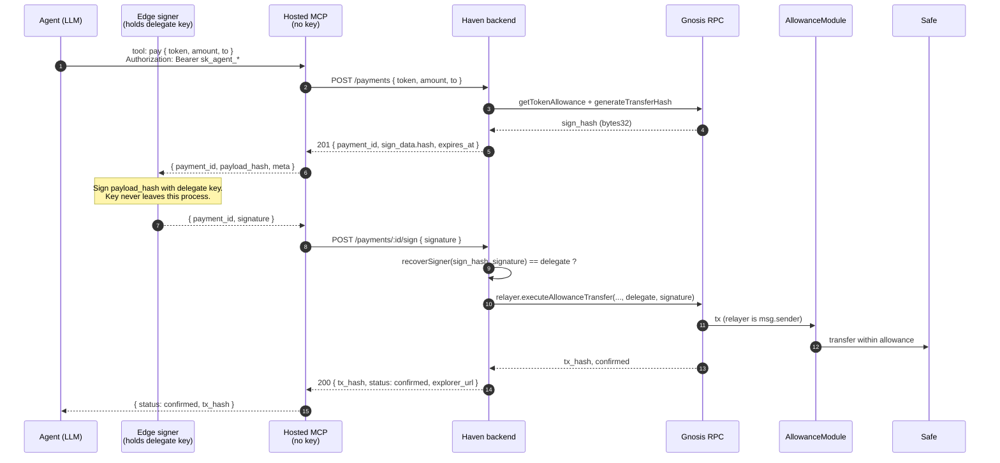

# Haven — Hosted MCP Connect Flow & Edge-Signing Contract

The foundation spec for the hosted (remote) MCP server. It defines the wire
contract between the hosted server and the **edge signer**, the custody rule
that keeps Haven non-custodial, and the two-credential split that the Connect
flow renders into the UI.

This is the gate document for the
[Hosted Haven MCP epic (#181)](https://github.com/d-hinders/Haven-AI/issues/181):
the contract below is what the server (#183), edge signer (#184), backend (#185),
and security tests (#190) all build against. **Lock this before writing the
server.**

Source of truth for the underlying payment mechanics:
[packages/backend/src/routes/payments.ts](../../packages/backend/src/routes/payments.ts)
and [docs/architecture/03-payment-sequence.md](03-payment-sequence.md). The
custody invariants this spec must preserve live in
[docs/regulatory/casp-risk-guardrails.md](../regulatory/casp-risk-guardrails.md)
(Red Line #2, Required Architecture Patterns) and
[docs/architecture/02-identity-and-custody.md](02-identity-and-custody.md).

## Why this exists

Today the MCP server is a **local stdio** process (`@haven_ai/mcp`) that the
user registers in each client's config file, embedding two secrets
(`HAVEN_API_KEY` + `HAVEN_DELEGATE_KEY`). Painful to set up, client-specific,
and it puts a raw private key in a settings file.

The hosted MCP makes connection a URL + token (one-click / one-command). But a
remote server that *held* the delegate key would be a hosted agent wallet —
[Red Line #2](../regulatory/casp-risk-guardrails.md). So the design (Option B)
splits responsibilities across the custody boundary:

- **Hosted MCP server** — authenticates the agent (identity), constructs the
  unsigned payload, and relays the signed transaction. Holds **no key
  material**.
- **Edge signer** — runs where the agent runs, holds the delegate key, signs
  the hash locally. Haven never receives the key.

## The one-line custody rule

> Only `{ payment_id, signature }` ever crosses the wire to the hosted MCP.
> The delegate private key never appears in any request to Haven, in any field,
> at any time.

If that holds, Haven cannot produce a delegate signature itself, the
AllowanceModule remains the on-chain gate, and the hosted server is
non-discretionary relay — exactly the posture the regulatory guardrails
require. Every other rule in this doc is downstream of this one.

## Two-credential split

The Connect flow provisions two things with different trust roles. Keeping them
distinct — in the wire protocol and in the UI — is what makes the non-custodial
model legible.

| | Artifact | Where it goes | Trust role | Blast radius if leaked |
|---|---|---|---|---|
| **Connect token** | `api_key` (`sk_agent_*`) | Sent to the hosted MCP as a Bearer header | **Identity only** | Cannot move funds — every payment still needs an edge signature (custody invariant #3) |
| **Signing key** | delegate EOA private key | Stays on the agent's machine; signs locally | **Authority** | Can spend up to the remaining on-chain allowance for that delegate, nothing more |

API auth is identity. Signature is authority. On-chain module state is
enforcement.

## Connection (identity)

The agent connects to the hosted MCP over HTTP/streamable transport with the
`api_key` as a Bearer token:

```
mcp.haven.ai/v1   Authorization: Bearer sk_agent_***
```

The server resolves the agent the same way the backend does today — `SELECT
agent WHERE api_key_hash = sha256(key)`
([payments.ts](../../packages/backend/src/routes/payments.ts)). The Bearer token
authenticates; it authorizes nothing on its own.

## Edge-signing sequence (in-budget)

The interesting half is the round trip between the hosted server and the edge
signer. The hosted MCP wraps the existing `/payments` + `/payments/:id/sign`
endpoints — it adds no new signing authority.



The only payload that flows back toward Haven from the signer is
`{ payment_id, signature }` (step 8). No key material is in it.

## Over-budget branch

If the requested amount exceeds the remaining on-chain allowance, `POST
/payments` returns `202 { payment_id, status: 'pending_approval', expires_at }`
([payments.ts](../../packages/backend/src/routes/payments.ts)) and **no hash is
issued**. The MCP surfaces `pending_approval` to the agent; the user approves in
the dashboard with the Safe owner key (already covered today). There is nothing
for the edge signer to sign until approval lands. This is unchanged behavior —
the hosted MCP must preserve it.

## Wire contract

Two MCP tools carry the payment round trip. Each maps directly onto an existing
backend endpoint; the MCP layer is a thin, non-discretionary wrapper.

### `pay` — construct (maps to `POST /payments`)

Input (from the agent):

```jsonc
{ "token": "USDC", "amount": "12.50", "to": "0xabc…" }
```

Output, in-budget — server → edge signer:

```jsonc
{
  "payment_id": "pay_…",        // ← /payments `payment_id`
  "payload_hash": "0x…",        // ← /payments `sign_data.hash` (bytes32 to sign)
  "expires_at": "2026-…Z",      // ← /payments `expires_at` (10 min window)
  "meta": {                      // descriptive context for display/audit only
    "token": "USDC", "amount": "12.50", "to": "0xabc…", "allowance_nonce": 7
  }
}
```

Output, over-budget:

```jsonc
{ "payment_id": "pay_…", "status": "pending_approval", "expires_at": "2026-…Z" }
```

Field-name note: the backend names the unsigned hash `sign_data.hash`; this spec
calls it `payload_hash` at the MCP boundary. The signed artifact is **only the
bytes32 hash** — the relayer builds the `executeAllowanceTransfer` calldata, so
the edge signer never needs a full unsigned transaction. `meta` is non-binding
context so the signer/agent can display *what* is being authorized; it is not
part of what gets signed.

### `submit` — relay (maps to `POST /payments/:id/sign`)

Input — edge signer → server:

```jsonc
{ "payment_id": "pay_…", "signature": "0x…" }   // 65-byte ECDSA: r(32)+s(32)+v(1), v ∈ {27,28}
```

Output:

```jsonc
{ "status": "confirmed", "tx_hash": "0x…", "explorer_url": "https://…" }
```

The backend re-verifies `recoverSigner(sign_hash, signature) == delegate_address`
before relaying ([payments.ts](../../packages/backend/src/routes/payments.ts)),
and the AllowanceModule re-verifies the signature on-chain. The signature is
checked twice independently; neither check is Haven holding a key.

### Other tools (no signing)

`whoami` / `get_agent`, `get_allowances`, `list_transactions`, and
`x402_authorize` are read or construct-only. `x402_authorize` follows the same
construct → edge-sign → relay shape as `pay`, and its response includes
Haven-authenticated `x402.expected` so the edge signer can reject locally
invented contexts or merchant headers whose amount, merchant, resource URL,
asset, or network differ from the funded intent (see
[04-x402-payment-sequence.md](04-x402-payment-sequence.md)); its one-shot mode
is **not** used over the hosted MCP, because one-shot requires the signature in
the initial request and the MCP must obtain the hash before the edge signer can
produce one. Always two-step over hosted MCP.

## Invariants in this flow

- **The hosted MCP holds no key.** It can request a signature from the edge
  signer; it cannot produce one. Compromising the hosted server yields, at
  worst, the ability to *ask* an edge signer to sign already-constructed,
  allowance-bounded transfers — never to sign unilaterally.
- **The allowance check is on-chain.** `pay` reads AllowanceModule state via the
  backend, so out-of-band spend by the same delegate is already counted.
- **The delegate signature is verified twice** — once by the backend
  (`recoverSigner`) and once on-chain by the AllowanceModule.
- **The relayer pays gas, not the agent.** The relayer wallet is `msg.sender`;
  the delegate signature lives in calldata. The relayer key is bounded to
  existing allowances (custody invariant #1).
- **Over-budget never auto-signs.** No hash is issued above the remaining
  allowance; the human approval path is unchanged.

## Review-enforceable custody checklist

Add these to any PR that touches the hosted MCP, the edge signer, or the relay
path (extends the
[Payment-Related Merge Checklist](../regulatory/casp-risk-guardrails.md)):

- [ ] The delegate private key is **never** included in any request to the
  hosted MCP — not in `pay`, `submit`, headers, query, or `meta`. The only
  signer→server payload is `{ payment_id, signature }`. *(Test-enforced in #190.)*
- [ ] The hosted MCP has no code path that signs an AllowanceModule transfer; it
  only constructs (via `/payments`) and relays (via `/payments/:id/sign`).
- [ ] The Bearer `api_key` authorizes nothing on its own — every payment requires
  an edge signature.
- [ ] `pay` returns `pending_approval` (no hash) when amount exceeds the remaining
  on-chain allowance.
- [ ] The hosted server stores/logs no key material; audit logs record
  `payment_id`, tool, and relay status only (#186).
- [ ] `recoverSigner(sign_hash, signature) == delegate_address` is enforced before
  relay, and recipient/amount/token/nonce are unchanged between `pay` and
  `submit` (non-discretionary relay).

## Scope notes

- POC state on **Gnosis Chain (id 100)**. Multi-chain is future work.
- **API-key agents only**, consistent with the other diagrams in this folder.
- The human-present / passkey signing path is a separate epic and is out of
  scope here.
