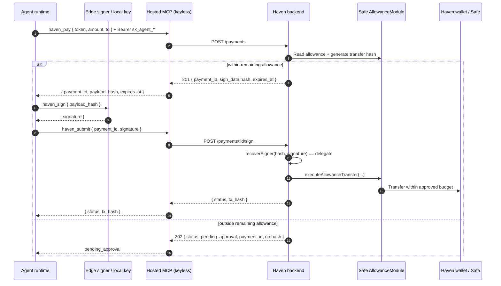

# Haven - Hosted MCP Connect Flow And Edge-Signing Contract

Current architecture for the hosted Haven MCP connection. The hosted server is
keyless: it authenticates agent identity, reads state, constructs unsigned
payment payloads, and relays signatures. Signing stays at the edge with the
agent runtime or `@haven_ai/signer`.

Source of truth:

- [`packages/mcp-server`](../../packages/mcp-server/README.md)
- [`packages/signer`](../../packages/signer/README.md)
- [`packages/frontend/src/lib/hosted-connect.ts`](../../packages/frontend/src/lib/hosted-connect.ts)
- [`docs/regulatory/casp-risk-guardrails.md`](../regulatory/casp-risk-guardrails.md)

## Why This Exists

The original local MCP server, `@haven_ai/mcp`, ran beside the agent runtime,
read the local Haven credential file, and signed locally. That is
non-custodial, but every runtime needed its own local server config.

Hosted MCP makes the connect step a stable HTTP URL plus Bearer token. A hosted
server that held the delegate key would cross a custody boundary, so Haven
splits identity from authority:

| Piece | Holds | Role |
|---|---|---|
| Hosted MCP | API key / Bearer token | Identity, read state, construct unsigned hashes, relay signatures |
| Edge signer or runtime | Delegate private key | Authority to sign payment payloads locally |
| Safe AllowanceModule | On-chain allowance state | Enforcement of automatic agent budget |

API auth is identity. Signature is authority. On-chain module state is
enforcement.

## Custody Rule

Only `{ payment_id, signature }` should cross from the signer side back to
hosted MCP for funding relay. Paid MCP-tool completion may also send the signed
`payment_header` back to hosted MCP so it can settle with the merchant and
attach evidence to the funding `payment_id`. The delegate private key must
never appear in hosted MCP headers, URLs, request bodies, logs, deep links, or
config snippets.

Hosted MCP also has a boot-time custody guard: it must not start when a
delegate key is injected into its environment.

## Connect-Agent Flow

The original Connect Agent flow remains supported during the Connect Agent 2
rollout. In that original flow, the Haven dashboard renders runtime-specific
hosted MCP snippets from `HOSTED_CLIENT_REGISTRY`.

1. User creates an agent and approves its on-chain agent budget.
2. Haven shows the one-time credential handoff.
3. User chooses a runtime in **Connect your agent**.
4. Haven generates a hosted MCP snippet with the hosted URL and Bearer API key.
5. The snippet never includes the delegate private key.
6. User provides the signing key to the local signer or runtime-local secret
   handling.
7. Runtime calls hosted MCP tools and local signing tools as needed.

Deep links are allowed only for runtimes with tested install schemes. They may
carry the hosted URL and Bearer token, but never the delegate key.

Connect Agent 2 adds a guarded staged pairing flow before hosted MCP can be
used for payments:

1. User starts in Haven with agent name, description, Haven wallet, agent
   rules, and agent budget.
2. Haven creates a pending setup and returns a setup token plus a copyable
   connector prompt/command.
3. The connector runs locally in the user's agent environment, resolves the
   setup, generates the delegate signing key and API key locally, and stores
   them in local protected storage or runtime config.
4. The connector sends Haven only the public signing address, proof of
   possession, API-key hash/prefix, and install status.
5. User returns to Haven and signs the wallet approval. The agent cannot spend
   until the Safe AllowanceModule approval exists on-chain.
6. Hosted MCP uses the locally stored API key for identity, while the local
   signer/runtime keeps using the local delegate key for authority.

See [Connect Agent 2 local-key pairing](../archive/connect-agent-2-local-key-pairing.md)
and [Connect Agent 2 rollout closeout](../archive/connect-agent-2-rollout-closeout.md).

## Direct Payment Sequence

Over-budget requests return no hash. There is nothing for the edge signer to
sign until the user approves in Haven and status advances to the appropriate
next action.

## x402 Sequence

Hosted MCP uses a two-step x402 funding path. One-shot x402 is not used over
hosted MCP because the hosted server must obtain the funding hash before the
edge can sign.

1. Agent receives an HTTP 402 challenge from the merchant/resource server.
2. Agent calls hosted `haven_pay_x402_quote` with the parsed
   `payment_required` challenge.
3. Hosted MCP asks Haven to construct the Safe-to-delegate funding leg.
4. Haven returns `{ payment_id, payload_hash, x402.expected }` or
   `pending_approval`.
5. Agent calls local `haven_sign` with the payload hash and `x402.expected`.
6. Agent calls hosted `haven_submit` with the funding signature.
7. After the funding leg succeeds, agent calls local
   `haven_x402_sign_header` with the original merchant challenge and the
   signer binding.
8. The local signer builds the EIP-3009 `X-PAYMENT` header only if amount,
   merchant, resource URL, asset, and network match the funded intent.
9. Agent retries the merchant request with `X-PAYMENT`. For paid MCP tools, the
   agent can instead pass the funding `payment_id` and signed `payment_header`
   to hosted `haven_complete_mcp_tool`; hosted MCP calls the merchant tool and
   records success evidence or a merchant-rejection reconciliation event.

Haven never builds the merchant payment header on the hosted server. Hosted MCP
only relays an already signed, merchant-bound header for paid MCP-tool
completion.

## Hosted MCP Tools

| Tool | Signs? | Purpose |
|---|---|---|
| `haven_get_agent` | No | Read agent identity and wallet context |
| `haven_get_allowances` | No | Read configured and on-chain budget state |
| `haven_pay` | No | Construct direct payment hash or queue approval |
| `haven_submit` | No | Relay a locally produced signature |
| `haven_pay_x402_quote` | No | Construct x402 funding hash or queue approval |
| `haven_complete_mcp_tool` | No | Complete a paid MCP tool with a signed merchant header and attach evidence |
| `haven_get_payment_status` | No | Read direct/x402/MPP payment state |
| `haven_list_transactions` | No | Read recent receipts/activity |

Local signer tools:

| Tool | Purpose |
|---|---|
| `haven_sign` | Sign hosted direct-payment or x402 funding hashes |
| `haven_x402_sign_header` | Build the merchant `X-PAYMENT` header after x402 funding succeeds |

## Review Checklist

Use this checklist for PRs that touch hosted MCP, edge signing, connect-agent
snippets, x402 signing, or relay code:

- Hosted MCP does not import, read, log, accept, or store a delegate key.
- Hosted snippets and deep links include the API key only, never the delegate
  key.
- Connect Agent 2 setup/register payloads include only setup token, public
  signing address, proof, API-key hash/prefix, and install status. They must not
  include plaintext API keys or private keys.
- Hosted MCP can construct and relay, but cannot sign.
- The signer emits signatures or x402 payment headers only; it does not need an
  API key and makes no network calls.
- API-key rotation affects identity only and does not imply signing-key
  rotation.
- Over-budget direct and x402 paths return `pending_approval` with no hash.
- x402 merchant header signing is bound to the funded amount, merchant,
  resource, asset, and network.
- The user can pause/revoke the agent in Haven and revoke Safe permissions
  outside Haven.

## Related Docs

- [Edge signer](07-edge-signer.md)
- [Connect Agent 2 local-key pairing](../archive/connect-agent-2-local-key-pairing.md)
- [x402 payment sequence](04-x402-payment-sequence.md)
- [Local to hosted MCP migration](../operations/local-to-hosted-mcp.md)
- [CASP / MiCA guardrails](../regulatory/casp-risk-guardrails.md)
