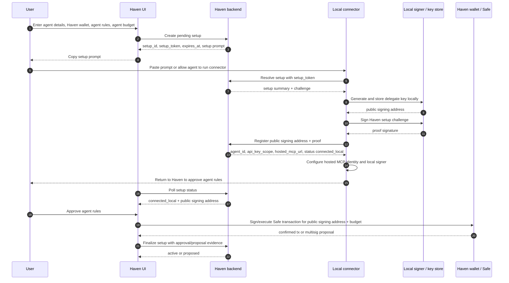
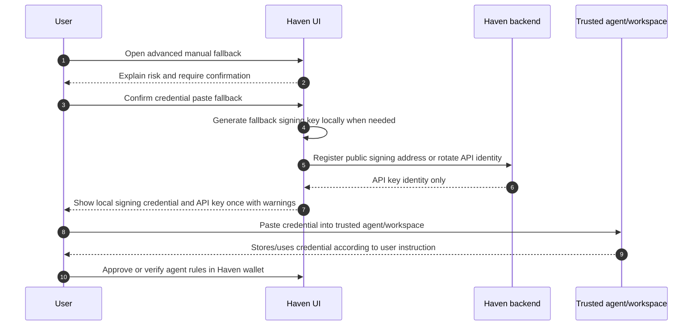

# Haven - Connect Agent 2 Local-Key Pairing

Contract for the Connect Agent 2 flow. This is the implementation source of
truth for issue #230 and the child work in #231 through #237.

Connect Agent 2 keeps the existing Connect Agent flow available while adding a
new primary path where the agent spending key is generated locally by the
user's agent environment. Haven receives only the public signing address and a
proof signature. The user still approves the resulting agent rules in their
Haven wallet before any automatic spend authority exists.

Related source docs:

- [CASP / MiCA guardrails](../regulatory/casp-risk-guardrails.md)
- [Hosted MCP connect flow](06-hosted-mcp-connect-flow.md)
- [Edge signer](07-edge-signer.md)
- [Identity and custody map](02-identity-and-custody.md)
- [Local to hosted MCP migration](../migration/local-to-hosted-mcp.md)
- [Hosted MCP deploy guide](../deploy/hosted-mcp.md)
- [UX copy guidelines](../design_system/UX_COPY_GUIDELINES.md)

## Decision

Connect Agent 2 uses a staged local-key pairing flow:

1. Haven creates a pending setup from user-selected agent details, Haven
   wallet, agent rules, and agent budget.
2. Haven gives the user one setup prompt containing a short-lived setup token
   and connector command.
3. The local connector runs in the user's agent environment.
4. The connector generates the delegate key locally and stores it locally.
5. The connector generates the agent API key locally, signs a Haven challenge,
   and sends only the public signing address, proof, API-key hash, and API-key
   prefix to Haven.
6. Haven stores only the API-key hash/prefix, creates a non-active pending
   agent, and confirms the connector can configure hosted MCP identity behind
   the scenes.
7. The agent remains inactive for payments until the user returns to Haven and
   approves the public signing address and agent budget in the Haven wallet.

The current Connect Agent flow remains available as the fallback path until
Connect Agent 2 is stable and intentionally replaces it.

## Current Implementation Delta

Connect Agent 2 changes setup only. It does not change the payment execution
authority model.

Current flow:

- `CreateAgentModal` creates the delegate key in the browser.
- The browser derives `delegate_address` before wallet approval.
- The frontend builds a Safe transaction with that address and the requested
  allowances.
- `POST /agents` requires `delegate_address` and returns the API key after the
  wallet setup step.
- The existing agent creation path is active-oriented: current storage defaults
  can create `active` agents unless implementation explicitly overrides status,
  and current agent auth primarily expects `active` or `paused` agents.
- `HostedConnectCard` and `hosted-connect.ts` produce hosted MCP setup snippets
  and optional setup prompts. Hosted snippets do not include the delegate key,
  but some current fallback prompt material can include it.

Connect Agent 2 target flow:

- Haven creates a pending setup before any delegate address exists.
- The local connector generates the delegate key in the agent environment.
- The connector registers only the public signing address, proof, and locally
  generated API-key hash/prefix.
- Haven never receives the plaintext agent API key in Connect Agent 2.
- The locally generated API key is limited by pending-agent status until wallet
  approval activates the agent.
- The user approves the public signing address and budget in the Haven wallet.
- Browser-generated keys and signing-key prompts become fallback-only paths.

## Core Principle

API auth is identity. Signature is authority. On-chain rules are enforcement.

Connect Agent 2 may improve setup UX, but it must not change this authority
model:

```text
User-approved Haven wallet transaction
  + on-chain allowance state
  + agent-held private key signature
  = automatic agent spend authority
```

The source of authority must never be:

```text
Haven backend
  + setup token
  + API key
  + off-chain setup state
```

## Parties And Custody

| Party | May hold | Must not hold |
|---|---|---|
| Haven backend | user auth session, pending setup metadata, setup token hash, public signing address, proof signature, API key hash/prefix, allowance mirror rows, wallet approval status | agent private key, user private key, seed phrase, unencrypted setup token after creation |
| Haven frontend | setup token while shown to the user, pending setup status, public signing address, budget/rule summary | agent private key in the Connect Agent 2 happy path |
| Local connector | setup token during pairing, generated private signing key, public signing address, proof signature, locally generated plaintext API key, runtime install metadata | user owner key, Haven server secrets |
| Local signer | delegate private key or protected reference, local signing audit rows | Haven API key unless a local full-MCP fallback intentionally uses it |
| Hosted MCP | API key/Bearer token, request context, unsigned payment state, submitted signatures | delegate private key, local signer credential file |
| Haven wallet / Safe | owner set, module state, delegate address, per-token allowances | off-chain setup tokens or API keys |

## State Model

Use a dedicated setup state machine for Connect Agent 2. Do not rely on
ordinary active agent state to describe partial setup.

Recommended storage shape:

- `agent_connection_setups` owns setup token hash, challenge, expiry, runtime
  target, setup status, and recovery metadata.
- Recommended default: `agents` is created at local registration time with a new
  non-active status such as `pending_approval`, and the connector receives the
  API key once so it can configure hosted MCP behind the scenes.
- A pre-approval API key may authenticate only allowlisted setup/readiness calls,
  such as setup status, connector install status, hosted MCP handshake, and tool
  discovery. It must not create payment intents, resume approvals, sign, submit,
  or otherwise spend.
- If implementation does not add that explicit allowlist, delay API-key issuance
  until `active` and require the connector to support a post-approval repair or
  install step. The UX-preferred path is the limited pending API key.
- Connect Agent 2 must not reuse the current active-by-default `/agents` path
  without overriding status and auth behavior.

Final setup states:

| State | Meaning | Entry trigger | Exit trigger |
|---|---|---|---|
| `draft` | UI-local form state only; no persisted setup exists. | User starts Connect Agent 2. | User reviews and creates pending setup. |
| `awaiting_connection` | Haven persisted the setup and issued a short-lived setup token. No public signing address is registered. | `POST /agent-connection-setups`. | Connector registers a valid public signing address; setup expires; user cancels. |
| `connected_local` | Connector generated/stored the key locally, proved possession, and registered the public signing address. Wallet authority is not live. | Valid connector registration. | UI asks user to approve agent rules; user cancels; setup expires under configured policy. |
| `awaiting_wallet_approval` | User is reviewing or about to approve the public signing address and budget in Haven. | Frontend loads `connected_local` setup and displays approval step. | User signs/executes/proposes; user cancels; approval fails. |
| `approval_in_progress` | Wallet approval has started and the UI is waiting for signature, proposal, submission, or receipt. | User clicks approve. | Transaction confirms; Safe proposal succeeds; user rejects; execution fails. |
| `proposed` | Multisig transaction was proposed, but remaining approvals are needed before automatic spend authority exists. | Safe transaction proposal succeeds for a multi-approval Haven wallet. | Reconciliation sees the on-chain rules live; proposal is rejected/expired outside Haven; user cancels local setup visibility. |
| `active` | On-chain authority is live and agent API identity may use payment tools normally. | Single-owner transaction confirms, or multisig transaction later confirms. | User pauses/revokes agent or rotates/replaces credentials. |
| `expired` | Setup token or pending setup expired before the required next step. | Expiry job or status read detects expiry. | User starts a new setup. |
| `cancelled` | User intentionally stopped the setup. | User cancels from Haven. | User starts a new setup. |
| `failed` | Setup cannot proceed without recovery. | Backend, connector, storage, proof, approval, or reconciliation failure. | User retries allowed step or starts a new setup. |

### State Rules

- `draft` is not persisted.
- Setup tokens authenticate setup only. They must not authenticate payment,
  hosted MCP calls, or wallet approval finalization.
- `connected_local` is not spend authority. It means only that Haven has a
  public signing address and proof that the local connector controls the key.
- `connected_local`, `awaiting_wallet_approval`, `approval_in_progress`, and
  `proposed` are all non-active for payment authorization.
- `proposed` must not be described as automatic spend authority.
- `active` requires backend-reconciled live on-chain allowance state for the
  exact Haven wallet, chain, registered signing address, token, amount, and reset
  period in the pending setup. A multisig proposal remains `proposed` until the
  authority is actually live.
- Unknown future states must not authenticate as active agents.

### Relationship To Payment And Approval States

Connect Agent 2 setup states are not payment intent states. Keep them separate
from the existing agent payment taxonomy used for direct payments, x402, and
MPP.

Existing payment and approval behavior should remain intact:

- In-budget payments still move through pending signature, submitted,
  confirmed, failed, or expired payment-intent states.
- Over-budget requests still create approval/pending-approval state and must
  not return a signable hash until the user approves in Haven.
- Agent-facing `phase` and `nextAction` taxonomy should continue to tell the
  agent when to sign and submit, wait for user approval, retry an original
  merchant request, or check payment status.

The Connect Agent 2 state machine answers "is this agent setup connected and
approved yet?" The payment taxonomy answers "what should the agent do for this
payment?" Do not collapse these into one status enum.

## Sequence: Happy Path



## Sequence: Manual Command Fallback

Use this when the agent cannot run shell commands, but the user can run a
command in the environment where the agent runs.

```mermaid
sequenceDiagram
  autonumber
  participant User
  participant UI as Haven UI
  participant API as Haven backend
  participant Shell as User terminal in agent environment
  participant Connector as Local connector

  User->>UI: Create pending setup
  UI->>API: Create setup
  API-->>UI: setup token + command
  UI-->>User: Show command and manual instructions
  User->>Shell: Run connector command manually
  Shell->>Connector: npx -y @haven_ai/connect --setup hv_setup_...
  Connector->>API: Resolve setup, register public signing address, receive API key
  Connector-->>Shell: Setup saved locally; return to Haven
  Shell-->>User: No private key printed
  User->>UI: Return to approve agent rules
```

## Sequence: Restart-Required Runtime

Use this when the connector can write config, but the runtime loads MCP tools
only at session start.

```mermaid
sequenceDiagram
  autonumber
  participant User
  participant Agent as Current agent session
  participant Connector as Local connector
  participant Runtime as Agent runtime config
  participant UI as Haven UI

  User->>Agent: Paste setup prompt
  Agent->>Connector: Run connector command
  Connector->>Runtime: Write hosted MCP + local signer config
  Connector-->>Agent: Setup saved; restart this session once
  Connector-->>UI: Report connected_local if status reporting is available
  User->>UI: Approve agent rules
  UI-->>User: Agent rules approved
  User->>Agent: Restart session
  Agent->>Runtime: Load Haven tools at startup
  Agent-->>User: Haven tools available
```

## Sequence: Explicit Credential-Paste Fallback

This is the last resort. It is not the Connect Agent 2 happy path. It requires
an explicit confirmation step and should keep the old Connect Agent path
available until this fallback can be implemented safely.



Requirements for this fallback:

- It must be collapsed by default.
- Any fallback signing key must be generated in the browser or local runtime.
  Haven backend still receives only the public signing address.
- If the fallback cannot keep the private signing key local, it must offer only
  API-key setup and require the user or agent runtime to generate the signing key
  locally.
- It must say that the private signing key can authorize payments within the
  approved agent budget.
- It must say that the API key identifies the agent but cannot spend alone.
- It must tell the user to pause or revoke the agent in Haven if the
  credential may have leaked.
- It must not duplicate the private key in copied text.

## Backend API Contract

Endpoint names are final enough for implementation planning but can be adjusted
when #231 implements them. Request and response shapes should stay semantically
equivalent.

### Create Pending Setup

`POST /agent-connection-setups`

Authenticated as the user.

Request:

```json
{
  "name": "Research Agent",
  "description": "Pays for research APIs",
  "safe_id": "uuid",
  "runtime": "claude-code",
  "allowances": [
    {
      "token_address": "0x2a22f9c3b484c3629090FeED35F17Ff8F88f76F0",
      "token_symbol": "USDC.e",
      "allowance_amount": "25000000",
      "reset_period_min": 1440
    }
  ]
}
```

Response:

```json
{
  "setup_id": "uuid",
  "status": "awaiting_connection",
  "setup_token": "hv_setup_...",
  "expires_at": "2026-06-03T12:00:00.000Z",
  "connector_command": "npx -y @haven_ai/connect --setup hv_setup_... --api https://api.haven.example",
  "setup_prompt": "Copy-ready prompt text"
}
```

Rules:

- Store only a hash of `setup_token`.
- Return `setup_token` only in this response.
- Expiry should be short enough to reduce token leakage risk. Initial default:
  30 minutes for local registration. The final duration should be configured
  server-side.
- The response must not include API key or private key material.

### Resolve Setup For Connector

`POST /agent-connection-setups/resolve`

Authenticated by setup token, not by user session or agent API key.

Request:

```json
{
  "setup_token": "hv_setup_...",
  "connector_version": "0.1.0",
  "runtime": "claude-code"
}
```

Response:

```json
{
  "setup_id": "uuid",
  "status": "awaiting_connection",
  "agent": {
    "name": "Research Agent",
    "description": "Pays for research APIs"
  },
  "haven_wallet": {
    "id": "uuid",
    "name": "Main Haven wallet",
    "address": "0x...",
    "chain_id": 100,
    "network": "Gnosis"
  },
  "agent_budget": [
    {
      "token_symbol": "USDC.e",
      "allowance_amount": "25000000",
      "reset_period_min": 1440
    }
  ],
  "hosted_mcp_url": "https://haven-mcp.example/v1",
  "challenge": {
    "id": "uuid",
    "message": "Haven Connect Agent 2\\nsetup_id: ...\\nchallenge: ...\\nexpires_at: ...",
    "expires_at": "2026-06-03T12:00:00.000Z"
  }
}
```

Rules:

- Prefer `POST` so setup tokens do not appear in URLs.
- Return only public setup context needed for local setup.
- Do not return unrelated user data.
- Do not return API key before proof-of-possession.

### Register Public Signing Address

`POST /agent-connection-setups/register`

Authenticated by setup token.

Request:

```json
{
  "setup_token": "hv_setup_...",
  "challenge_id": "uuid",
  "delegate_address": "0x...",
  "proof_signature": "0x...",
  "api_key_hash": "64 hex characters",
  "api_key_prefix": "sk_agent_abc",
  "runtime": "claude-code",
  "connector_version": "0.1.0",
  "connector_context": {
    "environment_label": "Local workspace",
    "runtime_version": "claude-code 1.2.3",
    "config_target": "project mcp config"
  },
  "install_capabilities": {
    "can_write_runtime_config": true,
    "restart_required": true
  }
}
```

Response:

```json
{
  "setup_id": "uuid",
  "agent_id": "uuid",
  "status": "connected_local",
  "agent_status": "pending_approval",
  "api_key_prefix": "sk_agent_...",
  "api_key_scope": "setup_pending",
  "delegate_address": "0x...",
  "hosted_mcp_url": "https://haven-mcp.example/v1",
  "next_action": "return_to_haven_for_wallet_approval"
}
```

Verification:

- Token hash exists and has not expired.
- Setup status is `awaiting_connection`.
- Challenge id is current and unexpired.
- `delegate_address` is a valid address.
- `proof_signature` recovers to `delegate_address` over the exact challenge
  message.
- No non-revoked active or pending agent for the same user already uses the
  address, unless #230 follow-up explicitly permits key reuse.

Rules:

- The connector generates the plaintext API key locally before registration.
- Store only `api_key_hash` and `api_key_prefix`.
- If an agent row is created here, it must be non-active for payment tools
  until wallet approval succeeds.
- Pending API-key auth must be implemented as an explicit allowlist. It may read
  setup status and report install/probe state, but payment endpoints must reject
  it until the agent is `active`.
- Store connector context only when it is non-sensitive. Do not store raw
  filesystem paths, usernames, hostnames, tokens, API keys, private keys, or
  chat transcripts.
- Do not accept fields named `delegate_key`, `delegatePrivateKey`,
  `private_key`, or `privateKey`.

### Read Setup Status

`GET /agent-connection-setups/:setup_id`

Authenticated as the user.

Response:

```json
{
  "setup_id": "uuid",
  "agent_id": "uuid",
  "status": "connected_local",
  "expires_at": "2026-06-03T12:00:00.000Z",
  "agent": {
    "name": "Research Agent",
    "description": "Pays for research APIs"
  },
  "haven_wallet": {
    "id": "uuid",
    "name": "Main Haven wallet",
    "address": "0x...",
    "chain_id": 100,
    "network": "Gnosis"
  },
  "agent_budget": [
    {
      "token_symbol": "USDC.e",
      "allowance_amount": "25000000",
      "reset_period_min": 1440
    }
  ],
  "delegate_address": "0x...",
  "api_key_prefix": "sk_agent_...",
  "runtime": "claude-code",
  "connector": {
    "connector_version": "0.1.0",
    "environment_label": "Local workspace",
    "runtime_version": "claude-code 1.2.3",
    "last_connected_at": "2026-06-03T11:44:00.000Z"
  },
  "install_status": {
    "hosted_mcp_configured": true,
    "local_signer_configured": true,
    "restart_required": true,
    "last_probe_at": "2026-06-03T11:45:00.000Z"
  },
  "approval": {
    "safe_tx_hash": null,
    "tx_hash": null,
    "status": "not_started"
  }
}
```

Rules:

- Never return plaintext `api_key`.
- Never return private key material.
- Include enough status for the UI to recover after reload.
- Include enough non-sensitive connector detail for the user to recognize the
  local agent environment before approving wallet authority.

### Update Connector Install Status

`POST /agent-connection-setups/:setup_id/install-status`

Authenticated by setup token before registration, or by limited pending/active
agent API key after registration. A consumed setup token may update install
metadata only; it must not register another address or change authority.

Request:

```json
{
  "runtime": "claude-code",
  "connector_version": "0.1.0",
  "hosted_mcp_configured": true,
  "local_signer_configured": true,
  "probe_result": "restart_required",
  "restart_required": true,
  "next_user_action": "restart_agent_session",
  "error_code": null,
  "environment_label": "Local workspace"
}
```

Rules:

- Install status is best-effort readiness metadata, not spend authority.
- The endpoint must not change `delegate_address`, wallet, chain, allowances,
  approval status, or agent status.
- The endpoint must reject private key material, API keys, raw paths, usernames,
  hostnames, and chat transcripts.
- UI can use this status to explain whether the connector installed hosted MCP,
  configured local signing, needs a restart, or needs manual repair.

### Record Wallet Approval

`POST /agent-connection-setups/:setup_id/wallet-approval`

Authenticated as the user.

Request for single-owner confirmed transaction:

```json
{
  "result": "confirmed",
  "tx_hash": "0x...",
  "safe_tx_hash": "0x...",
  "chain_id": 100,
  "safe_address": "0x...",
  "allowance_module_address": "0xCFbFaC74C26F8647cBDb8c5caf80BB5b32E43134",
  "delegate_address": "0x..."
}
```

Request for multisig proposal:

```json
{
  "result": "proposed",
  "safe_tx_hash": "0x...",
  "chain_id": 100,
  "safe_address": "0x...",
  "allowance_module_address": "0xCFbFaC74C26F8647cBDb8c5caf80BB5b32E43134",
  "delegate_address": "0x..."
}
```

Rules:

- Backend must verify the setup belongs to the user.
- Backend must verify the supplied `delegate_address` matches the registered
  address for the setup.
- Client-supplied chain, Safe, and module fields are hints, not authority.
  Backend must derive or fetch the transaction/proposal content from the chain or
  Safe transaction service and compare it to the pending setup.
- Backend must verify the exact Haven wallet/Safe, chain id, allowance module,
  registered signing address, token addresses, atomic allowance amounts, and
  reset periods match the pending setup before moving to `proposed` or `active`.
- For multisend or batched wallet approvals, backend must decode every inner
  call and reject proposals that include unrelated owner, module, guard, token,
  delegate, or authority changes.
- For `confirmed`, backend must verify transaction success and reconcile the
  on-chain allowance snapshot before marking the agent `active`.
- For `proposed`, backend must verify the Safe proposal content matches the
  intended setup before recording `proposed`, but the agent remains non-active
  for payments until reconciliation sees live on-chain authority.
- Endpoint should be idempotent for the same transaction/proposal.
- `proposed` must not be presented as automatic spend authority.

### Cancel Setup

`POST /agent-connection-setups/:setup_id/cancel`

Authenticated as the user.

Rules:

- Cancelling before local registration invalidates the setup token.
- Cancelling after API key issuance should revoke or invalidate the non-active
  agent API key unless a product decision keeps it for recovery.
- Cancelling cannot revoke on-chain authority once the user has approved it;
  after on-chain authority exists, use the normal pause/revoke flow.

## Connector Contract

Preferred command shape:

```sh
npx -y @haven_ai/connect --setup hv_setup_... --api https://api.haven.example --runtime claude-code
```

The setup prompt may ask the agent to run that command, but the command is the
component that generates and stores the key. The LLM chat should not generate
or print the private key.

Connector responsibilities:

1. Parse setup token, API URL, runtime hint, and optional non-interactive flags.
2. Resolve setup with Haven.
3. Display a concise local summary before making changes.
4. Generate the delegate key locally.
5. Store the key locally using the best available storage:
   - OS keychain where supported.
   - encrypted local runtime storage if supported.
   - protected credential file fallback outside the repo, for example
     `~/.haven/agents/<agent-id>.json`.
6. Derive public signing address.
7. Sign the Haven challenge.
8. Register public signing address and proof.
9. Keep the locally generated API key in protected local storage and configure
   hosted MCP identity.
10. Configure local sign-only tooling.
11. Probe what it can probe and report install status to Haven.
12. Print next steps without secrets.

Connector must not:

- print the private key
- send the private key to Haven
- place the private key in hosted MCP config
- place the private key in deep links, URLs, headers, or setup-status reports
- write credentials into project files by default
- overwrite unrelated runtime config entries

Expected terminal output:

```text
Fetched Haven setup for Research Agent.
Generated local signing key.
Stored signing key locally.
Registered signing address with Haven: 0xabc...def.
Configured hosted Haven MCP.
Configured local Haven signer.
Restart this agent session once, then return to Haven to approve the agent rules.
```

## Setup Prompt Contract

The happy-path setup prompt should be copyable into a coding/local agent. It
may include:

- setup command
- setup token
- Haven API URL
- hosted MCP URL
- selected runtime
- agent name and budget summary
- instructions not to print or paste private keys

It must not include:

- delegate private key
- final API key, unless a separate explicit fallback path is confirmed
- credential JSON
- raw wallet approval transaction data

Example:

```text
Please connect this workspace to Haven.

Run this local setup command:

npx -y @haven_ai/connect --setup hv_setup_... --api https://api.haven.example --runtime claude-code

The Haven connector will generate the signing key locally and send Haven only
the public signing address. Do not print private keys in chat or logs.

When the connector finishes, tell me to return to Haven to approve the agent
rules.
```

## Expiry And Recovery

Recommended defaults:

- Setup token expires after 30 minutes while in `awaiting_connection`.
- Challenge expires with the setup token or sooner.
- Once `connected_local`, the setup token is consumed for registration and
  should not be reusable for another address.
- `connected_local` can have a longer approval window, for example 24 hours,
  because the private key is already local and the API key is non-active.
- If approval expires before wallet approval, the user should restart setup or
  explicitly refresh the pending approval window.

Recovery rules:

- If the connector fails before registration, user can rerun the command while
  the setup token remains valid.
- If the connector registers the address but runtime config fails, user can
  rerun the connector in a repair mode that does not rotate the registered
  address unless explicitly requested.
- If wallet approval fails, user can retry approval from Haven without rerunning
  the connector.
- If backend finalization fails after on-chain confirmation, Haven should
  recover from the transaction hash or on-chain allowance state.
- If the local key is lost after wallet approval, user must pause/revoke the
  agent and create a new signing path; Haven cannot recover the private key.

## Threat Model Notes

### Setup Token Leakage

Risk: another party with the setup token could register their own public
signing address before the legitimate connector.

Mitigations:

- short expiry
- setup token hash stored server-side
- one setup token per setup
- proof-of-possession challenge
- user review displays the registered signing address, connector version,
  runtime, non-sensitive environment label, install result, and last connected
  time before wallet approval
- wallet approval remains required before any spend authority exists
- cancellation invalidates the setup token

Residual risk: if the user approves a maliciously registered public signing
address, that address receives the configured on-chain budget. The review step
must clearly show that the agent environment connected and let users cancel.

### API Key Leakage

Risk: leaked `sk_agent_*` can impersonate the agent to Haven.

Mitigations:

- API key alone cannot spend.
- Agent status remains non-active until wallet approval.
- Payment execution still requires local delegate signature and on-chain
  allowance.
- Connect Agent 2 generates the plaintext API key locally and sends Haven only
  its hash/prefix.
- API key can be rotated.
- Connector should prefer secret/env references over plaintext config where
  runtime support exists.

Residual risk: leaked API key may read agent state or create pending requests
depending on backend authorization. Scope API permissions carefully and keep
pending-agent auth allowlisted.

### Private Key Leakage

Risk: leaked delegate private key can sign payment payloads within approved
on-chain allowance.

Mitigations:

- key generated locally
- key never sent to Haven
- key never printed by connector
- hosted MCP config and deep links never include key
- protected storage and local audit
- user can pause/revoke in Haven and revoke on-chain permissions outside Haven

Residual risk: if the user explicitly chooses credential paste fallback, the key
may enter chat history or logs. That path requires confirmation and clear
warnings.

### Partial Setup Failure

Risk: user sees setup as complete when either local config or wallet authority
is incomplete.

Mitigations:

- separate `connected_local`, `awaiting_wallet_approval`, `proposed`, and
  `active` states
- UI copy distinguishes "connected locally" from "agent rules approved"
- connector reports install status separately from Haven wallet approval
- setup status is pollable and recoverable
- backend auth rejects unknown or pending statuses

## Runtime Install Guidance

Connect Agent 2 should classify each runtime rather than promising that all
agents can update MCP tools without restart.

Initial runtime classes:

| Runtime | Install target | Restart guidance |
|---|---|---|
| Claude Code | `claude mcp add` or project config | likely restart current session |
| Codex CLI | `.codex/config.toml` plus env/secret reference | restart current session |
| Cursor | MCP config or deep link | reload or runtime-specific refresh |
| VS Code | MCP config/deep link | hot reload may work; verify per version |
| Claude Desktop | desktop config | full app restart |
| Other/SDK | generated instructions | manual |

The connector should report:

- hosted MCP configured
- local signer configured
- probe result if available
- restart required or not known
- next user action

This should use the install-status endpoint above when network access works. If
the runtime cannot report status automatically, the UI should show the last known
local registration and ask the user to confirm before wallet approval.

## Product Copy Rules

Primary UI should use:

- Haven wallet
- agent rules
- agent budget
- approve actions
- connect your agent
- signing address only when needed, preferably subordinate to the human summary

Primary UI should avoid:

- Safe
- AllowanceModule
- delegate
- relayer
- signer
- owner
- raw transaction hash

Exceptions are allowed in advanced/developer disclosures and architecture docs.

Example review copy:

```text
Review agent rules

Research Agent can make payments from Main Haven wallet up to 25 USDC per day.
Requests outside this budget will wait for approval in Haven.

The agent environment is connected. Approve these rules in your Haven wallet to
let this agent make payments within the budget.
```

## Implementation Sequence

Recommended order:

1. #231 Backend pending setup and pairing APIs.
2. #232 Local connector key generation, storage, proof registration.
3. #233 Runtime install/probe adapters.
4. #234 Frontend Connect Agent 2 UI and status polling.
5. #235 Wallet approval activation and multisig handling.
6. #236 Manual fallback and credential-paste confirmation.
7. #237 End-to-end tests, docs, rollout gates, and risk closeout.

Do not remove the old Connect Agent flow in this sequence.

## Feature Gate And Rollback

Connect Agent 2 ships with rollback gates:

- frontend Connect Agent 2 is enabled by default; set
  `NEXT_PUBLIC_CONNECT_AGENT_2_ENABLED=false`, `0`, or `off` to restore the old
  manual setup entry point
- backend setup-token creation is enabled by default; set
  `CONNECT_AGENT_2_ENABLED=false`, `0`, or `off` to block new setup creation
- connector package published as alpha/beta until the flow is verified

Rollback plan:

- hide Connect Agent 2 entry point
- keep old Connect Agent flow unchanged
- disable new setup-token creation if a security or runtime-install issue is
  found
- keep read/cancel endpoints available long enough for in-progress setups to
  recover or expire
- do not delete old credential and hosted-connect code until a separate removal
  issue is opened and reviewed

## Review Checklist

Use this checklist on PRs that implement this contract:

- Haven backend never accepts or stores agent private keys.
- Setup token is stored hashed and expires.
- Setup token cannot authorize payment or hosted MCP calls.
- Proof signature recovers to submitted public signing address.
- Connector-generated API key is stored only as hash/prefix server-side.
- Agent API key cannot move money without local delegate signature.
- Pending/non-active statuses do not authenticate as active payment agents.
- Hosted MCP snippets, deep links, URLs, headers, and logs never contain the
  delegate key.
- Connector stdout/stderr never contains the delegate key.
- UI distinguishes local connection from wallet approval.
- Manual credential paste/download is collapsed and explicitly confirmed.
- User can pause/revoke the agent in Haven after activation.
- User can revoke Safe permissions outside Haven.
