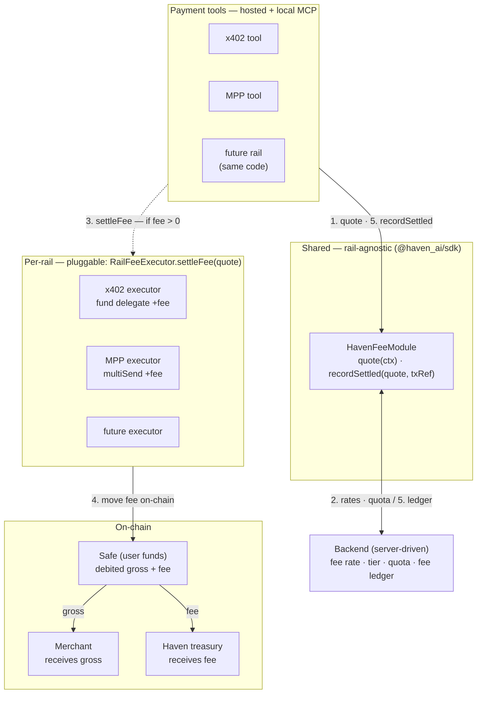

# Haven — Rail-agnostic platform fee module

> Overview of the per-transaction fee architecture. Design of record lives in
> [Epic #386](https://github.com/d-hinders/Haven-AI/issues/386); keep this file short.

Haven collects a usage-based, per-transaction fee. The design splits cleanly in
two: a **shared, rail-agnostic module** owns the fee *policy + accounting*, and
each rail plugs in its own *on-chain settlement*. Adding a rail means writing one
small executor plus a treasury address — never re-deriving fee logic.

The module lives in `@haven_ai/sdk`, so both the hosted MCP server and the local
MCP inherit it, and the x402 and MPP tool paths call the same interface.

## How to read it

- **Shared (the module).** Every tool routes through `quote()` and
  `recordSettled()`. The module decides the amount (asking the backend for the
  account's rate/tier/quota) and records each settled fee idempotently per
  `payment_id`. Rail-agnostic and identical everywhere.
- **Per-rail (the executors).** Only the on-chain mechanics differ. x402 funds
  the delegate with `gross + fee` (merchant settles `gross` via EIP-3009, the
  delegate sends `fee` to the treasury); MPP bundles `gross` → recipient and
  `fee` → treasury in one `multiSend`.
- **Backend.** Fee schedule is server-driven, so pricing changes ship without a
  new MCP release; the fee ledger is the reconcilable revenue record.

## The invariants that must hold

- **Surcharge, not a rake.** The Safe is debited `gross + fee`; the merchant
  always receives `gross` in full.
- **Never exceeds the approved allowance.** The AllowanceModule draw must cover
  `gross + fee`, or the fee path queues for approval like any over-budget action.
  Haven never gains unilateral signing authority — see
  [`casp-risk-guardrails.md`](../regulatory/casp-risk-guardrails.md).
- **Zero-fee path is first-class.** Free tier, committed-volume enterprise, and
  local MCP return `feeAmount: 0n`; steps 3–4 are skipped entirely. That the
  local (no-hosted-dependency) path collects no fee is by design — it is the
  enforcement mechanism behind the hosted-default topology
  ([08-local-vs-hosted-mcp.md](08-local-vs-hosted-mcp.md)).
- **Idempotent + reconcilable.** Retrying a `payment_id` never double-charges;
  every fee is recorded centrally and matched to its on-chain transfer.

See [04-x402-payment-sequence.md](04-x402-payment-sequence.md) for the delegate
funding mechanics the x402 executor rides on.
