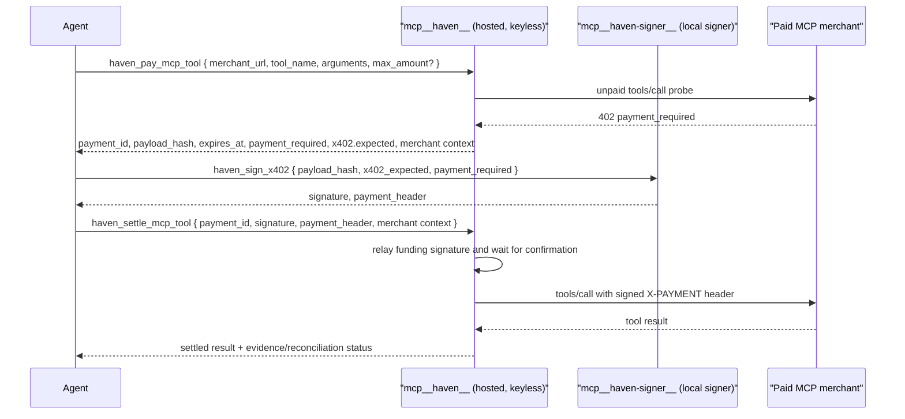

# @haven_ai/mcp-server

Hosted, **keyless** Haven MCP server. It speaks the MCP Streamable HTTP
transport, authenticates each agent by its API key (identity), and exposes
tools that **construct** and **relay** payments. It never holds a delegate key
and has no signing path — the edge signs.

This is the counterpart to the local `@haven_ai/mcp` package. That one runs on
the agent's machine and signs locally; this one is hosted and keyless. The
split exists for one reason: a hosted server that held the delegate key would
be a custodial agent wallet. See
[`docs/architecture/06-hosted-mcp-connect-flow.md`](../../docs/architecture/06-hosted-mcp-connect-flow.md)
and [`docs/regulatory/casp-risk-guardrails.md`](../../docs/regulatory/casp-risk-guardrails.md)
(Red Line #2).

## Connect-agent role

The Haven dashboard's **Connect your agent** flow points agent runtimes at the
hosted MCP URL and sends the agent API key as a Bearer token. That token is
identity only. The delegate private key stays with the agent runtime, usually
through `@haven_ai/signer` or a runtime-local secret store.

Hosted MCP tools are deliberately split:

- read state: agent info, live allowances, payment status, transactions
- construct: return unsigned direct-payment or x402 funding hashes
- relay: submit `{ payment_id, signature }` after the edge signs funding
- complete paid MCP tools: relay an already signed, merchant-bound `payment_header`
  together with the funding `payment_id` so evidence can be attached

It does not expose local signing tools. Those live in `@haven_ai/signer`
(`haven_sign`, `haven_sign_x402`, `haven_x402_sign_header`,
`haven_sign_sweep_delegate`).

## Custody invariant

> The delegate private key never crosses the wire to this server. Funding relay
> sends only `{ payment_id, signature }`; paid MCP completion may additionally
> send a signed, single-use `payment_header` that is already bound to the
> merchant, amount, and nonce.

The bound `HavenClient` is constructed without a `delegateKey`, so the signing
methods (`pay()`, `sign()`, `authorizeX402()`) are unavailable by construction.
`createHostedHavenClient` throws if a key is ever present.

## Tools

| Tool | Maps to | Signs? |
|---|---|---|
| `haven_get_agent` | `GET /machine-payments/agent` | no |
| `haven_get_allowances` | `GET /machine-payments/allowances` | no |
| `haven_pay` | `POST /payments` (returns `payload_hash`) | no — edge signs |
| `haven_submit` | `POST /payments/:id/sign` (relays signature) | no |
| `haven_quote_x402` | merchant x402 quote probe | no |
| `haven_pay_x402_quote` | `POST /x402` (returns funding `payload_hash` + x402 context) | no — edge signs |
| `haven_pay_mcp_tool` | merchant MCP quote probe + `POST /x402` | no — edge signs |
| `haven_settle_mcp_tool` | `POST /payments/:id/sign`, then merchant MCP endpoint + evidence/reconciliation APIs | no — relays signed artifacts |
| `haven_complete_mcp_tool` | merchant MCP endpoint + evidence/reconciliation APIs | no — relays signed header |
| `haven_discover_tools` | `GET /catalog` | no |
| `haven_get_payment_status` | `GET /machine-payments/:id/status` | no |
| `haven_get_resume_state` | `GET /machine-payments/:id/status` as resume state | no |
| `haven_list_receipts` | `GET /machine-payments/receipts` | no |
| `haven_sweep_delegate` | gasless stranded-funds sweep prepare/submit | no — relays signed sweep |

`haven_pay` returns `{ payment_id, payload_hash, expires_at }` in-budget, or
`{ status: "pending_approval", payload_hash: null }` when the amount exceeds the
on-chain allowance (nothing to sign; the user approves in Haven).

### x402 paid MCP tool flow

The happy path is three agent-visible tool calls across two MCP namespaces:



Use these fully-qualified next steps when an agent discovers tools at runtime:

1. `mcp__haven__haven_pay_mcp_tool` returns the live merchant price, the
   unsigned funding `payload_hash`, `expires_at`, `payment_required`,
   `x402.expected`, and merchant context. `expires_at` is the funding/quote
   signing window; if it passes, re-run this same tool with the same
   `idempotency_key`.
2. `mcp__haven-signer__haven_sign_x402` signs the funding hash and builds the
   merchant `X-PAYMENT` header locally. The delegate key never leaves this
   process.
3. `mcp__haven__haven_settle_mcp_tool` relays the signed funding artifact, waits
   for confirmation, then relays the already-signed merchant header and records
   evidence or reconciliation against the funding payment.

The five-call decomposed path remains available for debugging and advanced
agents:

```text
mcp__haven__haven_pay_mcp_tool
  -> mcp__haven-signer__haven_sign
  -> mcp__haven__haven_submit
  -> mcp__haven-signer__haven_x402_sign_header
  -> mcp__haven__haven_complete_mcp_tool
```

The header-builder is intentionally at the edge: the EIP-3009 header is a
delegate-key signature, so it cannot run on the keyless hosted server. Hosted
MCP may relay that already signed, merchant-bound header for paid MCP tool
completion, but it never builds or signs it. The signer validates
`x402.expected.auth`, resource, merchant, amount, asset, network, and `expires_at`
before signing the merchant header; mismatches or expired payment windows fail
before the delegate hot wallet signs anything.

## Run

```sh
PORT=8788 HAVEN_API_URL=https://havenbackend-production-8a00.up.railway.app \
  npx @haven_ai/mcp-server
```

Endpoints: `POST /v1` (MCP, requires `Authorization: Bearer sk_agent_*`),
`GET /healthz` (liveness). The server is stateless and multi-tenant — each
request is handled by a fresh server bound to that request's token.
